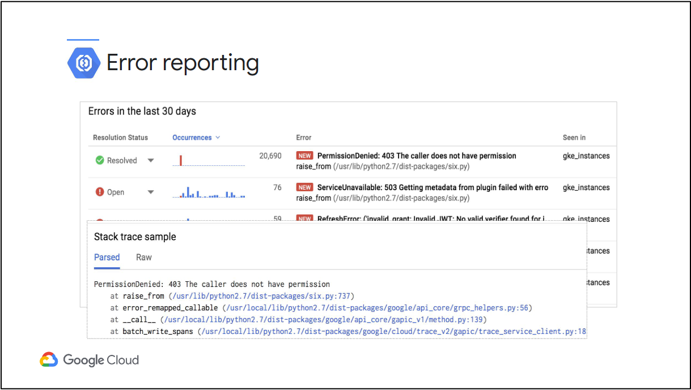
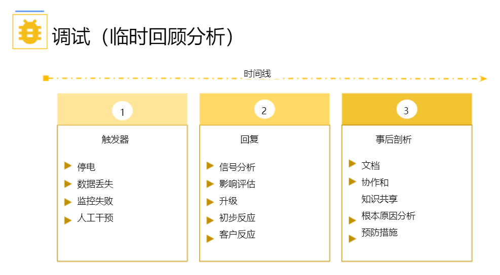

# Google Cloud 中的日志记录、监控和可观察性
了解如何监控、排除故障以及改进基础架构和应用程序性能。 本课程以站点可靠性工程 (SRE) 原则为指导，结合了讲座、演示、动手实验室和实际案例研究。 在本课程中，您将获得全堆栈监控、实时日志管理和分析、生产中调试代码以及分析 CPU 和内存使用情况的经验。

# 课程信息
## 目标
* 规划和实施架构良好的日志记录和监控基础设施。
* 定义服务级别指标 (SLI) 和服务级别目标 (SLO)。
* 创建有效的监控仪表板和警报。
* 监控、排查和改进 Google Cloud 基础架构。

# 介绍
欢迎使用 Google Cloud 中的日志记录、监控和可观察性！ 使用以下资源熟悉本课程将涵盖的主题，了解如何访问课程材料以及如何发送反馈。

## 课程介绍
略

# Google Cloud 中的监控简介
在本模块中，我们将花一些时间对构成 Google Cloud 日志记录、监控和可观察性套件的各种产品进行高级概述。

## 模块概览
Google Cloud 中的核心运营工具分为两大类：
* 以操作为中心的组件（包括日志记录、监控、错误报告和服务监控）往往更适合主要对基础设施感兴趣的人员，并保持基础设施正常运行、无错误。
* 相比之下，应用程序性能管理工具（包括 Debugger、Trace 和 Profiler）往往更适合那些试图完善或排除在 Google Cloud 计算产品之一中运行的应用程序的故障的开发人员。

## 监控工具概述
一切都始于信号。指标、日志记录和跟踪数据捕获已从硬件层集成到 Google 产品中。  
信号数据从这些产品流入 Google Cloud 运营工具，您可以在仪表板中并通过 Metrics Explorer 将其可视化。您可以在日志资源管理器中剖析和分析自动日志和自定义日志。监控服务是否符合服务级别目标 (SLO)，并跟踪错误预算。使用运行状况检查来检查面向外部的站点和服务的正常运行时间和延迟。您还可以调试和分析正在运行的应用程序。  
当指标发现可能存在的问题时，信号数据可以向代码生成通知，或者通过各种信息渠道向关键人员发出通知。错误报告可以帮助运营和开发团队发现、计数和分析基于云的服务中的崩溃。  

Google Cloud 拥有许多产品，从 Kubernetes 到 BigQuery，再到 Spanner，它们都将指标和日志流式传输到 Google 的 Cloud Logging 和 Cloud Monitoring 组件中。  
日志路由器确定数据的去向，并可用于排除某些类型的条目，或者将日志路由到 Pub/Sub 或 BigQuery 等外部位置，也许用于自动处理和/或长期存储和分析。  
审核员可能会检查日志查看器以查看给定 Spanner 实例的创建时间和创建者。安全人员可以使用威胁检测或安全指挥中心来发现和分析入侵尝试。网络工程师可能会在 BigQuery 中运行 SQL 查询以更好地了解网络流。

除了原始监控指标和日志记录条目之外，Google Cloud 还帮助 SysOps/SRE 和 DevOps 人员分析和提高应用程序性能。  
* 调试器将允许检查服务的代码状态，而不会停止或降低其性能。
* Profiler 可用于检查 CPU 和内存使用情况，以帮助发现瓶颈并提高算法性能。
* 跟踪是关于分析多层微服务应用程序中的延迟。
* 开发者可以使用 Logs API 直接写入 Google Cloud 日志。

## 基于操作的工具
Google Cloud 收集一千多个不同的指标数据流，这些数据可以合并到仪表板、警报和许多其他关键工具中。

云监控可让您了解云驱动的应用程序的性能、正常运行时间和整体运行状况。监控获取数据并通过仪表板、Metrics Explorer 图表和自动警报生成见解。

Google 的云日志记录旨在收集、存储、搜索、分析、监控日志条目和事件并发出警报。  
自动日志记录已集成到 Google Cloud 产品中，例如 App Engine、Cloud Run、运行日志记录代理的 Compute Engine 虚拟机和 GKE。  
通过 Pub/Sub 将日志数据作为消息导出到 Cloud Storage 或导出到 BigQuery 表中。可以创建基于日志的指标并将其集成到云监控仪表板、警报和服务 SLO 中。  
可以使用自定义代码或 Dataflow 等流处理技术近乎实时地分析 Pub/Sub 消息。 BigQuery 允许分析师通过 SQL 查询检查日志数据，并且可以使用多种工具和技术分析 Cloud Storage 中的存档日志文件。  
Cloud Logging 中的默认日志保留取决于日志类型。数据访问日志默认保留 30 天，但最多可配置为 3650 天。管理日志默认存储 400 天。您可以将日志导出到 Cloud Storage 或 BigQuery 以延长保留期。

三个关键日志类别是审核日志、代理日志和网络日志。
* 云审计日志有助于回答“谁在何时何地做了什么？”的问题。管理活动跟踪配置更改。数据访问跟踪读取资源配置或元数据的调用，以及创建、修改或读取用户提供的资源数据的用户驱动的调用。系统事件是更改资源配置的非人为 Google Cloud 管理操作。 Access Transparency 为您提供日志，记录 Google 人员在访问您的内容时所采取的操作。
* 代理日志使用 Google 定制和打包的 Fluentd 代理，该代理可以安装在任何 AWS 或 Google Cloud VM 上，以从 Google Cloud 实例（例如，计算引擎、托管 VM 或容器）以及 AWS EC2 实例提取日志数据。
* 网络日志为网络和安全操作提供深入的网络服务遥测。 VPC流日志记录VPC网络流的样本，可用于网络监控、取证、实时安全分析和费用优化。防火墙规则日志记录允许您审核、验证和分析防火墙规则的效果。 NAT 网关日志捕获有关 NAT 网络连接和错误的信息。

错误报告对正在运行的云服务中的崩溃进行计数、分析和聚合。其管理界面显示具有排序和过滤功能的结果。专用视图显示错误详细信息：时间表、发生次数、受影响的用户计数、首次和最后查看日期以及已清理的异常堆栈跟踪。您还可以创建警报以接收有关新错误的通知。

服务监控可帮助组织了解服务内依赖性并对其进行故障排除。

## 应用程序性能管理工具
调试器、跟踪器和分析器。
* Google Cloud 的调试器可让您在应用程序在生产中运行时对其进行调试，而无需停止或减慢应用程序的运行速度，因此您可以在实际生产条件下检查代码的功能和性能。
* Cloud Trace 基于 Google 在其生产服务上使用的工具，是一个跟踪系统，可从分布式应用程序收集延迟数据并将其显示在 Google Cloud Console 中。
* Cloud Profiler 通过使用统计技术和影响极低的仪器来改变这种情况，这些仪器可以在所有生产应用程序实例上运行，以提供应用程序的完整 CPU 和堆图片，而不会减慢速度。

# 避免客户痛苦
在本模块中，我们将讨论几个站点可靠性工程 (SRE) 概念以及如何使用它们来帮助避免客户的痛苦。 在这种情况下，客户是基于云的系统的任何消费者。

## 模块概述
您将学习： 从延迟、流量、错误和饱和度这四个黄金信号构建监控基础；使用服务水平指标 SLI 定义关键系统措施；  
使用服务级别目标 (SLO) 和服务级别协议 (SLA) 来衡量和避免客户痛苦；并通过基于 SLO 的错误预算实现开发人员和运营人员的和谐。

## 为什么要监控
监控:收集、处理、聚合和显示有关系统的实时定量数据，例如查询计数和类型、错误计数和类型、处理时间和服务器生命周期.

* 开发人员和业务利益相关者都倾向于认为让客户满意的最关键方法是开发出色的产品。
* 优秀的产品需要部署到具有足够容量来处理客户端负载的环境中，因此有人需要正确的信息来做出这些容量规划决策。
* 优秀的产品需要彻底的测试，最好至少部分自动化，并且最好作为完善的持续集成/持续开发（CI/CD）发布管道的一部分。
* 通过创造具有良好正常运行时间和 SLO 合规性的优质产品来赢得信任，但在出现问题时也需要透明度。
* 所有这一切都完全建立在监测系统和数据的坚实基础上。

### 为什么要监控？
* 持续改进:我们希望我们的产品能够不断改进，并且我们需要监控数据来确保它能够不断改进。
* 仪表板:我们希望仪表板能够提供商业智能，以便我们的 DevOps 人员拥有完成工作所需的数据。
* 警报:构建自动化系统来优先处理并处理尽可能多的警报。
* 调试:我们希望监控系统能够帮助提供对于调试应用程序的功能和性能问题至关重要的数据。

## 关键措施
业务决策者希望衡量项目的价值，以便更好地支持最有价值的项目，同时不将资源浪费在那些无益的项目上。衡量成功的常见方法是使用指标。指标可以分为业务指标和技术指标。  
在商业中，成功指标可能包括：投资回报率（ROI）,息税前利润 (EBIT) ,员工流动率,客户流失率.
在软件中，成功指标可以是：浏览量,用户注册,点击率,结账.

S.M.A.R.T. 的指标:具体的,可衡量的,可实现的,相关的,有时间限制的.
* 指标应该是具体的(Specific)。
* 指标应该是可衡量的(Measurable)。
* 指标目标应该是可实现的(Achievable)。
* 指标应该是相关的(Relevant)。
* 指标应该是有时间限制的(Time-bound)。

四个黄金信号:延迟、流量、饱和度和错误。
* 延迟衡量系统特定部分返回结果所需的时间。
* 流量衡量有多少请求到达您的系统。
* 饱和度衡量系统与容量的接近程度。
* 错误衡量系统故障或问题。

## SLI's, SLO's and SLA's
### SLI
服务水平指标：SLI 是一种度量服务性能的指标，通常以百分比或比率的形式表示。它们用于衡量服务的某些方面，例如可用性、响应时间、错误率等。例如，一个 Web 服务的 SLI 可能是“99.9% 的可用性”或“平均响应时间不超过100毫秒”。

### SLO
服务水平目标：SLO 是关于服务性能的具体目标。它们基于 SLI 设定，定义了服务应该达到的性能水平。SLO 通常包括一个目标值和一个时间范围，例如：“我们的服务将在每个月至少有 99.9% 的可用性”。

### SLA
服务水平协议：SLA 是服务提供商与客户之间的正式协议，其中定义了服务的性能指标、SLO 和服务水平的权责关系。SLA 还包括了对未达到 SLO 的惩罚或补偿机制。SLA 通常是合同的一部分，确保服务提供商履行其性能承诺。

### 错误预算
错误预算：错误预算是一种度量服务可用性的方式，它关注了 SLO 的剩余可用性。如果服务的错误率低于 SLO，那么错误预算将保持正余额。但是，如果错误率超出了 SLO，错误预算将减少。错误预算的概念使团队可以更灵活地权衡服务的可用性和新功能的发布速度。当错误预算用尽时，通常需要暂停发布新功能以稳定服务。

总的来说，SLI 衡量了服务的性能，SLO 定义了所期望的性能水平，SLA 是合同中的法律协议，错误预算是一种帮助团队管理服务可用性的工具。它们一起帮助组织确保其服务在承诺的性能水平内运行，并提供了一种方式来权衡可用性与快速迭代开发之间的关系。

## 选择一个好的 SLI
我们希望我们的 SLI 能够衡量我们的系统，并且与用户的幸福感密切相关。

## 指定 SLI
略

## 开发 SLO 和 SLI
略

# 警报策略
警报可以及时了解云应用程序中的问题，以便您可以快速解决问题。 在本模块中，您将学习如何开发警报策略、定义警报策略、添加通知渠道、识别警报类型和每种警报的常见用途、构建资源组并发出警报，以及以编程方式管理警报策略。

## 模块概述
略

## 制定警报策略
提醒是 Google Cloud 通过某种通知渠道向外部应用程序、票务系统或人员发送的自动通知。  
生成警报的最佳时机是当系统似乎有望在分配的时间窗口之前耗尽其所有错误预算时。

## 创建警报
Google Cloud 使用提醒政策定义提醒。提醒策略具有：一个名字，一种或多种警报条件，通知和文档。
* 从希望警报监控的目标资源和指标开始。您可以根据您需要的具体指标进行筛选、分组和聚合。
* 然后配置触发警报通知的是/否决策逻辑。它包括触发条件、阈值和持续时间。
* 选择通知渠道：● 电子邮件 ● 短信 ● Slack ● GCP 移动应用程序 ● PagerDuty ● Webhooks ● Pub/Sub4
* 包含文档以增加清晰度：让团队更容易理解问题所在。使用Markdown 来格式化消息。
* 创建一个或多个警报策略后，警报 UI 会提供事件和警报事件的摘要。每个事件都处于以下三种状态之一：
  * 公开事件。如果事件处于打开状态，则当前满足警报策略的条件集，或者没有数据表明不再满足条件。这通常表示有新的或未处理的警报。
  * 承认的事件。技术人员发现了一个新的开放警报，但在开始调查之前，他们将其标记为已确认，以向其他人发出有人正在处理该问题的信号。
  * 已关闭的事件。如果事件已关闭，则不再满足警报策略条件。如果没有数据表明情况是否仍然存在并且事件已过期，则事件将被列为已关闭。

基于日志的指标是基于日志条目内容的 Cloud Monitoring 指标。  
组提供了一种针对一组资源（而不是针对单个资源）的行为发出警报的机制。创建组后，可以将组内的所有资源作为一个单元进行监控。

## 用 CLI 创建警报策略
提醒政策可以在 Google Cloud Console 中创建，也可以使用 CLI 或 API 来创建。从 CLI 或 API 创建警报从 JSON 或 YAML 格式的警报策略定义开始。警报 API 和 gcloud 可以创建、检索和删除警报政策。

## 实验简介：警告在 Google Cloud
在本实验中，您将向 GCP 部署应用程序，然后创建警报策略，以便在应用程序未启动或生成错误时通知您。

## 实验：警告在 Google Cloud
### 概述
在本实验中，您将应用程序部署到 App Engine，然后创建警报策略，以便在应用程序无法访问或生成错误时通知您。

### 目标
在本实验中，您将学习如何执行以下任务：
* 从 GitHub 下载示例应用程序。
* 将应用程序部署到 App Engine。
* 创建正常运行时间检查和警报。
* 或者，使用 CLI 创建警报策略。

### 设置和要求
略

### 任务 1. 从 GitHub 下载并测试示例应用程序
略

### 任务 2. 将应用程序部署到 App Engine
略

### 任务 3. 检查 App Engine 日志
略

### 任务 4. 创建 App Engine 延迟警报
略

### 任务 5.（可选）使用 CLI 创建警报策略
略

### 审查
略

## 服务监控
Google 云服务监控简化了基于延迟和基于可用性的服务级别指标的服务级别目标的创建。

## 实验简介：服务监控
略

## 实验：服务监控
### 概述
Google Cloud 的服务监控可根据可用性、延迟或自定义服务级别指标 (SLI) 简化微服务服务级别目标 (SLO) 的创建。 在本实验中，您将使用服务监控来创建 99.5% 可用性 SLO 和相应的警报。

### 目标
在本实验中，您将学习如何执行以下任务：
* 部署测试应用程序。
* 使用服务监控创建 SLO。
* 将警报与 SLO 相关联。

### 设置和要求
略

### 任务 1. 部署测试应用程序
略

### 任务 2. 使用服务监控创建可用性 SLO
略

# 监控关键系统
监控就是准确跟踪我们在 Google 云中创建的资源所发生的情况。 在本模块中，我们将了解与监控项目架构相关的选项和最佳实践。 我们将区分所需的核心 Cloud IAM 角色，以决定谁可以执行与监控相关的操作。 就像建筑一样，这是另一个关键的早期步骤。 我们将检查一些 Google 创建的默认仪表板，并了解如何正确使用它们。 我们将创建图表并使用它们构建自定义仪表板以显示资源消耗和应用程序负载。 最后，我们将定义正常运行时间检查来跟踪活跃度和延迟。

## 模块概览
略

## 可观察性架构
Google Cloud Monitoring 使用 Workspaces 来组织监控信息。工作区是一种用于监控一个或多个 Google Cloud 项目中包含的资源的工具。  
它提供了统一的视图或单一管理平台，通过它可以观看这些资源。  
由于能够监控当前项目和其他项目中的资源，监控工作区提供了出色的跨项目可见性。  
受监控的资源可能是 Google Cloud 或 AWS 的一部分。

监控工作区有助于组织您的监控工作。它们充当中央、安全的访问中心，用于监控信息、仪表板、警报策略和正常运行时间检查。在 IAM 允许的情况下，操作人员和开发人员都可以使用此信息。

工作区属于单个宿主项目：
* 工作区属于单个宿主项目。宿主项目存储您配置的仪表板、警报策略、正常运行时间检查、通知通道和组定义的所有配置内容。如果删除宿主项目，也会删除工作区。
* 工作区的名称设置为宿主项目的名称。这是不可配置的。

> IAM 角色控制用户对工作区的访问
> 服务可能需要权限才能添加指标数据
> 请记住，监控工作区仅影响和控制与监控相关的 Google Cloud 资源。

## 仪表板
仪表板是您查看和分析对您重要的指标数据的一种方式。它们为您提供关键信号数据的图形表示，帮助您做出有关基于 Google Cloud 的资源的关键决策。  
仪表板由一个或多个单独的图表组装而成，并以特定的方式布局。

> 监控的变化之一是 Google 承诺提供更多固执己见的默认信息。 Google Cloud 发现您的项目包含 Compute Engine 虚拟机或 Kubernetes 集群，因此监控功能会自动为您创建仪表板，以辐射 Google 认为对这两种资源类型重要的信息。

## 创建图表
略

## 仪表板构造
略

## 正常运行时间检查
略

## 监控和仪表板多个项目
### 概述
Google Cloud Monitoring 使用户能够从单个指标范围监控多个项目。在本练习中，您将从三个 Google Cloud 项目开始，其中两个具有可监控资源，第三个用于托管指标范围。您将两个资源项目附加到指标范围、构建正常运行时间检查并构建集中式仪表板。

### 目标
* 配置 Worker 项目。
* 创建一个指标范围并将两个工作项目链接到其中。
* 创建并配置监控组。
* 创建并测试正常运行时间检查。

### 设置和要求
略

### 任务 1. 配置资源项目
略

### 任务 2. 创建指标范围并将两个工作项目链接到其中
略

### 任务 3. 创建和配置监控组
略

### 任务 4. 创建并测试正常运行时间检查
略

### 任务 5. 创建自定义仪表板
略

### 审查
略

# 配置 Google Cloud 服务以实现可观察性
在指标讨论的下一部分中，让我们花一点时间来研究一下配置 Google 云服务以实现可观察性的技巧。 在本模块中，我们将花一些时间学习如何使用代理将日志记录和监控代理集成到 Compute Engine 虚拟机和映像中，启用和利用 Kubernetes 监控，使用 Prometheus 扩展和阐明 Kubernetes 监控，以及通过代码公开自定义指标 ，并在 OpenCensus 的帮助下。

## 概览
略

## 监控
正如我们所讨论的，监控数据可以来自许多不同的来源。对于 Google Compute Engine 实例，由于虚拟机在 Google 硬件上运行，因此监控无需监控代理即可访问一些实例指标，包括 CPU 利用率、一些磁盘流量指标、网络流量和正常运行时间信息，但可以通过安装来增强这些信息代理进入虚拟机操作系统。

## logging
Google 对在虚拟机操作系统级别创建的日志几乎没有可见性。如果您需要访问 Windows 事件日志或 Linux 系统日志等内容，则需要安装 Google Logging 代理。  
日志记录代理可以将日志从常见的第三方应用程序和系统软件流式传输到 Google Cloud Logging。

## 烘焙镜像
从长远来看，您不希望每次创建虚拟机时都安装日志记录和监控代理。  
另一种选择是将代理烘焙到虚拟机映像中，但这需要定期更新映像，以便代理保持最新状态。  
使用 VM 启动脚本来安装代理也很常见。

将其映像创建过程视为标准 DevOps 管道。致力于代码库触发器构建作业，该作业创建/测试/部署带有所有必需的内置软件和应用程序的映像，包括日志记录和监控代理。

HashiCorp 的 Packer 是一个用于创建虚拟机映像的开源工具。它与 Google Cloud 完美集成，并且可以与 Cloud Build 结合使用来为 Compute Engine 创建映像。它确实在帮助自动化图像构建方面做得很好。

# 高级记录和分析
在本模块中，我们将研究 Google Cloud 的一些高级日志记录和分析功能。 具体来说，在本模块中，您将学习识别和选择资源标记方法、定义日志接收器、根据日志条目创建监控指标、使用错误报告将应用程序错误链接到日志记录和其他操作工具，以及将日志长期导出到 BigQuery 存储和基于 SQL 的分析。

# 监控网络安全和审核日志
在本模块中，我们将研究两个关键主题：与 VPC 网络相关的监控，以及如何使用 Google 的 Cloud Audit 日志。 您将学习收集和分析 VPC 流、防火墙规则和 Cloud NAT 日志，启用数据包镜像，解释网络智能中心的功能，并使用 Cloud Audit 日志来回答“谁、何时、做了什么？ ” 我们还将介绍审核日志记录的最佳实践。

# 管理事件
到目前为止，我们的课程主要关注检查和监控 Google Cloud 中运行的系统状态的方法。 但无论您的规划、设计、架构和预防性维护策略多么可靠，事情都会出错。 当它们确实出错时，您如何管理这些事件将对用户的感知产生巨大影响。 在本模块中，您将学习如何使用系统流程处理事件。

# 调查应用程序性能问题
将应用程序部署到 Google Cloud 时，应用程序性能管理产品提供了一套工具，可以帮助您深入了解代码和服务的运行情况，并帮助在需要时进行故障排除。

# 优化监控成本
在最后一个模块中，我们讨论优化 Google Cloud 运营套件的成本。 具体来说，您将学习分析 Google Cloud 内运营相关组件的资源利用成本，并实施控制 Google Cloud 内运营成本的最佳实践。
