# [为您的助理云工程师之旅做好准备](https://www.cloudskillsboost.google/course_sessions/4322739/documents/402625)
本课程帮助您为助理云工程师考试做好准备。您将了解考试涵盖的 Google Cloud 领域，以及如何制定学习计划来提高您的领域知识。

# 课程信息
## 目标
* 描述助理云工程师认证考试涵盖的五个领域。
* 确定您在每个领域的知识和技能的差距并制定学习计划。

# 介绍
略

## 模块概述
略

## 助理云工程师角色简介
助理云工程师负责部署和保护应用程序和基础设施、监控多个项目的运营并维护企业解决方案，以确保它们满足目标性能指标。此人拥有使用公共云和本地解决方案的经验。他们能够使用 Google Cloud Console 和命令行界面执行基于平台的常见任务，以维护和扩展一个或多个部署的解决方案，这些解决方案利用 Google Cloud 上 Google 管理或自我管理的服务。

## 认证价值和好处
助理级别主要关注技术要求和客户实施。
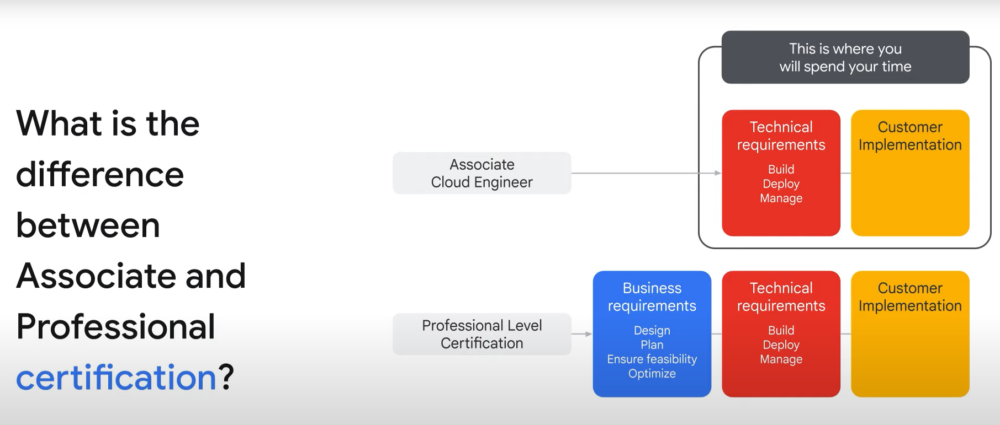

## 认证过程
略

## 制定学习计划
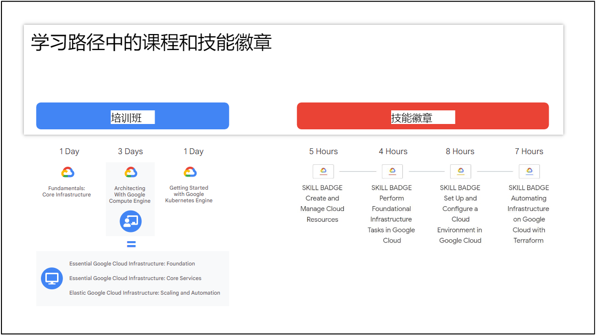

## Workbook
略

# 设置云解决方案环境
在本模块中，您将探索设置云解决方案环境所涉及的任务范围。

## 模块概述
略

## 为 Cymbal Superstore 云解决方案选择资源
迁移过程此阶段的结果包括建立资源层次结构、实施组织策略、管理项目和配额、管理用户和组以及应用访问管理。  
设置计费和监控云资源的使用情况也是需要考虑的事情。  
最后，选择与 Google Cloud 交互的方式也是一个重要的决定。  
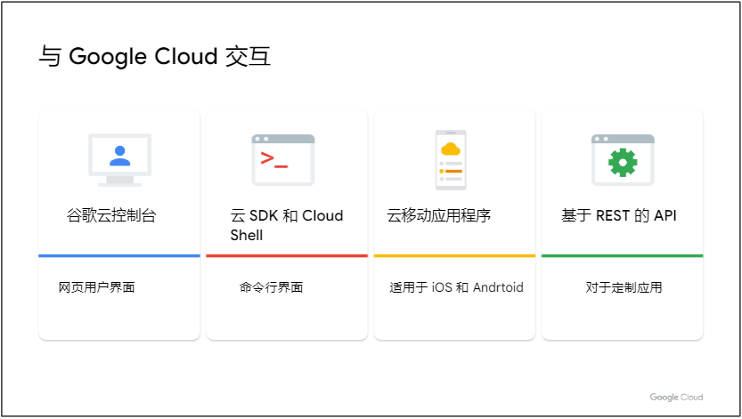  
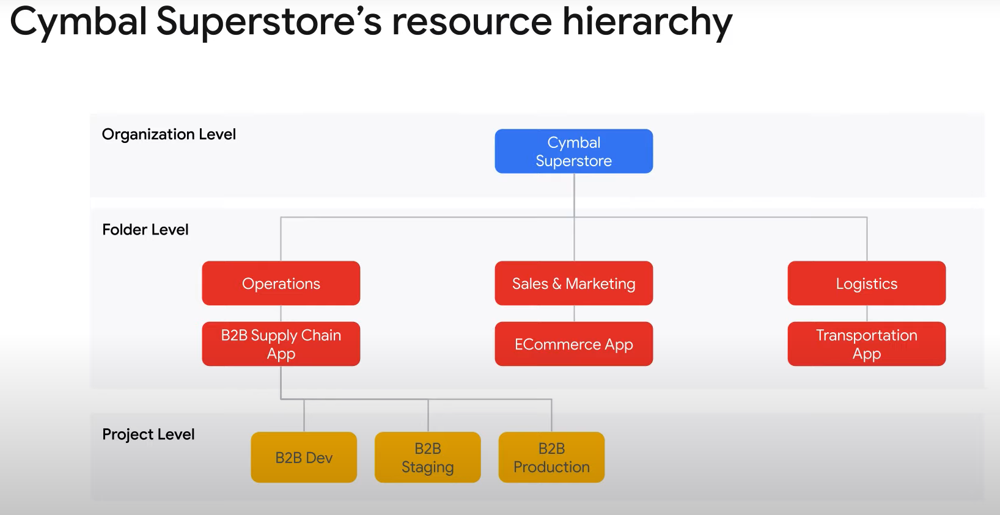  
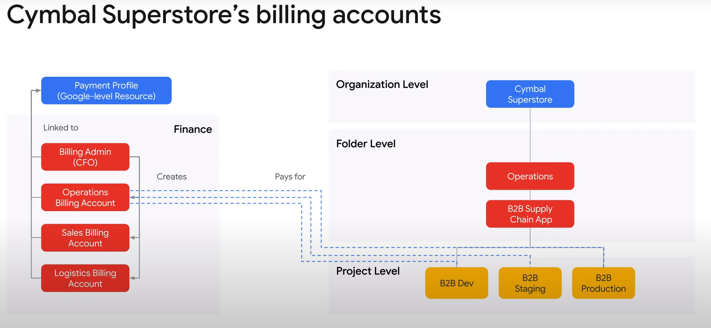  
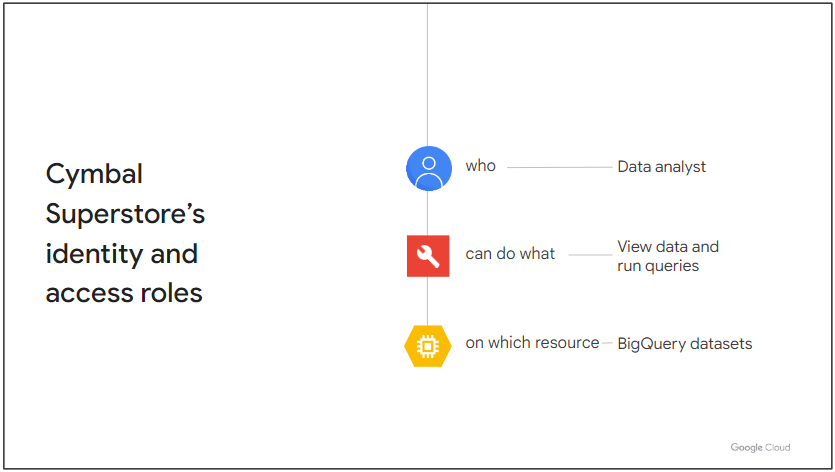  
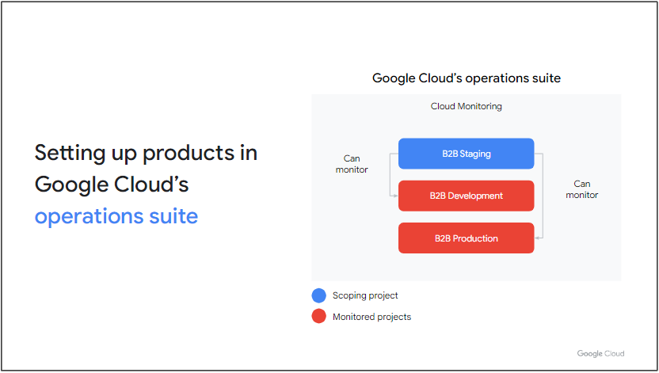

## 简介：诊断问题
略

## 诊断问题
[诊断问题](https://www.cloudskillsboost.google/course_sessions/5448985/quizzes/402592)

## 你的学习计划
1. 设置云项目和帐户
2. 管理计费配置
3. 安装和配置命令行界面 (CLI)，特别是 Cloud SDK（例如，设置默认项目）

## 学习计划资源
### 设置云项目和帐户
* 创建资源层次结构
* 将组织策略应用于资源层次结构
* 向成员授予项目内的 IAM 角色
* 管理 Cloud Identity 中的用户和组（手动和自动）
* 在项目内启用 API
* 在 Google Cloud 操作套件中配置和设置产品

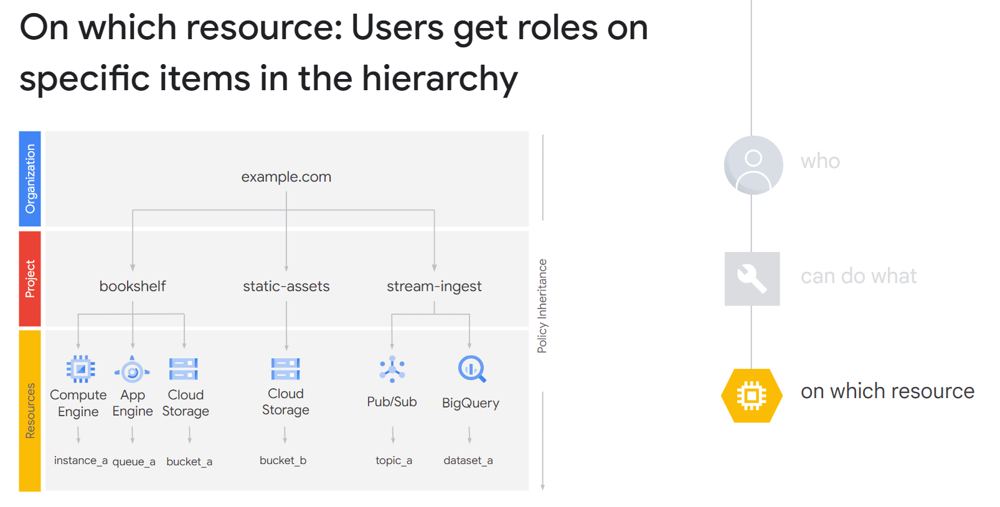  
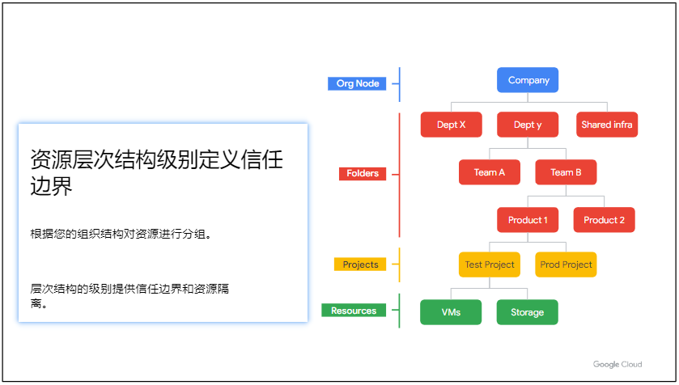  
[Google Cloud 资源层次结构详细介绍](https://cloud.google.com/resource-manager/docs/cloud-platform-resource-hierarchy?hl=zh-cn#resource-hierarchy-detail)  
[IAM 基本和预定义角色参考](https://cloud.google.com/iam/docs/understanding-roles#role_types)

### 管理计费配置
* 创建一个或多个计费帐户
* 将项目链接到计费帐户
* 建立计费预算和警报
* 设置账单导出

[管理您的 Cloud Billing 帐号](https://cloud.google.com/billing/docs/how-to/manage-billing-account?hl=zh-cn)  
[创建、修改或删除预算和预算提醒](https://cloud.google.com/billing/docs/how-to/budgets?hl=zh-cn)

### 安装和配置命令行界面
[与服务交互的方式](https://cloud.google.com/docs/overview?hl=zh-cn#ways_to_interact_with_the_services)  
[初始化 gcloud CLI](https://cloud.google.com/sdk/docs/initializing?hl=zh-cn)  
[管理 gcloud CLI 组件](https://cloud.google.com/sdk/docs/components?hl=zh-cn)  
[gcloud](https://cloud.google.com/sdk/gcloud/reference)  
[bq](https://cloud.google.com/bigquery/docs/bq-command-line-tool?hl=zh-cn)  
[gsutil 工具](https://cloud.google.com/storage/docs/gsutil?hl=zh-cn)

## 知识检测
略

# 规划和配置云解决方案
在本模块中，您将探索部署和实施 Cymbal Superstore 推荐的云解决方案所涉及的任务范围。

## 模块概述
略

## 为 Cymbal Superstore 云解决方案选择资源
略

## 简介：诊断问题
略

## 诊断问题
[诊断问题](https://www.cloudskillsboost.google/course_sessions/4322739/quizzes/375748)

## 你的学习计划
1. 使用定价计算器进行规划和估算
2. 规划和配置计算资源
3. 规划和配置数据存储选项
4. 规划和配置网络资源

## 学习计划资源
### [使用定价计算器进行规划和估算](https://cloud.google.com/products/calculator?hl=zh-cn)

### 规划和配置计算资源
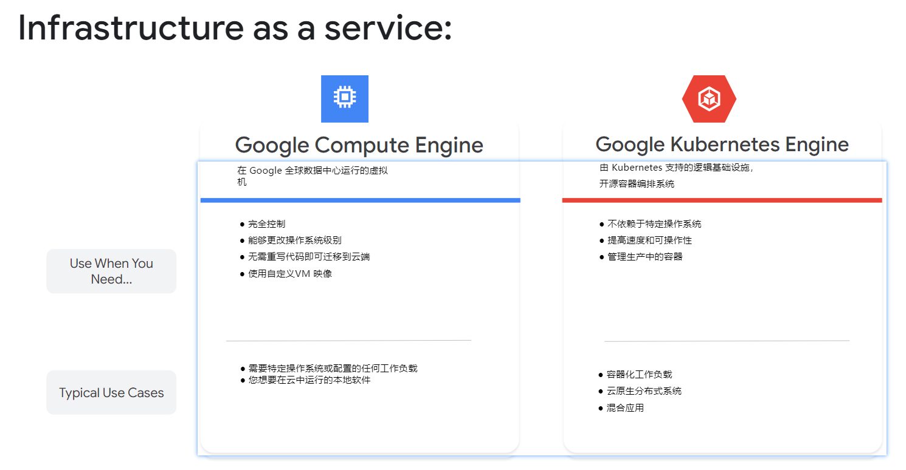  
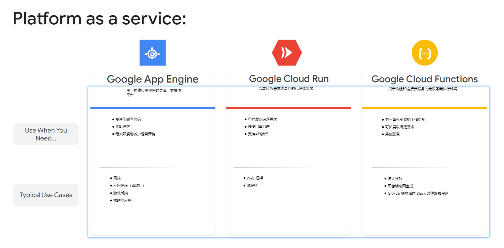

### 规划和配置数据存储选项
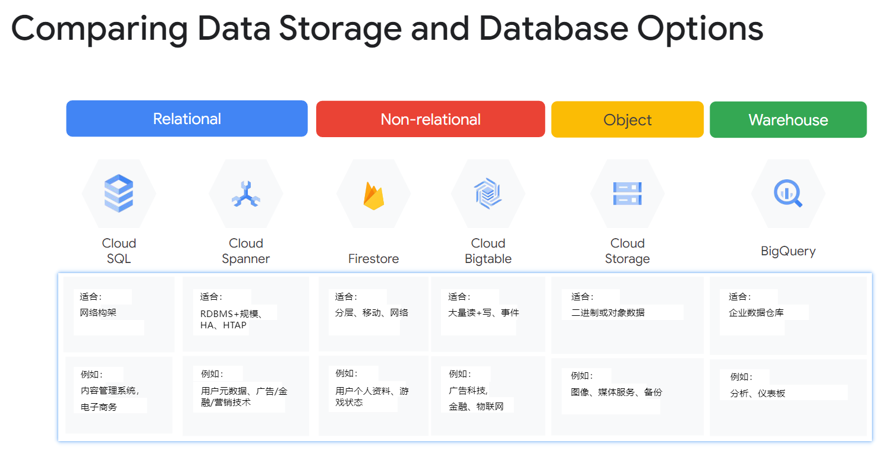  
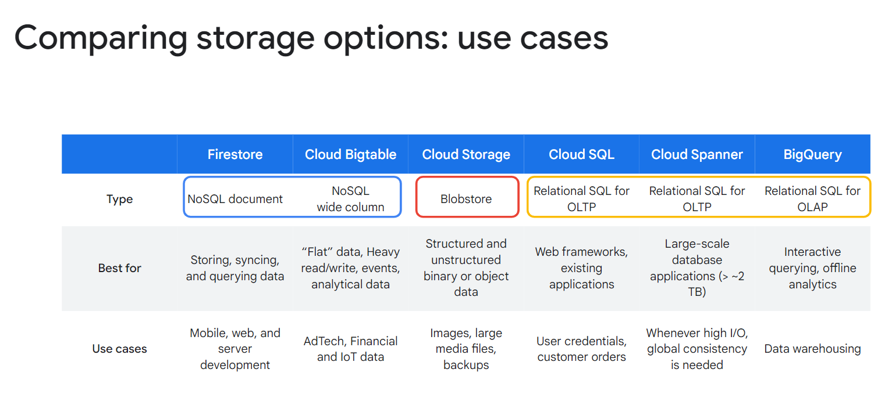  
[存储类别](https://cloud.google.com/storage/docs/storage-classes?hl=zh-cn)

### 规划和配置网络资源
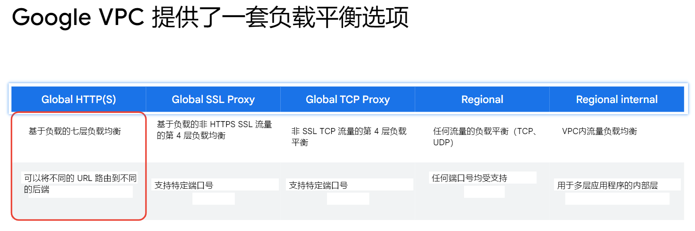  
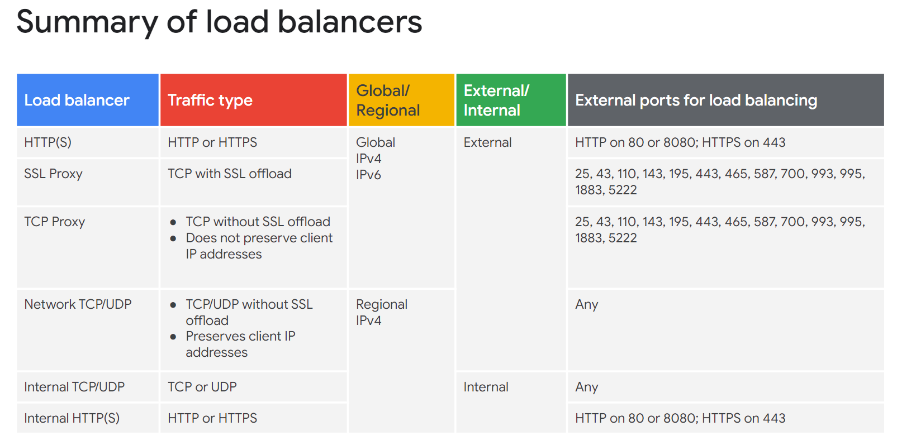  
[Cloud Load Balancing 概览](https://cloud.google.com/load-balancing/docs/load-balancing-overview?hl=zh-cn)

## 知识检测
略

# 部署和实施云解决方案
在本模块中，您将探索部署和实施 Cymbal Superstore 推荐的云解决方案所涉及的任务范围。

## 模块概述
略

## 为 Cymbal Superstore 云解决方案选择资源
略

## 简介：诊断问题
略

## 诊断问题
[诊断问题](https://www.cloudskillsboost.google/course_sessions/4322739/quizzes/375755)

## 你的学习计划
1. 部署和实施 Compute Engine 资源
2. 部署和实施 Google Kubernetes Engine 资源
3. 部署和实施 Cloud Run 和 Cloud Functions 资源
4. 部署和实施数据解决方案
5. 部署和实施网络资源
6. 使用 Cloud Marketplace 部署解决方案
7. 通过基础设施即代码实施资源

## 学习计划资源
### 部署和实施 Compute Engine 资源
* 使用 Cloud Console 和 Cloud SDK 启动计算实例（GCloud - 例如分配磁盘、可用性政策、SSH 密钥）
* 使用实例模板创建自动扩缩的托管实例组
* 为实例生成/上传自定义 SSH 密钥
* 安装并配置云监控日志代理
* 评估计算配额并请求增加

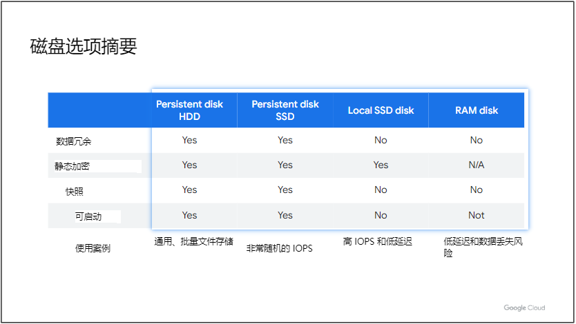  
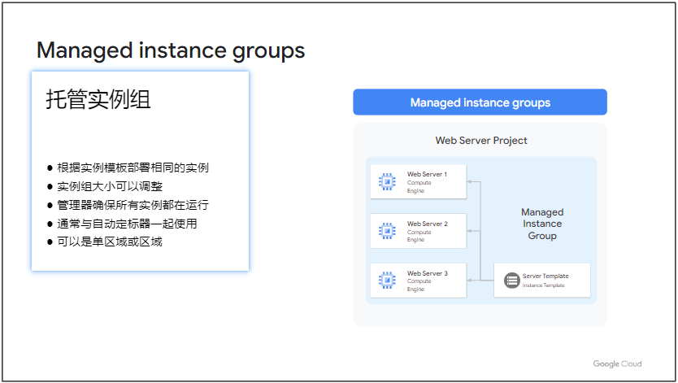  
[在 Google Cloud 上托管应用](https://cloud.google.com/hosting-options?hl=zh-cn)  
[机器系列和系列建议](https://cloud.google.com/compute/docs/machine-types?hl=zh-cn)   
[存储选项](https://cloud.google.com/compute/docs/disks?hl=zh-cn)  
[创建代管式实例组 (MIG) 的基本场景](https://cloud.google.com/compute/docs/instance-groups/creating-groups-of-managed-instances?hl=zh-cn)

### 部署和实施 Google Kubernetes Engine 资源
* 安装和配置 Kubernetes (kubectl) 的命令行界面 (CLI)
* 部署具有不同配置的 Google Kubernetes Engine 集群，包括 AutoPilot、区域集群、私有集群等
* 将容器化应用程序部署到 Google Kubernetes Engine
* 配置 Google Kubernetes Engine 监控和日志记录

[集群配置选项简介](https://cloud.google.com/kubernetes-engine/docs/concepts/types-of-clusters?hl=zh-cn)

### 部署和实施 Cloud Run 和 Cloud Functions 资源
* 部署应用程序并更新扩展配置、版本和分流
* 部署接收 Google Cloud 事件（例如，Pub/Sub 事件、Cloud Storage 对象更改通知事件）的应用程序

[选择 App Engine 环境](https://cloud.google.com/appengine/docs/the-appengine-environments?hl=zh-cn)  
[Cloud Run：没有人告诉您的有关无服务器的信息](https://cloud.google.com/blog/topics/developers-practitioners/cloud-run-story-serverless-containers?hl=en)  
[快速掌握云函数](https://cloud.google.com/blog/topics/developers-practitioners/learn-cloud-functions-snap?hl=en)

### 部署和实施数据解决方案
* 使用产品初始化数据系统（例如 Cloud SQL、Firestore、BigQuery、Cloud Spanner、Pub/Sub、Cloud Bigtable、Dataproc、Dataflow、Cloud Storage）
* 加载数据（例如，命令行上传、API 传输、导入/导出、从 Cloud Storage 加载数据、将数据流式传输到 Pub/Sub）

[Cloud Storage 产品概览](https://cloud.google.com/storage/docs/introduction?hl=zh-cn)  
[创建存储桶](https://cloud.google.com/storage/docs/creating-buckets?hl=zh-cn)  
[如何将数据提取到 BigQuery 中以便进行分析](https://cloud.google.com/blog/topics/developers-practitioners/bigquery-explained-data-ingestion?hl=en)  
[数据加载简介](https://cloud.google.com/bigquery/docs/loading-data?hl=zh-cn)

### 部署和实施网络资源
* 创建带子网的 VPC（例如自定义模式 VPC、共享 VPC）
* 使用自定义网络配置启动 Compute Engine 实例
* 为 VPC 创建入口和出口防火墙规则
* 使用 Cloud VPN 在 Google VPC 和外部网络之间创建 VPN
* 创建负载均衡器以将应用程序网络流量分配给应用程序

[VPC 网络](https://cloud.google.com/vpc/docs/vpc?hl=zh-cn)

### 使用 Cloud Marketplace 部署解决方案
* 浏览Cloud Marketplace 目录并查看解决方案详细信息
* 部署云市场解决方案

### 通过基础设施即代码实施资源
* 通过Cloud Foundation Toolkit 模板构建基础设施并实施最佳实践
* 在 GKE 中安装和配置 Config Connector 以创建、更新、删除和保护资源

[Terraform 文档](https://cloud.google.com/docs/terraform?hl=zh-cn)

## 知识检测
略

# 确保云解决方案的成功运行
在本模块中，您将探索确保成功云操作的范围，包括管理计算、存储和网络资源以及监控和日志记录任务。

## 模块概述
略

## 为 Cymbal Superstore 云解决方案选择资源
略

## 简介：诊断问题
略

## 诊断问题
[诊断问题](https://www.cloudskillsboost.google/course_sessions/4322739/quizzes/375762)

## 你的学习计划
* 管理 Compute Engine 资源
* 管理 Google Kubernetes Engine 资源
* 管理 Cloud RUn 资源
* 管理存储和数据库解决方案
* 管理网络资源
* 监视和日志记录

## 学习计划资源
### 管理 Compute Engine 资源
* 管理单个 VM 实例（例如，启动、停止、编辑配置或删除实例）
* 远程连接到实例
* 将 GPU 附加到新实例并安装必要的依赖项
* 查看当前正在运行的虚拟机清单（实例 ID、详细信息）
* 使用快照（例如，从虚拟机创建快照、查看快照、删除快照）
* 使用映像（例如，从 VM 或快照创建映像、查看映像、删除映像）
* 使用实例组（例如，设置自动扩展参数、分配实例模板、创建实例模板，删除实例组）
* 使用管理界面（例如，云控制台、云外壳、云 SDK）

[实例模板](https://cloud.google.com/compute/docs/instance-templates?hl=zh-cn)  
[实例组](https://cloud.google.com/compute/docs/instance-groups?hl=zh-cn)

### 管理 Google Kubernetes Engine 资源
* 查看当前正在运行的集群清单（节点、Pod 和服务）
* 浏览 Docker 镜像并在工件注册表中查看其详细信息
* 使用节点池（例如，添加、编辑或删除节点池）
* 使用 pod（例如，添加、编辑或删除 pod）
* 使用服务（例如，添加、编辑或删除服务）
* 使用有状态应用程序（例如持久卷、有状态集）
* 管理水平和垂直自动缩放配置。
* 使用管理界面（例如，Cloud Console、Cloud Shell、Cloud SDK、kubectl）

[GKE 概览](https://cloud.google.com/kubernetes-engine/docs/concepts/kubernetes-engine-overview)  
[Pod](https://cloud.google.com/kubernetes-engine/docs/concepts/pod)  
[deployment](https://cloud.google.com/kubernetes-engine/docs/concepts/deployment)  
[Service](https://cloud.google.com/kubernetes-engine/docs/concepts/service)  

### 管理 Cloud Run 资源
* 调整应用流量拆分参数
* 设置自动伸缩实例的伸缩参数
* 确定是运行云运行（完全托管）还是为安托斯运行云运行

[关于实例自动扩缩](https://cloud.google.com/run/docs/about-instance-autoscaling?hl=zh-cn)

### 管理存储和数据库解决方案
* 管理和保护云存储桶内和云存储桶之间的对象
* 为云存储桶设置对象生命周期管理策略
* 执行查询以从数据实例（例如，Cloud SQL、BigQuery、Cloud Spanner、云数据存储、云大表）
* 估算数据存储资源的成本
* 备份和还原数据库实例（例如，云 SQL、云数据存储）
* 在 Cloud Dataproc、Cloud Dataflow 或 BigQuery 中查看作业状态

[对象生命周期管理](https://cloud.google.com/storage/docs/lifecycle?hl=zh-cn)

### 管理网络资源
* 将子网添加到现有 VPC
* 扩展子网以拥有更多 IP 地址
* 保留静态外部或内部 IP 地址
* 使用 CloudDNS、CloudNAT、负载均衡器和防火墙规则

### 监视和日志记录
* 根据资源指标创建云监控警报
* 创建和摄取云监控自定义指标（例如，从应用程序或日志）
* 配置日志接收器以将日志导出到外部系统（例如，本地或 BigQuery）
* 配置日志路由器
* 在云日志记录中查看和过滤日志
* 在云日志记录中查看特定日志消息详细信息
* 使用云诊断来研究应用程序问题（例如，查看云跟踪数据、使用云调试以查看应用程序时间点）
* 查看谷歌云平台状态

[创建指标阈值提醒政策](https://cloud.google.com/monitoring/alerts/using-alerting-ui?hl=zh-cn)  
[提醒概览](https://cloud.google.com/monitoring/alerts?hl=zh-cn)

## 知识检测
略

# 配置访问和安全
在本模块中，您将探索配置访问和安全性的范围。 这涉及管理 IAM 以及云解决方案的服务帐户。

## 模块概述
略

## 管理 Cymbal Superstore 云解决方案的访问
略

## 简介：诊断问题
略

## 诊断问题
[诊断问题](https://www.cloudskillsboost.google/course_sessions/4322739/quizzes/375769)

## 你的学习计划
略

## 学习计划资源
略

## 知识检测
略

