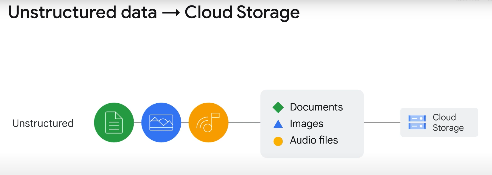
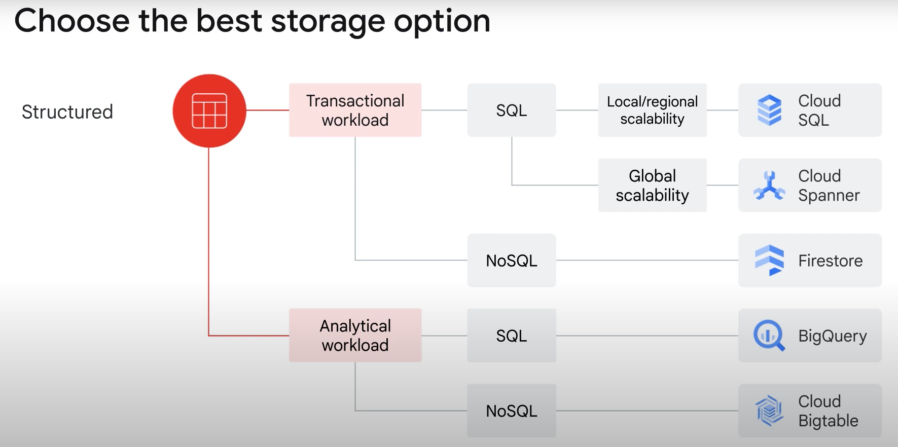

# 课程信息
## 目标
* 实施各种结构化和非结构化存储模型。
* 讨论云中不同的应用程序托管服务选项。
* 概述如何在 Google Cloud 中管理云安全。

# 课程介绍
略

# 我在哪里存储这些东西？
## 介绍
您将了解 Google Cloud 中提供的存储和数据库选项。  
1. 探索 Google Cloud 中提供的不同存储选项。
2. 学习区分云中的结构化和非结构化存储。
3. 检查如何使用 Cloud Storage 进行非结构化数据存储。
4. 探索关系存储选项与 NoSQL 存储选项的用例，并确定 Google Cloud 可用的选项。

这是本模块的议程。  
* 首先了解云中的不同存储选项，其中包括结构化和非结构化存储。
* 接下来，我们将学习如何使用 Cloud Storage 利用非结构化存储，并完成一个实践实验室，探索一系列适用于 Cloud Storage 的活动。
* 我们将继续了解 SQL 托管服务的用例。
* 接下来，我们将探索 Cloud SQL，然后完成另一个实验，在该实验中我们将创建并连接到Cloud SQL for MySQL 实例并使用 Google Cloud 控制台和 mysql 客户端执行基本 SQL 操作。
* 我们将了解如何利用 Cloud Spanner 并探索可用的 NoSQL 选项。
* 然后，我们将讨论使用 Firestore 作为完全托管、可扩展且无服务器的文档数据库。
* 我们将通过描述如何将 Cloud Bigtable 用作 NoSQL 选项来完成本模块。

## Google Cloud 中提供的不同存储选项
Google Cloud 提供关系型和非关系型数据库以及全球对象存储。  
选择正确的选项来存储和处理数据通常取决于需要存储的数据类型和业务需求。  
存在三种常见的云存储用例。  
1. 首先是内容存储和交付。
2. 第二个用例是用于数据分析和通用计算的存储。
3. 第三个用例是备份和归档存储。

## 区分云中的结构化和非结构化存储
非结构化数据是以非表格形式存储的信息，例如文档、图像和音频文件。非结构化数据通常最适合 Cloud Storage 。
  
结构化数据，它表示存储在表、行和列中的信息。  
  
结构化数据有两种类型：事务工作负载和分析工作负载。  

---

事务工作负载源于在线事务处理系统，当需要快速数据插入和更新来构建基于行的记录时，会使用该系统。  
如果您的数据是事务性的并且需要使用 SQL 访问它，那么 Cloud SQL 和 Cloud Spanner 是两个选择。  
Cloud SQL 最适合本地到区域的可扩展性，但 Cloud Spanner 最适合在全球范围内扩展数据库。  
如果无需 SQL 即可访问事务数据，Firestore 可能是最佳选择。  
Firestore 是一个事务型 NoSQL、面向文档的数据库。

---

分析工作负载，它们源于在线分析处理系统，在需要读取整个数据集时使用。  
如果您的分析工作负载需要 SQL 命令，BigQuery 可能是最佳选择。  
BigQuery 是 Google 的数据仓库解决方案，可让您分析 PB 级数据集。  
Bigtable 还为分析工作负载提供可扩展的 NoSQL 解决方案。  
它最适合仅需要毫秒延迟的实时、高吞吐量应用程序。  

  

## 如何使用 Cloud Storage 进行非结构化数据存储
### 什么是对象存储？
对象存储是一种计算机数据存储架构，它将数据作为“对象”进行管理，而不是作为文件和文件夹层次结构（文件存储）或磁盘块（块存储）进行管理。  
这些对象以打包格式存储，其中包含实际数据本身的二进制形式、相关的关联元数据（例如创建日期、作者、资源类型和权限）以及全局唯一标识符。  

---

Cloud Storage 中有四种主要存储类别，存储的数据根据​​其所属类别进行管理和计费。
* 第一个是标准存储。标准存储被认为最适合频繁访问或“热”数据。它也非常适合仅存储短暂时间的数据。
* 第二个存储类别是近线存储。这最适合存储不经常访问的数据，例如平均每月读取或修改一次数据。
* 第三种存储类别是 Coldline 存储。冷线存储最多每 90 天读取或修改一次数据。
* 第四种存储类别是归档存储。这是成本最低的选项，非常适合数据归档、在线备份和灾难恢复。对于您计划每年访问次数少于一次的数据来说，这是最佳选择。

---

有几个特征适用于所有这些存储类别。
* 无最小对象大小要求的无限存储、全球可访问性和位置、低延迟和高耐用性、统一的体验（扩展到安全性、工具和 API）以及地理冗余（如果数据存储在多区域或双区域中）。
* Cloud Storage 文件被组织到存储桶中。存储桶需要一个全局唯一的名称和存储它的特定地理位置，而存储桶的理想位置是延迟最小化的地方。
* Cloud Storage 提供的存储对象是“不可变的”，这意味着您不能编辑它们，而是会在每次更改时创建一个新版本。
* 管理员可以允许每个新版本完全覆盖旧版本，也可以通过在存储桶中启用“版本控制”来跟踪对特定对象所做的每个更改。
* Cloud Storage 还为您的对象提供生命周期管理策略。
* Cloud Storage 与其他 Google Cloud 产品和服务的紧密集成意味着可以通过多种其他方式将数据移至该服务中。

## 实验室简介：云存储：Qwik Start - CLI/SDK
在本实验中，您将：
* 将对象上传到存储桶
* 从存储桶下载对象
* 将对象复制到存储桶中的文件夹
* 列出存储桶或文件夹的内容
* 列出对象的详细信息
* 以及，使对象可公开访问。

## 云存储：Qwik Start - CLI/SDK (GSP074)
### 概览
在本实操实验中，您将学习如何使用 Google Cloud 命令行创建存储桶，向其中上传对象，在其中创建文件夹和子文件夹，并将这些对象设为可公开访问。

### 设置和要求
略

### 检验您的掌握情况
略

### 将对象上传到存储桶
略

### 从存储桶下载对象
略

### 将对象复制到存储桶中的文件夹
略

### 列出存储桶或文件夹的内容
略

### 列出对象的详细信息
略

### 将您的对象设为可公开访问
略

### 检验您的掌握情况
略

### 移除公共访问权限
略

### 检验您的掌握情况
略

### 恭喜！
略

## SQL 托管服务
数据库是经过组织的信息集合，以便可以轻松访问和管理。  
用户正在使用数据库构建软件应用程序来回答业务问题，例如购买机票、提交费用报告、存储照片或存储医疗记录。  
Google Cloud 提供两种托管关系数据库服务：Cloud SQL 和 Cloud Spanner。  

## 探索 Cloud SQL 
Cloud SQL 提供完全托管的关系数据库，包括 MySQL、PostgreSQL 和 SQL Server 即服务。  
它旨在将平凡但必要且通常耗时的任务交给 Google（例如应用补丁和更新、管理备份和配置复制），以便您可以专注于构建出色的应用程序。  
Cloud SQL：
* 不需要任何软件安装或维护。
* 最多可扩展至 96 个处理器内核、624 GB RAM 和 64 TB 存储空间。
* 支持自动复制场景，例如从 Cloud SQL 主实例、外部主实例和外部 MySQL 实例。
* 支持托管备份，因此备份数据可以安全存储，并且在需要恢复时可以访问。
* 在 Google 内部网络上以及存储在数据库表、临时文件和备份中时加密客户数据。
* 包括网络防火墙，控制对每个数据库实例的网络访问。

## 实验室简介：Cloud SQL for MySQL：Qwik Start
在本实验中，您将：
* 创建 Cloud SQL 实例。
* 在 Cloud Shell 中使用 mysql 客户端连接到实例。

## Cloud SQL for MySQL：Qwik Start (GSP151)
### 概述
在本实验中，您将学习如何创建并连接到 Google Cloud SQL MySQL 实例，以及如何使用 Cloud Console 和 mysql 客户端执行基本 SQL 操作。

### 设置和要求
略

### 任务 1. 创建 Cloud SQL 实例
略

### 任务 2. 在 Cloud Shell 中使用 mysql 客户端连接到您的实例
略

### 任务3.创建数据库并上传数据
略

### 恭喜！
略

## Cloud Spanner 用作托管服务
Cloud Spanner 是一种完全托管的关系数据库服务，可水平扩展、高度一致并使用 SQL。  
Cloud Spanner 特别适合需要以下功能的应用程序：
* 具有联接和二级索引的 SQL 关系数据库管理系统
* 内置高可用性
* 强大的全局一致性 
* 以及每秒大量的输入/输出操作

那么 Cloud Spanner 是如何工作的呢？
Google Spanner 使用区域内和跨区域的复制来实现可用性，因此，如果一个区域离线，仍然可以从另一个区域提供用户的数据。

## NoSQL 托管服务选项
Google 提供两种托管 NoSQL 数据库选项：Firestore 和 Cloud Bigtable。
* Firestore 是一个完全托管的无服务器 NoSQL 文档存储，支持 ACID 事务。
* Cloud Bigtable 是 PB 级稀疏宽列 NoSQL 数据库，可提供极低的写入延迟。

## Firestore，NoSQL 文档存储
探索 Firestore，这是一个数据库，可让您使用完全托管、可扩展且无服务器的文档数据库开发丰富的应用程序。  
Firestore 是一种灵活、水平可扩展的 NoSQL 云数据库，适用于移动、Web 和服务器开发。  

---

使用 Firestore，传入数据存储在文档结构中，然后将这些文档组织成集合。  
除了子集合之外，文档还可以包含复杂的嵌套对象。  
然后，Firestore 的 NoSQL 查询可用于检索单个特定文档或检索集合中与查询参数匹配的所有文档。  
查询可以包括多个链接的过滤器，并组合过滤和排序选项。  
默认情况下也会对它们建立索引，因此查询性能与结果集的大小成正比，而不是与数据集的大小成正比。  
Firestore 使用数据同步来更新任何连接设备上的数据。  
但是，它还旨在高效地进行简单的一次性获取查询。  
它缓存应用程序正在使用的数据，因此即使设备处于离线状态，应用程序也可以写入、读取、侦听和查询数据。当设备重新上线时，Firestore 会将所有本地更改同步回 Firestore。  
Firestore 利用 Google Cloud 强大的基础设施：自动多区域数据复制、强一致性保证、原子批量操作和真实事务支持。

## Bigtable 作为 NoSQL 选项
Bigtable是Google的NoSQL大数据数据库服务。  
Bigtable 旨在以一致的低延迟和高吞吐量处理大量工作负载，因此它是运营和分析应用程序的绝佳选择，包括物联网、用户分析和财务数据分析。

---

如果满足以下条件，客户通常会选择 Bigtable：
* 他们正在处理超过 1TB 的半结构化或结构化数据。
* 数据速度快且吞吐量高，或者数据变化很快。
* 他们正在使用 NoSQL 数据。这通常意味着不需要强关系语义的事务。
* 数据是时间序列或具有自然语义顺序。
* 他们正在处理大数据，对数据运行异步批处理或同步实时处理。
* 或者他们正在对数据运行机器学习算法。

---

Bigtable 可以与其他 Google Cloud 服务和第三方客户端交互。
* 使用 API，可以通过数据服务层（例如托管 VM、HBase REST 服务器或使用 HBase 客户端的 Java 服务器）从 Bigtable 读取数据或将数据写入 Bigtable。通常，这用于向应用程序、仪表板和数据服务提供数据。
* 数据还可以通过各种流行的流处理框架（例如 Dataflow Streaming、Spark Streaming 和 Storm）进行流式传输。
* 如果无法选择流式处理，也可以通过 Hadoop MapReduce、Dataflow 或 Spark 等批处理流程从 Bigtable 读取数据或将数据写入 Bigtable。

## 测验
略

## 总结
略

