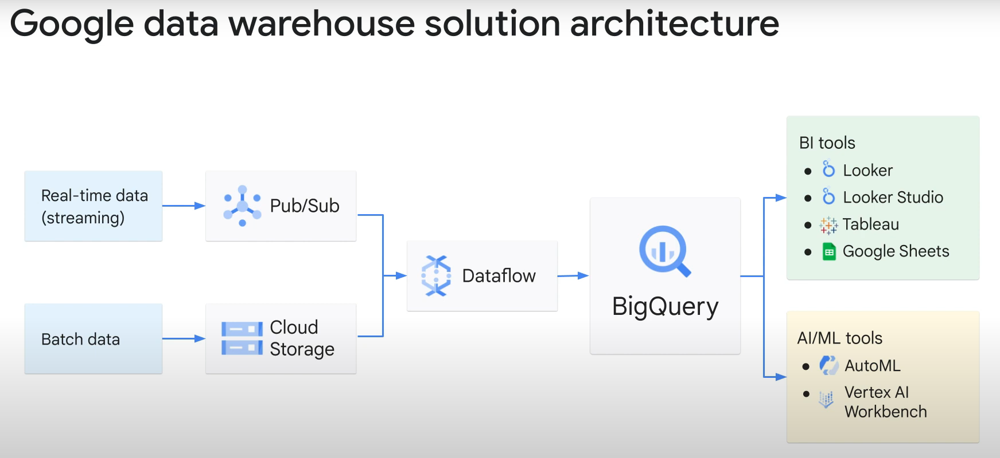

# 课程信息
## 目标
* 发现云中的各种托管大数据服务。
* 解释什么是机器学习、使用的术语及其价值主张。

# 课程介绍
略

# 你有数据，但你用它做什么呢？
大数据：发现云中的各种托管大数据服务

## 介绍
欢迎来到 Google 云计算基础课程的第 9 单元：您拥有数据，但您正在用它做什么？  
在本模块中，您将了解 Google 提供的一些用于处理大数据的托管服务。  
这意味着您将：
* 探索云中的大数据托管服务。
* 检查使用 Dataproc 将 Apache Hadoop、Apache Spark 和其他大数据技术作为云中的托管服务运行。
* 了解如何使用 Dataflow 将 ETL 管道构建为托管服务。
* 探索 BigQuery 作为托管数据仓库和分析引擎。

模块议程遵循目标:
* 首先介绍云中的大数据托管服务，然后介绍如何通过 Dataproc 使用大数据操作。
* 然后，您将使用 Google Cloud 控制台和 gcloud CLI 创建 Dataproc 集群并执行各种任务来完成两个实验。
* 探索如何使用 Dataflow 执行提取、转换和加载操作。您将使用数据流模板来创建流式传输管道。您将设置 Python 开发环境，获取适用于 Python 的 Dataflow SDK，并使用 Google Cloud 控制台运行示例管道。
* 您将了解 BigQuery 作为数据仓库的作用，然后再通过另一个实践实验室来了解 Dataprep。

## 云中的大数据托管服务
大数据架构允许公司分析其存储的数据以了解其业务。在本模块中，我们将重点介绍 Google 为数据处理提供的三种托管服务。
* 对于已经投资 Apache Hadoop 和 Apache Spark 并希望继续使用这些工具的公司来说，Dataproc 提供了一种在 Google Cloud 中运行开源软件的绝佳方法。
* 寻求流数据解决方案的公司可能对 Dataflow 作为托管服务更感兴趣。Dataflow 针对结构化和非结构化数据的大规模批处理或长时间运行的流处理进行了优化。
* 第三个托管服务是 BigQuery，它提供了一种经过优化的数据分析解决方案，可在 PB 级数据集上快速获取答案。BigQuery 允许对结构化数据进行快速 SQL。

## 通过 Dataproc 利用大数据
了解 Dataproc 如何提供快速、简单且经济高效的方式来运行 Apache Hadoop 和 Apache Spark。  
Apache Hadoop 和 Apache Spark 是开源技术，通常是大数据处理的基础。  
Apache Hadoop 是一组工具和技术，使计算机集群能够存储和处理大量数据。它将各个计算机智能地连接到一个集群中，以分布数据的存储和处理。  
Apache Spark 是用于大规模数据处理的统一分析引擎，可实现批处理和流数据的高性能。  
Dataproc 是一项托管 Spark 和 Hadoop 服务，可让您使用开源数据工具进行批处理、查询、流式处理和机器学习。Dataproc 自动化可帮助您快速创建集群、轻松管理集群，并且由于集群通常运行时间较短，因此您可以节省资金，因为它们会在您不需要时关闭。  
让我们看看 Dataproc 的主要功能：
* 成本效益
* 快速且可扩展
* 开源生态系统
* 完全托管
* 映像版本控制
* 内置集成

## 实验室简介：Dataproc：Qwik Start - 控制台
您将创建一个 Dataproc 集群，在集群中运行一个简单的 Apache Spark 作业，并使用 Google Cloud 控制台修改集群中的工作线程数量。

## Dataproc：Qwik Start - 控制台 (GSP103)
### 概览
Cloud Dataproc 是一项快速、简单易用的全托管式云服务，为您提供了一种更简单、更经济实惠的方式来运行 Apache Spark 和 Apache Hadoop 集群。过去需要数小时或数天才能完成的操作现在只需几秒钟或几分钟就可以完成。您可以快速创建 Cloud Dataproc 集群并随时调整其规模，而不必担心您不断增长的数据流水线负载超过集群处理能力。

本实验向您介绍如何使用 Google Cloud Console 创建 Google Cloud Dataproc 集群，在该集群中运行简单的 Apache Spark 作业，然后修改该集群中的工作器数量。

### 设置和要求
略

### 创建集群
略

### 提交作业
略

### 查看作业的输出结果
略

### 检验您的掌握情况
略

### 恭喜！
略

## 实验室简介：Dataproc：Qwik Start - 命令行
略

## Dataproc：Qwik Start - 命令行 (GSP104)
### 概述
略

### 设置和要求
略

### 任务 1. 创建集群
略

### 任务 2. 提交作业
略

### 任务 3. 更新集群
略

### 任务 4. 测试您的理解程度
略

### 恭喜！
略

## 使用 Dataflow 构建提取、转换和加载管道
使用 Dataflow 执行提取、转换和加载操作。  
Dataflow 是 Google 提供的一项托管服务，针对大规模批处理或长时间运行的流处理进行了优化。Dataflow 创建一个管道来处理流数据和批数据。  

## 实验室简介：Dataflow：Qwik Start - 模板
在本实验中，我们将使用 Google 提供的 Pub/Sub to BigQuery 模板在 Dataflow 中创建流式处理管道。  
您将学习如何使用 Cloud Shell 和/或 Google Cloud 控制台创建 BigQuery 数据集和表、运行管道并提交查询。  

## Dataflow：Qwik Start - 模板 (GSP192)
### 概述
您将学习如何使用 Google 的 Cloud Dataflow 模板之一创建流式处理管道。更具体地说，您将使用 Cloud Pub/Sub to BigQuery 模板，该模板从 Pub/Sub 主题读取以 JSON 编写的消息并将其推送到 BigQuery 表。您可以在 Google 提供的模板入门指南中找到此模板的文档。  

### 设置
略

### 任务 1. 使用 Cloud Shell 创建 Cloud BigQuery 数据集和表
略

### 任务 2. 使用 Cloud Console 创建 Cloud BigQuery 数据集和表
略

### 任务 3. 运行管道
略

### 任务 4. 提交查询
略

### 任务 5. 测试您的理解程度
略

### 恭喜！
略

## 实验室简介：Dataflow：Qwik Start - Python
您将学习如何设置 Python 开发环境、获取适用于 Python 的 Dataflow SDK 以及使用 Google Cloud 控制台运行示例管道。

## Dataflow：Qwik Start - Python
### 概览
在本实验中，您将设置自己的 Python 开发环境，获取 Python 版 Cloud Dataflow SDK，并使用 Cloud Console 运行示例流水线。

### 设置和要求
略

### 任务 1. 创建 Cloud Storage 存储桶
略

### 任务 2. 安装 pip 和 Cloud Dataflow SDK
略

### 任务 3. 远程运行示例流水线
略

### 任务 4. 检查您的运行结果是否成功
略

### 任务 5. 检验您的掌握情况
略

## BigQuery，Google 的企业数据仓库
BigQuery 是一个完全托管的无服务器数据仓库。数据仓库是一个大型存储，包含从组织内的各种来源收集的 TB 和 PB 数据，用于指导管理决策。  
让我们看一下 BigQuery 的一些主要功能：
1. BigQuery 提供两种服务合二为一：存储加分析。它是存储 PB 级数据的地方。BigQuery 也是一个分析数据的地方，具有机器学习、地理空间分析和商业智能等内置功能。
2. BigQuery 是一种完全托管的无服务器解决方案，这意味着您可以使用 SQL 查询来回答组织在前端的最大问题，而无需担心后端的基础设施。
3. BigQuery 具有灵活的即用即付定价模式，您可以根据查询处理的数据字节数以及任何永久表存储付费。
4. BigQuery 中的数据默认进行静态加密，无需客户执行任何操作。静态加密是指加密用于保护存储在磁盘（包括固态驱动器或备份介质）上的数据。
5. BigQuery具有内置的机器学习功能，因此您可以使用SQL直接在BigQuery中编写ML模型。

那么数据仓库解决方案的典型架构是什么样的呢？  

BigQuery 可以从各种来源提取数据集，包括：
* 内部数据：即直接保存在 BigQuery 中的数据。
* 外部数据：例如存储在其他 Google Cloud 存储服务中的数据。
* 多云数据：即存储在多个云服务中的数据，例如AWS或Azure。
* 公共数据集：如果您没有自己的数据，您可以分析 Cloud Marketplace 中提供的任何公共数据集。

您可以使用三种基本模式将数据加载到 BigQuery 中：
* 批量加载：其中源数据通过单个批量操作加载到 BigQuery 表中。
* 流式传输：连续流式传输较小批次的数据，以便数据可用于近乎实时的查询。
* 生成数据：SQL 语句用于将行插入现有表或将查询结果写入表。

## 实验室简介: Dataprep: Qwik Start
您将使用 Dataprep 导入数据集并创建配方以将数据解释为有意义的结果。

## Dataprep: Start (GSP105)
### 概述
Trifacta 的 Cloud Dataprep 是一项智能数据服务，用于直观地探索、清理和准备数据以进行分析。 Cloud Dataprep 是无服务器的，可以在任何规模下使用。没有可供部署或管理的基础设施。只需点击几下即可轻松准备数据，无需任何代码！  
在本实验中，您将使用 Dataprep 来操作数据集。您导入数据集、更正不匹配的数据、转换数据和连接数据。

### 设置和要求
略

### 任务 1. 在您的项目中创建 Cloud Storage 存储桶
略

### 任务 2.初始化 Cloud Dataprep
略

### 任务 3. 创建流
略

### 任务 4. 导入数据集
略

### 任务 5. 准备候选文件
略

### 任务 6.整理贡献文件并将其加入候选人文件
略

### 任务 7. 数据摘要
略

### 任务 8. 重命名列
略

### 恭喜！
略

## 测验
略

## 总结
让我们快速总结一下：
* 探索了云中的大数据托管服务。
* 研究了如何使用 Dataproc 将 Hadoop、Spark 和其他大数据技术作为云中的托管服务运行。
* 了解了如何使用 Dataflow 将 ETL 管道构建为托管服务。
* 探索了 BigQuery，它是一个托管数据仓库和分析引擎。

# 让机器来做工作
机器学习：解释什么是机器学习、使用的术语及其价值主张

# Course review 课程回顾
本课程最后回顾了每个部分所涵盖的要点。