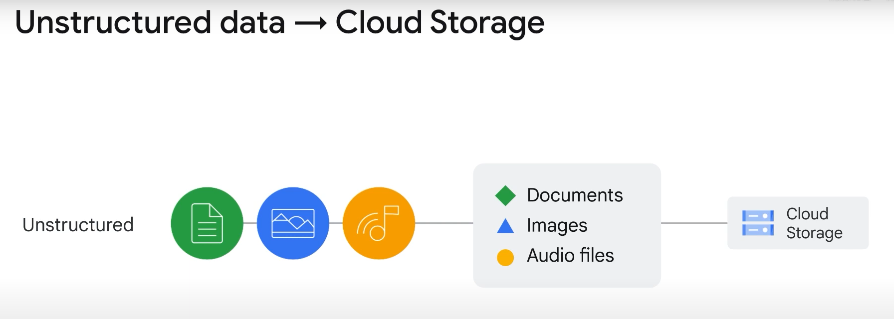
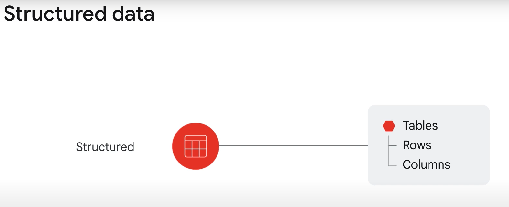
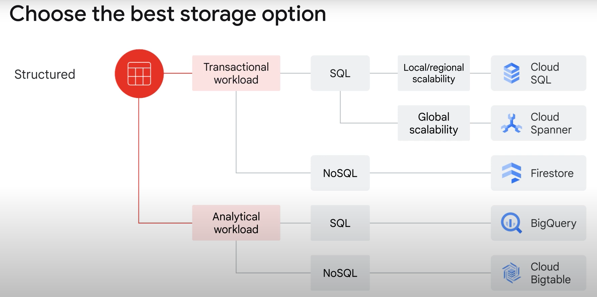
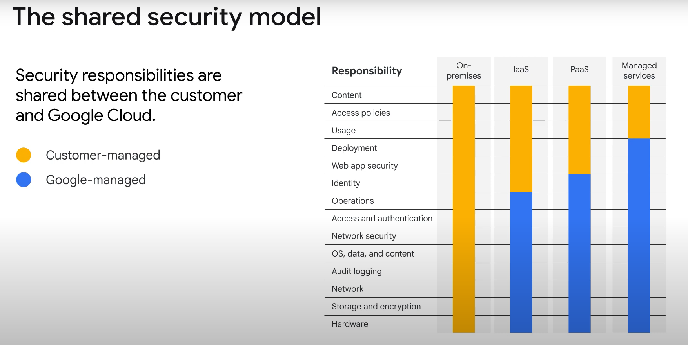

# 课程信息
## 目标
* 实施各种结构化和非结构化存储模型。
* 讨论云中不同的应用程序托管服务选项。
* 概述如何在 Google Cloud 中管理云安全。

# 课程介绍
略

# 我在哪里存储这些东西？
## 介绍
您将了解 Google Cloud 中提供的存储和数据库选项。  
1. 探索 Google Cloud 中提供的不同存储选项。
2. 学习区分云中的结构化和非结构化存储。
3. 检查如何使用 Cloud Storage 进行非结构化数据存储。
4. 探索关系存储选项与 NoSQL 存储选项的用例，并确定 Google Cloud 可用的选项。

这是本模块的议程。  
* 首先了解云中的不同存储选项，其中包括结构化和非结构化存储。
* 接下来，我们将学习如何使用 Cloud Storage 利用非结构化存储，并完成一个实践实验室，探索一系列适用于 Cloud Storage 的活动。
* 我们将继续了解 SQL 托管服务的用例。
* 接下来，我们将探索 Cloud SQL，然后完成另一个实验，在该实验中我们将创建并连接到Cloud SQL for MySQL 实例并使用 Google Cloud 控制台和 mysql 客户端执行基本 SQL 操作。
* 我们将了解如何利用 Cloud Spanner 并探索可用的 NoSQL 选项。
* 然后，我们将讨论使用 Firestore 作为完全托管、可扩展且无服务器的文档数据库。
* 我们将通过描述如何将 Cloud Bigtable 用作 NoSQL 选项来完成本模块。

## Google Cloud 中提供的不同存储选项
Google Cloud 提供关系型和非关系型数据库以及全球对象存储。  
选择正确的选项来存储和处理数据通常取决于需要存储的数据类型和业务需求。  
存在三种常见的云存储用例。  
1. 首先是内容存储和交付。
2. 第二个用例是用于数据分析和通用计算的存储。
3. 第三个用例是备份和归档存储。

## 区分云中的结构化和非结构化存储
非结构化数据是以非表格形式存储的信息，例如文档、图像和音频文件。非结构化数据通常最适合 Cloud Storage 。
  
结构化数据，它表示存储在表、行和列中的信息。  
  
结构化数据有两种类型：事务工作负载和分析工作负载。  

---

事务工作负载源于在线事务处理系统，当需要快速数据插入和更新来构建基于行的记录时，会使用该系统。  
如果您的数据是事务性的并且需要使用 SQL 访问它，那么 Cloud SQL 和 Cloud Spanner 是两个选择。  
Cloud SQL 最适合本地到区域的可扩展性，但 Cloud Spanner 最适合在全球范围内扩展数据库。  
如果无需 SQL 即可访问事务数据，Firestore 可能是最佳选择。  
Firestore 是一个事务型 NoSQL、面向文档的数据库。

---

分析工作负载，它们源于在线分析处理系统，在需要读取整个数据集时使用。  
如果您的分析工作负载需要 SQL 命令，BigQuery 可能是最佳选择。  
BigQuery 是 Google 的数据仓库解决方案，可让您分析 PB 级数据集。  
Bigtable 还为分析工作负载提供可扩展的 NoSQL 解决方案。  
它最适合仅需要毫秒延迟的实时、高吞吐量应用程序。  

  

## 如何使用 Cloud Storage 进行非结构化数据存储
### 什么是对象存储？
对象存储是一种计算机数据存储架构，它将数据作为“对象”进行管理，而不是作为文件和文件夹层次结构（文件存储）或磁盘块（块存储）进行管理。  
这些对象以打包格式存储，其中包含实际数据本身的二进制形式、相关的关联元数据（例如创建日期、作者、资源类型和权限）以及全局唯一标识符。  

---

Cloud Storage 中有四种主要存储类别，存储的数据根据​​其所属类别进行管理和计费。
* 第一个是标准存储。标准存储被认为最适合频繁访问或“热”数据。它也非常适合仅存储短暂时间的数据。
* 第二个存储类别是近线存储。这最适合存储不经常访问的数据，例如平均每月读取或修改一次数据。
* 第三种存储类别是 Coldline 存储。冷线存储最多每 90 天读取或修改一次数据。
* 第四种存储类别是归档存储。这是成本最低的选项，非常适合数据归档、在线备份和灾难恢复。对于您计划每年访问次数少于一次的数据来说，这是最佳选择。

---

有几个特征适用于所有这些存储类别。
* 无最小对象大小要求的无限存储、全球可访问性和位置、低延迟和高耐用性、统一的体验（扩展到安全性、工具和 API）以及地理冗余（如果数据存储在多区域或双区域中）。
* Cloud Storage 文件被组织到存储桶中。存储桶需要一个全局唯一的名称和存储它的特定地理位置，而存储桶的理想位置是延迟最小化的地方。
* Cloud Storage 提供的存储对象是“不可变的”，这意味着您不能编辑它们，而是会在每次更改时创建一个新版本。
* 管理员可以允许每个新版本完全覆盖旧版本，也可以通过在存储桶中启用“版本控制”来跟踪对特定对象所做的每个更改。
* Cloud Storage 还为您的对象提供生命周期管理策略。
* Cloud Storage 与其他 Google Cloud 产品和服务的紧密集成意味着可以通过多种其他方式将数据移至该服务中。

## 实验室简介：云存储：Qwik Start - CLI/SDK
在本实验中，您将：
* 将对象上传到存储桶
* 从存储桶下载对象
* 将对象复制到存储桶中的文件夹
* 列出存储桶或文件夹的内容
* 列出对象的详细信息
* 以及，使对象可公开访问。

## 云存储：Qwik Start - CLI/SDK (GSP074)
### 概览
在本实操实验中，您将学习如何使用 Google Cloud 命令行创建存储桶，向其中上传对象，在其中创建文件夹和子文件夹，并将这些对象设为可公开访问。

### 设置和要求
略

### 检验您的掌握情况
略

### 将对象上传到存储桶
略

### 从存储桶下载对象
略

### 将对象复制到存储桶中的文件夹
略

### 列出存储桶或文件夹的内容
略

### 列出对象的详细信息
略

### 将您的对象设为可公开访问
略

### 检验您的掌握情况
略

### 移除公共访问权限
略

### 检验您的掌握情况
略

### 恭喜！
略

## SQL 托管服务
数据库是经过组织的信息集合，以便可以轻松访问和管理。  
用户正在使用数据库构建软件应用程序来回答业务问题，例如购买机票、提交费用报告、存储照片或存储医疗记录。  
Google Cloud 提供两种托管关系数据库服务：Cloud SQL 和 Cloud Spanner。  

## 探索 Cloud SQL 
Cloud SQL 提供完全托管的关系数据库，包括 MySQL、PostgreSQL 和 SQL Server 即服务。  
它旨在将平凡但必要且通常耗时的任务交给 Google（例如应用补丁和更新、管理备份和配置复制），以便您可以专注于构建出色的应用程序。  
Cloud SQL：
* 不需要任何软件安装或维护。
* 最多可扩展至 96 个处理器内核、624 GB RAM 和 64 TB 存储空间。
* 支持自动复制场景，例如从 Cloud SQL 主实例、外部主实例和外部 MySQL 实例。
* 支持托管备份，因此备份数据可以安全存储，并且在需要恢复时可以访问。
* 在 Google 内部网络上以及存储在数据库表、临时文件和备份中时加密客户数据。
* 包括网络防火墙，控制对每个数据库实例的网络访问。

## 实验室简介：Cloud SQL for MySQL：Qwik Start
在本实验中，您将：
* 创建 Cloud SQL 实例。
* 在 Cloud Shell 中使用 mysql 客户端连接到实例。

## Cloud SQL for MySQL：Qwik Start (GSP151)
### 概述
在本实验中，您将学习如何创建并连接到 Google Cloud SQL MySQL 实例，以及如何使用 Cloud Console 和 mysql 客户端执行基本 SQL 操作。

### 设置和要求
略

### 任务 1. 创建 Cloud SQL 实例
略

### 任务 2. 在 Cloud Shell 中使用 mysql 客户端连接到您的实例
略

### 任务3.创建数据库并上传数据
略

### 恭喜！
略

## Cloud Spanner 用作托管服务
Cloud Spanner 是一种完全托管的关系数据库服务，可水平扩展、高度一致并使用 SQL。  
Cloud Spanner 特别适合需要以下功能的应用程序：
* 具有联接和二级索引的 SQL 关系数据库管理系统
* 内置高可用性
* 强大的全局一致性 
* 以及每秒大量的输入/输出操作

那么 Cloud Spanner 是如何工作的呢？
Google Spanner 使用区域内和跨区域的复制来实现可用性，因此，如果一个区域离线，仍然可以从另一个区域提供用户的数据。

## NoSQL 托管服务选项
Google 提供两种托管 NoSQL 数据库选项：Firestore 和 Cloud Bigtable。
* Firestore 是一个完全托管的无服务器 NoSQL 文档存储，支持 ACID 事务。
* Cloud Bigtable 是 PB 级稀疏宽列 NoSQL 数据库，可提供极低的写入延迟。

## Firestore，NoSQL 文档存储
探索 Firestore，这是一个数据库，可让您使用完全托管、可扩展且无服务器的文档数据库开发丰富的应用程序。  
Firestore 是一种灵活、水平可扩展的 NoSQL 云数据库，适用于移动、Web 和服务器开发。  

---

使用 Firestore，传入数据存储在文档结构中，然后将这些文档组织成集合。  
除了子集合之外，文档还可以包含复杂的嵌套对象。  
然后，Firestore 的 NoSQL 查询可用于检索单个特定文档或检索集合中与查询参数匹配的所有文档。  
查询可以包括多个链接的过滤器，并组合过滤和排序选项。  
默认情况下也会对它们建立索引，因此查询性能与结果集的大小成正比，而不是与数据集的大小成正比。  
Firestore 使用数据同步来更新任何连接设备上的数据。  
但是，它还旨在高效地进行简单的一次性获取查询。  
它缓存应用程序正在使用的数据，因此即使设备处于离线状态，应用程序也可以写入、读取、侦听和查询数据。当设备重新上线时，Firestore 会将所有本地更改同步回 Firestore。  
Firestore 利用 Google Cloud 强大的基础设施：自动多区域数据复制、强一致性保证、原子批量操作和真实事务支持。

## Bigtable 作为 NoSQL 选项
Bigtable是Google的NoSQL大数据数据库服务。  
Bigtable 旨在以一致的低延迟和高吞吐量处理大量工作负载，因此它是运营和分析应用程序的绝佳选择，包括物联网、用户分析和财务数据分析。

---

如果满足以下条件，客户通常会选择 Bigtable：
* 他们正在处理超过 1TB 的半结构化或结构化数据。
* 数据速度快且吞吐量高，或者数据变化很快。
* 他们正在使用 NoSQL 数据。这通常意味着不需要强关系语义的事务。
* 数据是时间序列或具有自然语义顺序。
* 他们正在处理大数据，对数据运行异步批处理或同步实时处理。
* 或者他们正在对数据运行机器学习算法。

---

Bigtable 可以与其他 Google Cloud 服务和第三方客户端交互。
* 使用 API，可以通过数据服务层（例如托管 VM、HBase REST 服务器或使用 HBase 客户端的 Java 服务器）从 Bigtable 读取数据或将数据写入 Bigtable。通常，这用于向应用程序、仪表板和数据服务提供数据。
* 数据还可以通过各种流行的流处理框架（例如 Dataflow Streaming、Spark Streaming 和 Storm）进行流式传输。
* 如果无法选择流式处理，也可以通过 Hadoop MapReduce、Dataflow 或 Spark 等批处理流程从 Bigtable 读取数据或将数据写入 Bigtable。

## 测验
略

## 总结
略

# 有一个 API 可以实现这一点！
托管服务：讨论云中不同的应用程序托管服务选项

## 介绍
欢迎来到 Google 云计算基础课程的第五模块：有一个 API！  
在课程的这一部分中，您将探索如何使用托管服务构建应用程序。  
这意味着您将：
1. 探索 API 的目的和好处。
2. 比较 Cloud Endpoints 和 Apigee API Management 这两种不同的 API 管理工具。
3. 检查 Pub/Sub，这是一种用于大规模处理分布式面向消息的架构的 Google Cloud 工具。

模块议程遵循目标。
* 首先探讨 API 的用途，包括目前最流行的服务风格的 REST API。
* 您将探索 Cloud Endpoints，这是一个分布式 API 管理系统，然后完成动手实验室，您将在其中使用 Cloud Endpoints 部署示例 API。
* 您将探索 Apigee API Management，这是一个用于开发和管理 API 代理的平台。
* 您将了解托管服务的用例，然后是 Pub/Sub，这是 Google 的托管消息系统。
* 该模块以另一个动手实验结束，然后是一个简短的测验和所涵盖主题的摘要。

## API 的目的
应用程序开发人员构建他们编写的软件，以便提供一个干净、定义良好的界面，隐藏不必要的细节，然后他们记录该界面。这是一个应用程序编程接口。  
表述性状态传输（REST）是目前最流行的服务架构风格。它概述了服务必须遵守的一组关键约束和协议。如果服务符合这些 REST 约束，则称其为 RESTful。  
REST API 与云配合良好的主要原因之一是其无状态特性。API 运行不需要存储或引用状态信息。  

## Cloud Endpoints
Cloud Endpoints，它是一个用于在任何 Google Cloud 后端上开发、部署和管理 API 的系统。  
Cloud Endpoints 是一个分布式 API 管理系统，它使用分布式可扩展服务代理，该代理是在自己的 Docker 容器中运行的服务代理。目标是帮助您创建和维护低延迟和高性能的最苛刻的 API。  
Cloud Endpoints 提供 API 控制台、托管、日志记录、监控和其他功能，帮助您创建、共享、维护和保护 API。  

## 实验室简介：云端点：Qwik Start
在本实验中，您将：
* 部署 Cloud Endpoints 配置。
* 部署 API 后端。
* 向 API 发送请求。
* 跟踪 API 活动。
* 向 API 添加配额。

## 云端点：Qwik Start (GSP164)
### 概述
在本实验中，您将使用 Google Cloud Endpoints 部署示例 API，这是一组用于从 App Engine 应用程序内生成 API 的工具。 示例代码将包括：
* 一个 REST API，您可以查询该 API，通过三个字母的 IATA 代码（例如，SFO、JFK、AMS）查找机场名称。
* 将 API 配置上传到 Cloud Endpoints 的脚本。
* 部署 Google App Engine 灵活后端来托管示例 API 的脚本。

向示例 API 发送一些请求后，您可以查看 Cloud Endpoints 活动图和日志。 这些工具可让您监控 API 并深入了解其使用情况。

### 设置和要求
略

### 任务 1. 获取示例代码
略

### 任务 2. 部署端点配置
略

### 任务 3. 部署 API 后端
略

### 任务 4. 向 API 发送请求
略

### 任务 5. 跟踪 API 活动
略

### 任务 6. 向 API 添加配额
略

### 恭喜！
略

## Apigee
另一个可用于开发和管理 API 代理的 Google Cloud 平台是 Apigee API Management。与 Cloud Endpoints 不同，Apigee API Management 特别关注业务问题，例如速率限制、配额和分析。

## Pub/Sub
Pub/Sub 是一种 Google Cloud 异步消息服务和 API，支持大规模分布式面向消息的架构。  
Pub/Sub 这个名称是 Publisher/Subscriber 的缩写，即向订阅者发布消息。  
Pub/Sub 是一种分布式消息服务，可以从各种设备流（例如游戏事件、物联网设备和应用程序流）接收消息。  

## 实验室简介：Pub/Sub：Qwik Start - Python
在本实验中，您将：
* 了解 Pub/Sub 的基础知识。
* 创建并列出 Pub/Sub 主题。
* 创建并列出 Pub/Sub 订阅。
* 向主题发布消息。
* 使用拉取订阅者输出各个主题消息。

## Google Cloud Pub/Sub：Qwik Start - Python (GSP094)
### 概览
使用 Google Cloud Pub/Sub 服务，应用能够可靠、快速地异步交换消息。为实现这一目标，数据制作者需要将消息发布到 Cloud Pub/Sub 主题。然后，订阅程序客户端会创建对该主题的订阅，并处理来自该订阅的消息。对于无法可靠地传送的消息，Cloud Pub/Sub 最多会将其保留七天。  
在本实验中，您需要执行以下操作：
* 了解 Pub/Sub 的基础知识。
* 创建并列出 Pub/Sub 主题。
* 创建并列出 Pub/Sub 订阅。
* 向主题发布消息。
* 使用拉取订阅程序输出单独的主题消息。

### 设置和要求
略

### 任务 1. 创建虚拟环境
略

### 任务 2. 安装客户端库
略

### 任务 3. Pub/Sub - 基础知识
发布者创建主题并向主题发送消息，订阅程序则为相应主题创建订阅以接收来自该主题的消息。

### 任务 4. 创建主题
略
### 任务 5. 创建订阅
略
### 任务 6. 发布消息
略
### 任务 7. 查看邮件
略
### 任务 8. 检验您的掌握情况
略
### 恭喜！
略

## 总结
略

# 您无法保护云的安全，对吗？
## 介绍
欢迎来到 Google 云计算基础课程的第六模块：您无法保护云的安全，对吗？  
在课程的这一部分中，您将了解云的安全最佳实践。  
这意味着您将： 概述如何在 Google Cloud 中管理安全性，包括共享安全模型。  
探索 Google Cloud 的不同加密选项。  
确定使用身份和访问管理 (IAM) 配置身份验证和授权时的最佳实践。  

---

模块议程遵循目标。
* 首先探索云中的安全性意味着什么，然后概述共享安全模型。
* 比较 Google 的安全责任与客户的责任。
* 了解加密选项，包括使用 IAM 进行身份验证和授权。
* 介绍身份感知代理 (IAP)，然后完成一个实验，您将在其中使用 IAP 设置用户身份验证。
* 您将确定使用 IAM 的授权最佳实践，然后进行动手实验室。

## 云中的安全
Google 提供 [五层保护](https://cloud.google.com/docs/security/infrastructure/design?hl=zh-cn#introduction) 来确保客户数据安全：硬件基础设施，服务部署，存储服务，互联网通信，运营安全层。
* 硬件基础设施：
  * 谷歌数据中心的服务器主板和网络设备是由谷歌定制设计的。
  * Google 服务器计算机使用各种技术来确保它们启动正确的软件堆栈。
  * Google 设计并构建了自己的数据中心，其中包含多层物理安全保护。
* 服务部署：
  * 服务间通信加密：Google 的基础设施为网络上的远程过程调用（“RPC”）数据提供加密隐私和完整性。
  * 用户身份：Google 的中央身份服务通常向最终用户显示为 Google 登录页面，它不仅仅要求提供简单的用户名和密码。
* 存储服务层：
  * 静态加密：Google 的大多数应用程序访问物理存储会间接地通过使用存储服务，并且在这些存储服务层应用加密（使用集中管理的密钥）。
  * 谷歌还在硬盘和固态硬盘中启用硬件加密支持。
* 互联网通信层：
  * Google Front End 服务。
  * 拒绝服务 (DoS) 保护。
* 运营安全层：
  * 入侵检测：规则和机器智能向谷歌的运营安全团队发出可能发生事件的警告。
  * 降低内部风险：Google 积极限制并积极监控已获得基础设施管理访问权限的员工的活动。
  * 软件开发实践：谷歌采用中央源代码控制，并要求对新代码进行两方审查。

## 共享安全模型
安全责任由客户和 Google Cloud 共同承担。
  

## 加密选项
* 最简单的选项是 Google Cloud 默认加密：Google Cloud 会默认将传输中的和静态的数据加密。
* 其次是客户管理的加密密钥 (CMEK)：云密钥管理服务（或 Cloud KMS）可自动化并简化加密密钥的生成和管理。
* 最后是提供最多控制的选项：客户提供的加密密钥 (CSEK)。
* 第四个选项是在将数据存储在云中之前对数据进行本地加密。这通常称为客户端加密。

## 使用 IAM 身份验证和授权
借助 IAM，管理员可以应用策略来定义谁可以对哪些资源执行哪些操作。
* IAM 政策的“谁”部分可以是 Google 帐号、Google 群组、服务帐号或 Cloud Identity 域。
* IAM 策略的“可以做什么”部分由角色定义。IAM 角色是权限的集合。

---

IAM 中有三种角色：基本角色、预定义角色和自定义角色。
* 第一种角色类型是基本角色。基本角色的范围很广泛。当应用于 Google Cloud 项目时，它们会影响该项目中的所有资源。基本角色包括所有者、编辑者、查看者和计费管理员。
  * 项目查看者可以检查资源，但不能修改它们。
  * 项目编辑者可以检查和修改资源。
  * 所有者还可以检查和修改资源。此外，项目所有者可以管理关联角色和权限，并设置计费。
  * 公司通常希望有人控制项目的计费，但无权更改项目中的资源。这可以通过计费管理员角色来实现。
* 预定义角色。特定的 Google Cloud 服务提供了一组预定义的角色，甚至定义了可以应用这些角色的位置。
* 如果您需要分配具有更具体权限的角色怎么办？您将使用自定义角色。 
  * 许多公司使用“最小权限”模型，在该模型中，组织中的每个人都被授予完成其工作所需的最小权限。

## 实验室简介：用户身份验证：身份感知代理
身份感知代理（IAP）是一种资源，可用于设置对基于 https 的应用程序的身份验证，而无需使用 VPN。  
IAP 允许您通过 TLS 为应用程序建立中央授权层，因此您可以使用应用程序级访问控制模型，而不是依赖网络级防火墙。  
只有用户和组才能通过具有正确 IAM 角色的代理访问受 IAP 保护的应用程序和资源。  
代理在外部世界和内部服务之间提供一层保护。  
当您通过 IAP 授予用户对应用程序或资源的访问权限时，他们将受到所使用产品实施的精细访问控制的约束，而无需 VPN。  
当用户尝试访问受 IAP 保护的资源时，IAP 会执行身份验证和授权检查。  
IAP 通过 TLS 保护外部请求的身份验证和授权。  
IAP 无法防止虚拟机内部的活动，例如有人使用 SSH 访问虚拟机。  
IAP 也无法防止项目内的活动，例如项目内通过本地网络进行的虚拟机到虚拟机的通信。  

## 用户身份验证：身份感知代理 (GSP499)
### 概述
在本实验中，您将使用 Google App Engine 构建一个最小的 Web 应用程序，然后探索使用身份感知代理 (IAP) 来限制对应用程序的访问并向其提供用户身份信息的各种方法。您的应用程序将：
* 显示欢迎页面
* 访问IAP提供的用户身份信息
* 使用密码验证防止用户身份信息被欺骗

你将学到什么：
* 如何使用 Python 编写和部署简单的 App Engine 应用程序
* 如何启用和禁用 IAP 以限制对您的应用程序的访问
* 如何将用户身份信息从 IAP 获取到您的应用中
* 如何以加密方式验证来自 IAP 的信息以防止欺骗

### 介绍
对 Web 应用程序的用户进行身份验证通常是必要的，并且通常需要在应用程序中进行特殊编程。对于 Google Cloud 应用，您可以将这些职责交给 Identity-Aware Proxy 服务。如果您只需要限制对选定用户的访问，则无需对应用程序进行任何更改。如果应用程序需要知道用户的身份（例如为了在服务器端保留用户首选项），身份感知代理可以用最少的应用程序代码提供该信息。  

什么是身份感知代理？  
身份感知代理 (IAP) 是一项 Google Cloud 服务，可拦截发送到您的应用程序的网络请求，使用 Google Identity Service 对发出请求的用户进行身份验证，并且仅允许来自您授权的用户的请求通过。此外，它还可以修改请求标头以包含有关经过身份验证的用户的信息。

### 设置和要求
略

### 任务 1. 部署应用程序并使用 IAP 保护它
略

### 任务 2. 访问用户身份信息
略

### 任务 3. 使用加密验证
略

### 恭喜！
略

## IAM 授权最佳实践
* 使用项目对共享相同信任边界的资源进行分组。
* 检查授予每个资源的策略并确保识别继承。
* 在授予角色时请使用最小权限原则。
* 使用 Cloud Audit Logs 审核策略并审核策略中使用的组的成员身份。
* 我们建议将角色授予组而不是个人。这使您可以更新组成员身份，而不是更改 IAM 策略。

## 实验室简介：IAM：Qwik Start
您将了解如何将角色分配给第二个用户以及删除与 IAM 关联的分配角色。  
在本实验中，您将：
* 探索编辑角色。
* 准备用于访问测试的资源。
* 删除项目访问权限。
* 添加存储权限。
* 验证访问权限。

## Cloud IAM：Qwik 快速入门 (GSP064)
### 概览
借助 Google Cloud 的 Identity and Access Management (IAM) 服务，您可以为 Google Cloud 资源创建和管理权限。Cloud IAM 将各项 Google Cloud 服务的访问权限控制措施整合到单个系统中，从而带来统一的操作体验。

在本实操实验中，您将学习如何通过 Cloud IAM 向第二位用户分配角色，以及如何移除已分配的角色。具体而言，您将使用 2 套不同的凭据来登录系统，体验如何通过 Google Cloud 的“Project Owner”和“Project Viewer”角色来授予及撤销权限。

### 前提条件
略

### 设置两位用户
略

### IAM 控制台和项目级角色
略

### 查看 Editor 角色
略

### 准备资源以进行访问权限测试
略

### 移除项目访问权限
略

### 添加 Storage 权限
略

### 验证访问权限
略

### 恭喜！
略

## 测验
略

## 总结
略