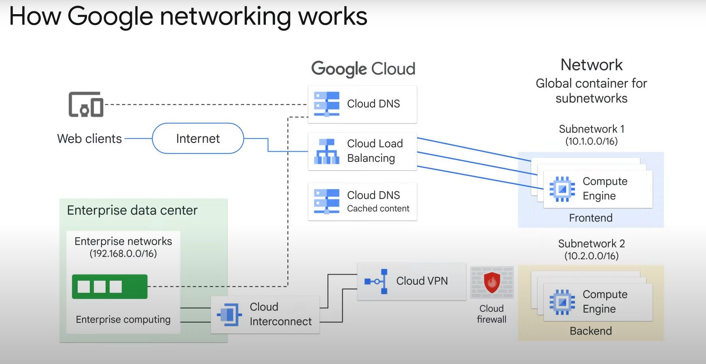
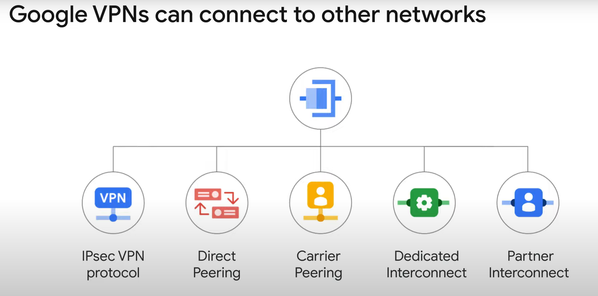
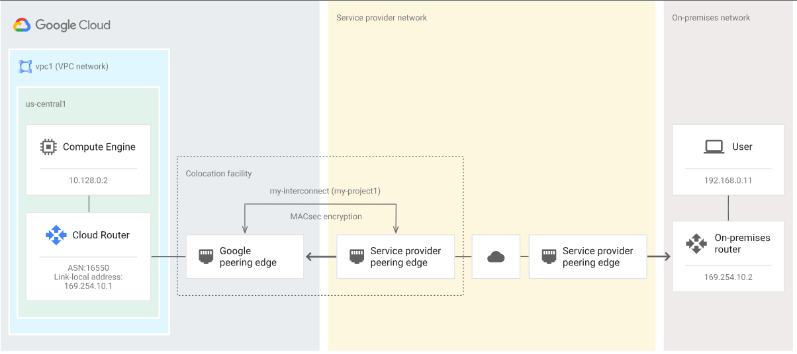
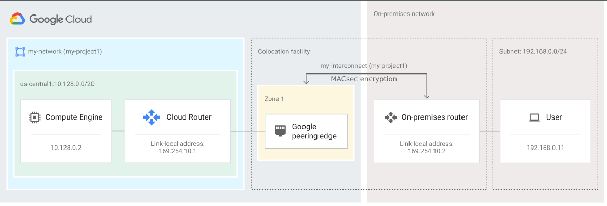
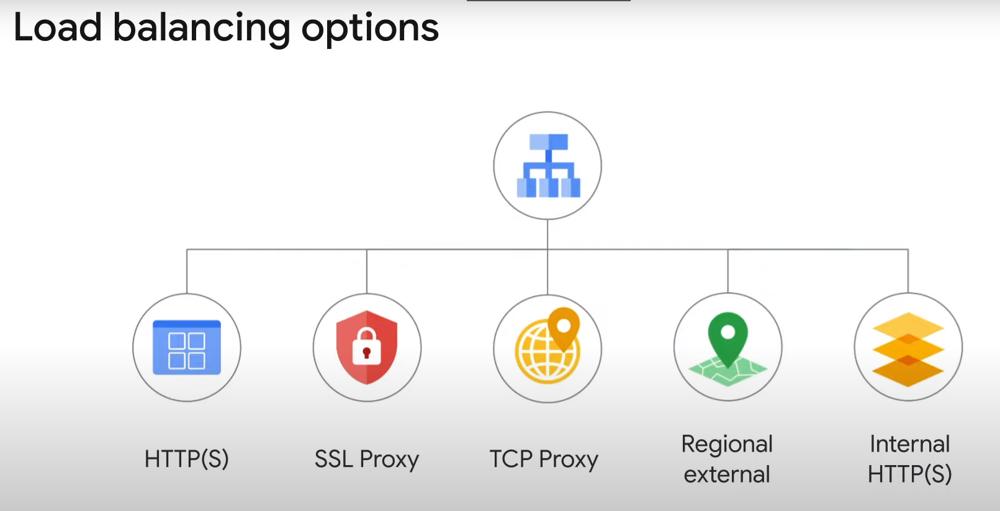

# 课程信息
## 目标
* 演示如何在云中构建安全网络。
* 识别云自动化和管理工具。

# 课程介绍
略

# 它有助于网络
## 介绍
欢迎来到 Google 云计算基础课程的第七个模块：它有助于网络。  
在本课程的这一部分中，您将了解 Google Cloud 中的网络工作原理以及设置网络之前必须考虑的事项。  
这意味着您将：
* 探索虚拟私有云 (VPC)。
* 检查 Google 的网络架构。
* 了解如何使用多个 VPC 网络。
* 探索构建混合云的选项。
* 检查负载平衡选项。

模块议程遵循目标:
* 首先介绍云中的网络。
* 接下来，您将了解什么是虚拟私有云，包括公共和内部 IP 地址以及 Google 网络架构的基础知识。
* 接下来，您将探索路由和防火墙规则如何在云中工作。
* 之后，您将研究如何使用多个 VPC 网络。
* 两个实验室提供支持：
  * 在第一个中，您将创建 VPC 网络和 VM 实例。
  * 在另一个中，您将创建 Web 服务器并探索 IAM 角色和服务帐户。

## 云中的网络
  
* Web 客户端或最终用户执行由 Cloud DNS (Cloud Domain Name System)提供服务的域名系统查找。
* 内容分发网络 CDN (Content Delivery Network) 是 Google 网络内的位置，用于缓存更靠近用户的内容，以提高应用程序性能。
* Cloud Load Balancing 将选择合适的前端服务器来处理请求，并将页面返回给用户。
* 在 Google Cloud 中，“网络”是保存网络配置的隔离的全局资源。

## 虚拟私有云 (VPC)
虚拟私有云 (VPC) 是托管在公共云（如 Google Cloud！）内的安全、独立的私有云计算模型。  
VPC 网络将 Google Cloud 资源相互连接并连接到互联网。这包括诸如分段网络、使用防火墙规则限制对实例的访问以及创建静态路由以将流量转发到特定目的地等任务。  
可以在全球任何 Google Cloud 区域拥有子网，这是较大网络的分段部分。子网可以跨越组成地区的区域。  
Google Cloud 提供两种类型的 VPC 网络，具体取决于其子网创建模式：自动子网模式和自定义子网模式。  

## 公共和内部 IP 地址的基础知识
虚拟私有云 (VPC) 由子网组成，每个子网必须配置一个私有 IP CIDR (无类别域间路由) 地址。  
内部IP地址仅用于VPC内的通信，不能路由到Internet。  
那么，公共IP地址和内部IP地址有什么区别呢？  
* 公共或外部 IP 地址可以是临时的或保留的。
* 私有或内部 IP 地址是通过动态主机配置协议 (DHCP) 服务分配给虚拟机的。

## Google 的网络架构
Google Cloud VPC 有 Google 一套全面的网络功能和基础设施：
* Google Cloud VPC 是由 Google 管理的一套全面的网络功能和基础设施。
* Cloud Load Balancing 为 Google Cloud 提供高性能、可扩展的负载均衡，以确保用户获得一致的性能。
* 云 CDN 是一种内容交付网络，通常通过将文件存储在靠近用户的位置，以高可用性和高性能向最终用户提供内容。
* Cloud Interconnect 可让您通过企业级连接将自己的基础设施连接到 Google 的网络边缘。
* Cloud DNS（域名系统）将域名请求转换为 IP 地址。

## 路由以及防火墙规则
与物理网络非常相似，VPC 也有路由表。  
路由表是路由器位置及其 IP 地址的数据表，存储在路由器或网络主机的内存中。它列出了到特定网络目的地的路由，有时还列出了一个度量值（需要到达该地址的“跳数”），这有助于路由器选择最有效的路由。VPC 路由表是内置的，因此您无需配置或管理路由器。它们用于将流量从同一网络内、跨子网甚至 GCP 区域之间的一个实例转发到另一个实例，而无需外部 IP 地址。

---

您无需为 Google Cloud 配置或管理的另一件事是防火墙。  
VPC 提供全球分布式防火墙，可以控制该防火墙以限制通过传入和传出流量对实例的访问。通过 Compute Engine 实例上的元数据标签可以方便地定义防火墙规则。

## 多个 VPC 构建强大的网络
通过 VPC 对等 (VPC peering)，可以在两个 VPC 之间建立关系以交换流量。  
它允许跨两个 VPC 网络进行私有 RFC 1918 连接，无论它们是否属于同一项目或组织。  

---

或者，要使用身份和访问管理 (IAM) 的全部功能来控制一个项目中的人员和内容可以与另一个项目中的 VPC 进行交互，您可以配置共享 VPC (Shared VPC)。  
共享 VPC 允许组织将多个项目的资源连接到公共 VPC 网络。  
使用共享 VPC 时，您可以将一个项目指定为宿主项目，并将一个或多个其他服务项目附加到该项目。

## 实验：[多个 VPC 网络 (GSP211)](../labs/GSP211.md)

## 构建混合云网络
许多 Google Cloud 客户希望将其 Google Virtual Private Cloud 连接到系统中的其他网络，例如本地网络或其他云中的网络。  
有几种有效的方法可以实现这一目标：

* Cloud VPN 通过 IPsec VPN 连接，将您的对等网络安全地连接到 Virtual Private Cloud (VPC) 网络。两个网络之间传输的流量由一个 VPN 网关加密，再由另一个 VPN 网关解密。此操作可以保护您的数据在互联网上传输时的安全。您还可以将两个 Cloud VPN 实例相互连接。
  * Internet Protocol Security: IPsec是一种强大的网络安全协议，用于确保在互联网上进行的数据传输的机密性、完整性和认证性。它在保护敏感数据和构建安全连接方面发挥着重要作用。
  * VPN（Virtual Private Network，虚拟私有网络）：是一种用于在公共网络（如互联网）上建立加密隧道的技术，用于在远程位置之间创建安全的通信连接。通过VPN，用户可以在不受地理位置限制的情况下，安全地访问远程网络资源，就像直接连接到私有网络一样。
* 借助直接对等互连 (Direct Peering)，您能够在企业网络和 Google 边缘网络之间建立直接对等互连连接，并交换高吞吐量的云端流量。建立直接对等互连以后，可以为您的本地网络到 Google 服务（包括可通过一个或多个公共 IP 地址公开的 Google Cloud 产品）提供直接通道。从 Google 网络到您的本地网络的流量（包括来自您的项目中 VPC 网络的流量）也会经由该直接通道。
* 借助运营商对等互连 (Carrier Peering)，您可以通过服务提供商访问 Google 应用（例如 Google Workspace），以获取将您的基础架构连接到 Google 的企业级网络服务。通过服务提供商连接到 Google 时，您可以使用一条或多条链路获得具有更高可用性、更短延迟时间的连接。与服务提供商合作，获取您所需的连接。
* 合作伙伴互连 (Partner Interconnect) 通过支持的服务提供商在本地网络与 Virtual Private Cloud (VPC) 网络之间提供连接。如果您的数据中心所在的物理位置无法连接到专用互连对接网点，或者如果您的数据不需要用尽 10 Gbps 的连接，则合作伙伴互连连接很有用。  
* 专用互连 (Dedicated Interconnect) 可在您的本地网络和 Google 网络之间提供直接物理连接。通过专用互连，您可以在网络之间传输大量数据，这比在公共互联网上购买额外带宽更加经济实惠。  

## 负载平衡选项
负载均衡器的工作是在应用程序的多个实例之间分配用户流量。  
Cloud Load Balancing 是一项完全分布式、软件定义的托管服务，适用于您的所有流量。而且由于负载均衡器不在您必须管理的虚拟机中运行，因此您不必担心扩展或管理它们。您可以将 Cloud Load Balancing 置于所有流量之前：HTTP(S)、TCP 流量 和 SSL 流量以及 UDP 流量。Cloud Load Balancing 提供跨区域负载平衡，包括自动多区域故障转移，如果后端变得不健康，它会缓慢地分批转移流量。Cloud Load Balancing 可对用户、流量、网络、后端运行状况和其他相关条件的变化做出快速反应。    
Cloud VPC 提供了一套负载均衡选项：
* 如果您需要对 Web 应用程序进行跨区域负载均衡，请使用全局 HTTP(S) 负载均衡。
* 对于非 HTTP 的安全套接字层 (SSL) 流量，请使用 SSL 代理负载平衡。
* 如果是其他不使用安全套接字层的 TCP 流量，请使用 TCP 代理负载平衡。
* 如果您想要对 UDP 流量或任何端口号上的流量进行负载平衡，您仍然可以通过区域外部负载平衡 (Regional external load balancing) 在整个 Google Cloud 区域中实现负载平衡。
* 如果您想在项目内部（例如应用程序的表示层和业务层之间）对流量进行负载平衡，请使用内部 HTTP(S) 负载平衡。

## 实验：[具有 Cloud Armor 的 HTTP 负载均衡器 (GSP215)](../labs/GSP215.md)

## 测验
略

## 总结
* 您探索了虚拟私有云 (VPC)。虚拟私有云 (VPC) 是托管在公共云（如 Google Cloud！）内的安全、独立的私有云计算模型。虚拟私有云由子网或子网组成，每个子网必须配置一个私有 IP CIDR 地址。
* 您检查了 Google 的网络架构，包括区域和接入点。
* 您还了解了五种 Google Cloud 网络产品：
  * Google Cloud VPC
  * Cloud Load Balancing
  * Cloud CDN
  * Cloud Interconnect
  * Cloud DNS
* 了解如何通过 VPC 对等互连和共享 VPC 使用多个 VPC 网络。
* 探索构建混合云的选项。选项包括：
  * IPsec VPN 协议
  * 直接对等互连
  * 运营商对等互连
  * 专用互连
  * 合作伙伴互连
* 检查负载平衡选项，包括 Cloud Load Balancing。

# 密切关注事物
## 介绍
欢迎来到 Google 云计算基础课程的第 8 单元：关注事物。  
在本课程的这一部分中，您将了解 Google Cloud 在自动创建和管理 Google Cloud 资源以及确保您的基础设施和应用程序以最佳状态运行方面可以发挥的作用。  
这意味着您将：
1. 了解基础设施即代码 (IaC)。
2. 探索 Terraform 作为 IaC 选项。
3. 检查云中监控、日志记录、错误报告、跟踪和分析的作用。
4. 了解如何使用 Google Cloud 操作套件进行监控、日志记录、错误报告、跟踪和分析。
模块议程遵循目标：
* 介绍基础设施即代码，然后再继续使用 Terraform 作为 IaC 工具。
* 您将了解监控和管理现有服务、应用程序和基础设施的重要性。
* 您将了解构成 Google Cloud 运营套件的集成工具。
* 您将通过动手实验室学习如何使用 Cloud Monitoring。
* 最后以一个简短的测验和所涵盖主题的回顾作为结束。

## 础设施即代码 (IaC)
基础设施即代码（IaC）就是采用所需基础设施的外观并将其定义为代码。您可以将代码捕获到人类可读且机器可使用的模板文件中。IaC 工具允许使用模板创建整个架构。该模板是一个配置文件，提供基础架构的详细信息。该模板用于自动构建基础设施，而不必使用控制台或手动运行命令来构建系统的所有部分。同一模板可以根据需要自动更新和/或删除资源。由于模板被视为代码，因此可以将它们存储在存储库中，使用版本控制系统进行跟踪，并与其他用户共享。模板还可用于灾难恢复。如果由于任何原因必须重建基础设施，则可以使用模板自动恢复。

## Terraform
Terraform 是一种工具，用于安全高效地构建、更改基础架构及对基础架构进行版本控制。Terraform 可管理现有主流服务提供程序和自定义内部解决方案。

配置文件会向 Terraform 说明运行单个应用或整个数据中心所需的组件。Terraform 会生成执行计划，以说明它会执行哪些操作来实现期望的状态。接着，Terraform 会实施执行计划，以构建所述基础架构。当配置发生变化时，Terraform 能够确定具体改动并制定可用的渐进式执行计划。

Terraform 可以管理的基础架构包含计算实例、存储空间和网络等低级组件，以及 DNS 条目和 SaaS 功能等高级组件。

### 主要特性
* 基础架构即代码

基础架构是以高级配置语法描述的。这样您就可以像对待其他代码一样，对数据中心的蓝图进行版本控制和处理。此外，基础架构可以共享和重复使用。

* 执行计划

Terraform 会有规划步骤，用于生成执行计划。执行计划会表明在您执行 apply 命令时 Terraform 会执行的操作。这可以避免 Terraform 操作基础架构时出现意外。

* 资源图表

Terraform 会构建包含您所有资源的图表，并行创建及修改不具依赖性的资源。因此，Terraform 会尽可能高效地构建基础架构，运营人员也能深入了解自己基础架构中的依赖项。

* 自动处理变更

只需极少的人工操作即可将复杂的变更集应用到您的基础架构。借助前文提到的执行计划和资源图表，您可以确切知道 Terraform 的变更内容和变更顺序，这有助于您避免许多可能的人为错误。

## 监视和管理现有服务、应用程序和基础设施
监控的定义是：收集、处理、聚合和显示有关系统的实时定量数据，例如查询计数和类型、错误计数和类型、处理时间和服务器生命周期。

## Google Cloud 运营套件
Google Cloud 的运营套件为云中的应用程序提供强大的监控（Cloud Monitoring）、日志记录（Cloud Logging）、错误报告（Cloud Error Reporting）和调试（Cloud Debugging）功能。它使您能够深入了解云驱动的应用程序的运行状况、性能和可用性；使您能够更快地发现并解决问题。  
* Cloud Monitoring：当 DevOps 人员想要准确跟踪 Google Cloud 项目内部发生的情况时，他们通常首先想到的是监控。云监控可让您了解云驱动的应用程序的性能、正常运行时间和整体运行状况。它从项目、日志、服务、系统、代理、自定义代码和各种常见应用程序组件（包括 Cassandra、NGINX、Apache Web Server 和 Elasticsearch）收集指标、事件和元数据。监控获取数据并通过仪表板、指标浏览器图表和自动警报生成见解。
* Cloud Logging：大多数日志分析都是从 Google Cloud 的集成日志浏览器开始的。日志条目还可以导出到多个目的地以供替代或进一步分析。可以使用自定义代码或 Dataflow 等流处理技术近乎实时地分析 Pub/Sub 消息。BigQuery 允许分析师通过 SQL 查询检查日志数据。四个主要日志类别是审核日志、代理日志、网络日志和服务日志：
  * 云审核日志有助于回答“谁在何时何地做了什么？”的问题。
  * 代理日志使用 Google 定制和打包的 Fluentd 代理，该代理可以安装在任何 AWS 或 Google Cloud VM 上，以从 Google Cloud 实例（例如计算引擎、托管 VM 或容器以及 AWS EC2 实例）提取日志数据。
  * 网络日志为网络和安全操作提供深入的网络服务遥测。
  * 服务日志提供对将代码部署到 Google Cloud 的开发人员创建的日志的访问权限。
* Cloud Error Reporting：错误报告对正在运行的云服务中的崩溃进行计数、分析和聚合。
* Cloud Trace 基于 Google 在其生产服务上使用的工具，是一个跟踪系统，可从分布式应用程序收集延迟数据并将其显示在 Google Cloud 控制台中。
* Cloud Profiler 通过使用统计技术和影响极低的仪器来改变这种情况，这些仪器在所有生产应用程序实例上运行，以提供应用程序的完整 CPU 和堆图片，而不会减慢应用程序的速度。

## 实验：[Cloud Monitoring Qwik Start (GSP089)](../labs/GSP089.md)

## 测验
略

## 总结
1. 首先您了解了基础设施即代码 (IaC)。
2. 然后您探索了 Terraform 作为 IaC 选项。
3. 接下来，您研究了云中监控（monitoring）、日志记录（logging）、错误报告（error reporting）、跟踪（tracing）和分析（profiling）的作用。
4. 最后，您学习了如何使用 Google Cloud 操作套件进行监控（monitoring）、日志记录（logging）、错误报告（error reporting）、跟踪（tracing）和分析（profiling）。