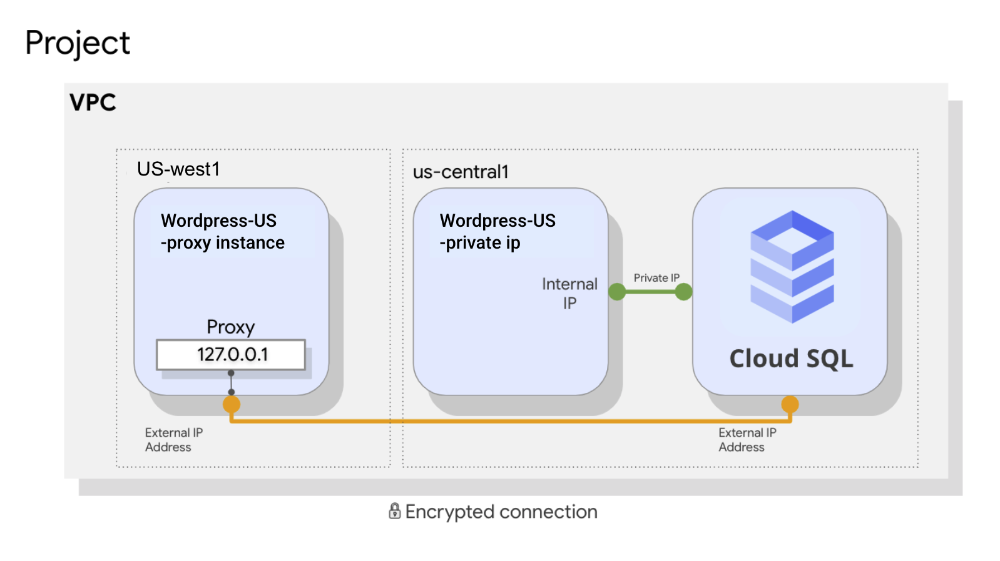

# [概览](https://www.cloudskillsboost.google/course_sessions/5373246/labs/386470)
在此实验中，您将配置一个 Cloud SQL 服务器，并学习如何通过外部连接使用代理将应用连接到该服务器。 您还将配置通过专用 IP 链路的连接，以提供性能和安全方面的优势。 

# 目标
在本实验中，您将学习如何执行以下任务：
* 创建 Cloud SQL 数据库
* 配置虚拟机以运行代理
* 在应用和 Cloud SQL 之间创建连接
* 使用专用 IP 地址将应用连接到 Cloud SQL

# 任务 1：创建 Cloud SQL 数据库
略

# 任务 2：在虚拟机上配置代理
略

# 任务 3：将应用连接到 Cloud SQL 实例
略

# 任务 4：通过内部 IP 地址连接到 Cloud SQL
略

# 任务 5：回顾
在此实验中，您创建了一个 Cloud SQL 数据库，并将其配置为同时使用通过安全代理的外部连接和通过专用 IP 地址的连接，后者更为安全且性能更好。 请注意，只有当应用和 Cloud SQL 服务器位于同一个区域并且属于同一个 VPC 网络时，才能通过专用 IP 地址进行连接。如果应用托管在其他区域、VPC 网络甚至不同的项目中，可以使用代理来确保应用通过外部连接的连接安全性。
