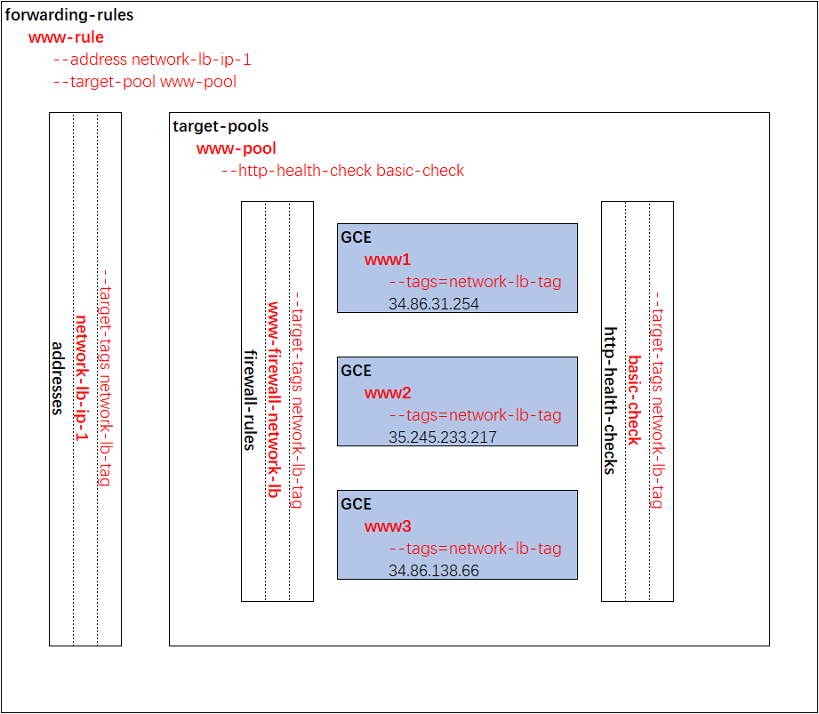
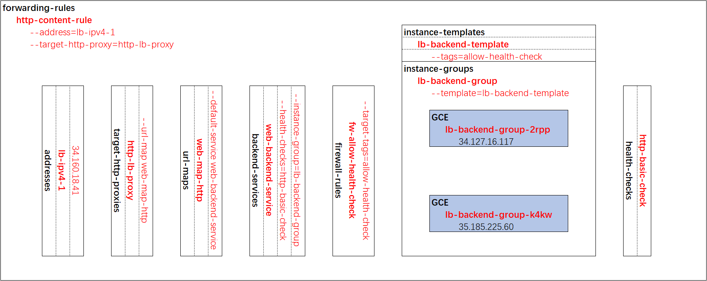

# 设置网络及 HTTP 负载均衡器 (GSP007)
## 概览
在本实操实验中，您将了解网络负载均衡器和 HTTP 负载均衡器之间的区别，并学习如何为 Compute Engine 虚拟机 (VM) 中运行的应用设置这两种负载均衡器。

## 学习内容
* 设置网络负载均衡器。
  
* 设置 HTTP 负载均衡器。
  
* 通过实操实验，学习网络负载均衡器和 HTTP 负载均衡器之间的区别。

## 设置和要求
略

## 任务 1. 为所有资源设置默认区域和可用区
略

## 任务 2. 创建多个网络服务器实例
略

## 任务 3. 配置负载均衡服务
配置负载均衡服务时，您的虚拟机实例将接收发往您配置的静态外部 IP 地址的数据包。 如果虚拟机实例是使用 Compute Engine 映像创建的，则系统会自动配置实例，处理此 IP 地址。

## 任务 4. 将流量发送到您的实例
在配置了负载均衡服务后，您可以开始将流量发送到转发规则并观察流量分散到不同的实例。

## 任务 5. 创建 HTTP 负载均衡器
HTTP(S) 负载均衡是以 Google Front End (GFE) 为基础实现的。 这些 GFE 分布于全球各地，可通过 Google 的全球网络和控制层面协同运作。 您可以将网址规则配置为将一些网址路由到一组实例，然后将其他网址路由到其他实例。

请求始终会被路由到距离用户最近的那组实例，当然，该组实例必须有足够的处理能力且适合处理该请求才行。 如果最近的那组实例没有足够的处理能力，则系统会将该请求发送到有足够处理能力的最近一组实例。

如需使用 Compute Engine 后端设置负载均衡器，您的虚拟机必须属于某个实例组。 这个代管式实例组提供了一组虚拟机，用于运行外部 HTTP 负载均衡器的后端服务器。

## 任务 6. 测试发送到您的实例的流量
略

## 恭喜！
略