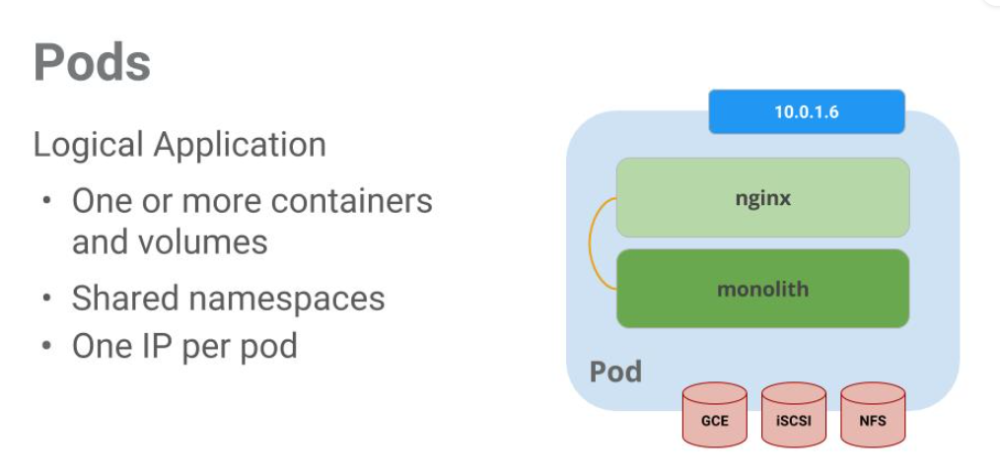
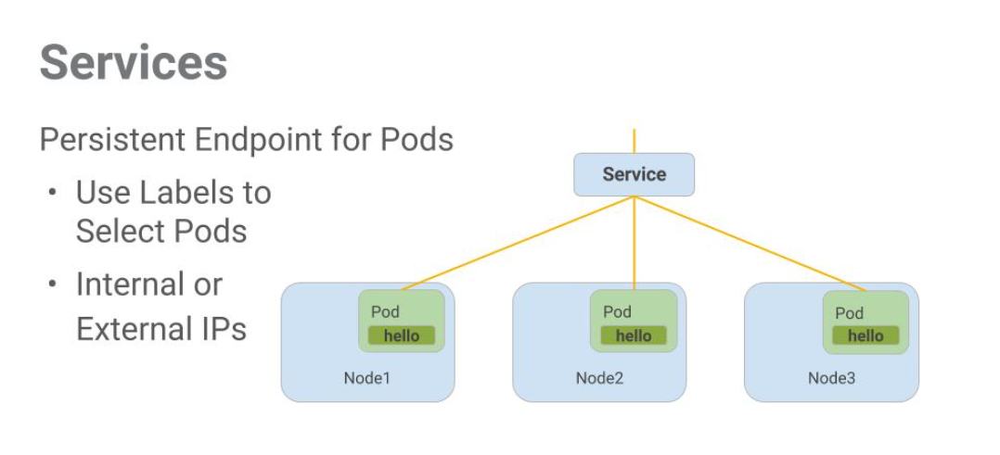

# 使用 Kubernetes 编排云
使用 Kubernetes Engine 等托管环境可以让您专注于体验 Kubernetes，而不是设置底层基础架构。Kubernetes Engine 是一个用于部署容器化应用程序的托管环境。它在开发人员生产力、资源效率、自动化操作和开源灵活性方面带来了最新的创新，以加快您的上市时间。

在本实验中，您将学习如何：
* 使用 Kubernetes Engine 预置完整的 Kubernetes 集群。
* 使用 kubectl 部署和管理 Docker 容器。
* 使用 Kubernetes 的部署和服务将应用程序分解为微服务。gcloud config list project

## Pods
  
在此示例中，有一个包含 monolith 和 nginx 容器的 pod。  
Pod 也有卷。卷是数据磁盘，其生存期与 Pod 的生存期一样长，可由该 Pod 中的容器使用。Pod 为其内容提供了一个共享的命名空间，这意味着我们示例 pod 中的两个容器可以相互通信，并且它们还共享附加的卷。  
Pod 还共享一个网络命名空间。这意味着每个 Pod 都有一个 IP 地址。  

## Services
  
服务使用标签来确定它们对哪些 Pod 进行操作。如果 Pod 具有正确的标签，则我们的服务会自动拾取并显示它们。

服务为一组 Pod 提供的访问级别取决于服务的类型。目前有三种类型：
* ClusterIP （internal） -- 默认类型表示此服务仅在集群内部可见
* NodePort 为群集中的每个节点提供可从外部访问的 IP
* LoadBalancer 添加来自云提供商的负载均衡器，用于将流量从服务转发到其中的节点。
