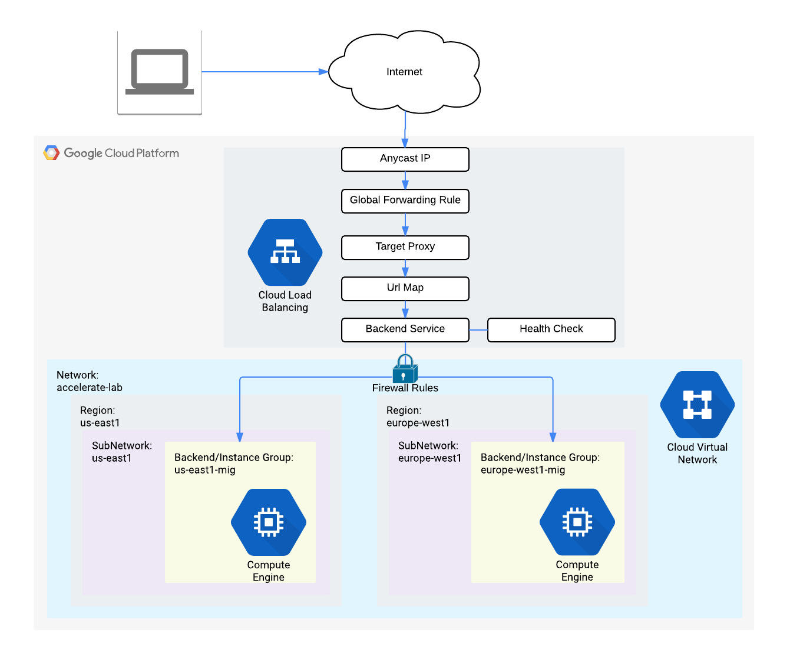

# 实验室简介：使用 Google Cloud Armor 的 HTTP 负载均衡器
您将使用 Google Cloud Armor 配置 HTTP 负载均衡器。  
Google Cloud Armor 用于帮助缓解分布式拒绝服务 (DDoS) 攻击。  
您将配置具有全局后端的 HTTP 负载均衡器，并对负载均衡器进行压力测试，并使用 Google Cloud Armor 将压力测试 IP 列入黑名单。  
在本实验中，您将：
* 创建 HTTP 和运行状况检查防火墙规则。
* 配置两个实例模板。
* 创建两个托管实例组。
* 使用 IPv4 和 IPv6 配置 HTTP 负载均衡器。
* 对 HTTP 负载均衡器进行压力测试。
* 将 IP 地址列入黑名单以限制对 HTTP 负载均衡器的访问。

# [概述](https://www.cloudskillsboost.google/course_sessions/5373683/labs/377214)
Google Cloud HTTP(S) 负载平衡是在 Google 网络边缘、Google 遍布全球的接入点 (POP) 中实现的。定向到 HTTP(S) 负载平衡器的用户流量进入距离用户最近的 POP，然后通过 Google 的全球网络进行负载平衡，到达具有足够可用容量的最近后端。

Cloud Armor IP 允许列表/拒绝列表使您能够限制或允许访问位于 Google Cloud 边缘的 HTTP(S) 负载均衡器，尽可能靠近用户和恶意流量。这可以防止恶意用户或流量消耗资源或进入您的虚拟私有云 (VPC) 网络。

在本实验中，您将配置具有全局后端的 HTTP 负载均衡器，如下图所示。然后，您对负载均衡器进行压力测试，并使用 Cloud Armor 将压力测试 IP 列入拒绝名单。  

# 设置和要求
略

# 任务 1. 配置 HTTP 和运行状况检查防火墙规则
配置防火墙规则以允许 HTTP 流量流向后端，并允许来自状况检查器的 TCP 流量。  
* 创建 HTTP 防火墙规则：请注意现有的 ICMP、内部、RDP 和 SSH 防火墙规则。每个 Google Cloud 项目都以默认网络和这些防火墙规则开始。
* 创建健康检查防火墙规则：运行状况检查确定负载均衡器的哪些实例可以接收新连接。对于 HTTP 负载平衡，对负载平衡实例的运行状况检查探测来自 130.211.0.0/22 和 35.191.0.0/16 范围内的地址。您的防火墙规则必须允许这些连接。

# 任务 2. 配置实例模板并创建实例组
托管实例组使用实例模板来创建一组相同的实例。使用它们创建 HTTP 负载均衡器的后端。  
实例模板是一种 API 资源，用于创建虚拟机实例和托管实例组。实例模板定义机器类型、启动磁盘映像、子网、标签和其他实例属性。  

---

托管实例组提供自动扩展功能，允许您根据负载的增加或减少自动在托管实例组中添加或删除实例。自动缩放可帮助您的应用程序优雅地处理流量的增加，并在资源需求较低时降低成本。您只需定义自动伸缩策略，自动伸缩器就会根据测量到的负载执行自动伸缩。  
主机名和服务器位置标识 HTTP 负载均衡器发送流量的位置。

# 任务 3. 配置 HTTP 负载均衡器
# 任务 4. 测试 HTTP 负载均衡器
# 任务 5. 将 siege-vm 列入拒绝名单
# 恭喜！
