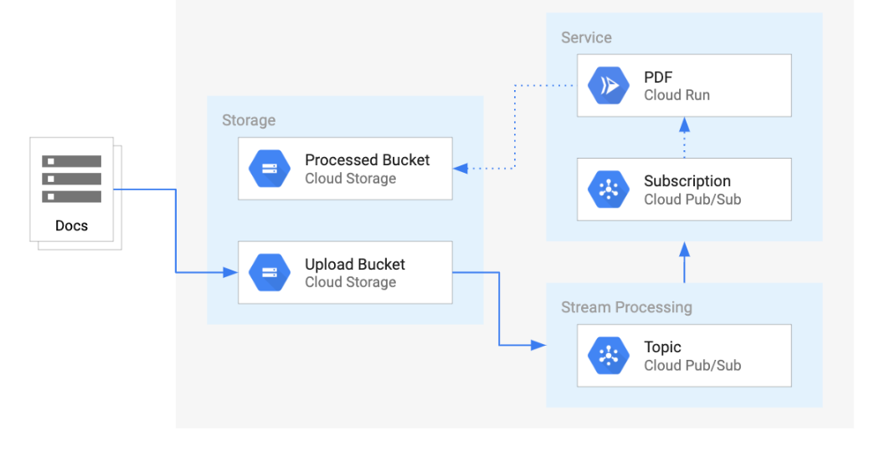

# 使用 Cloud Run 构建可创建 PDF 文件的无服务器应用
Cloud Run 是无服务器的，因此它可以抽象出所有基础架构管理，让您专注于构建应用程序，而不必担心开销。作为 Google 无服务器产品，它能够扩展到零，这意味着在不使用时不会产生成本。它还允许您使用基于容器的自定义二进制包，这意味着构建一致的隔离工件现在是可行的。

在本实验中，您将学习如何：
* 将 Node JS 应用程序转换为容器。
* 使用 Google Cloud Build 构建容器。
* 创建一个 Cloud Run 服务，用于将文件转换为云中的 PDF 文件。
* 将事件处理与 Cloud Storage 结合使用

