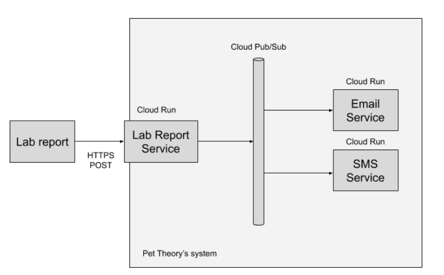

# 使用 Cloud Run 和 Pub/Sub 构建弹性异步系统
在本实验中，您将学习如何：
* 创建 Pub/Sub 主题和订阅
* 创建一个 Cloud Run 服务，用于接收 HTTP 请求并将消息发布到 Cloud Pub/Sub
* 创建用于接收来自 Cloud Pub/Sub 的消息的 Cloud Run 服务
* 创建触发 Cloud Run 服务的 Pub/Sub 订阅
* 测试系统的复原能力

