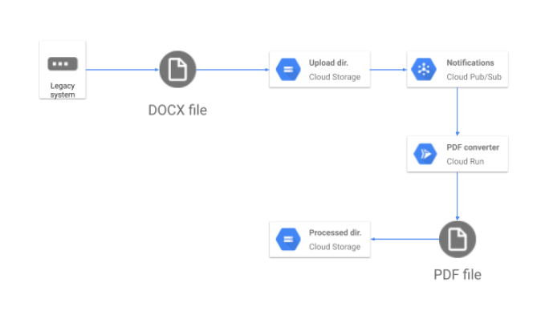

# 使用 Go 和 Cloud Run 创建 PDF
在本实验中，您将在 Cloud Run（一种无服务器服务）上构建一个 PDF 转换器 Web 应用，该应用可自动将存储在 Google Drive 中的文件转换为存储在隔离的 Google Drive 文件夹中的 PDF。

在本实验中，您将：
* 将 Go 应用程序转换为容器
* 了解如何使用 Google Cloud Build 构建容器
* 创建一个 Cloud Run 服务，用于将文件转换为云中的 PDF 文件。
* 了解如何创建服务帐户和添加权限
* 将事件处理与 Cloud Storage 结合使用

