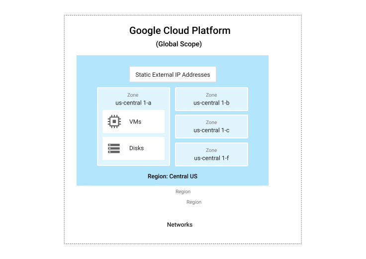

# Google Cloud 概览
本概览旨在帮助您从整体上了解 Google Cloud。
* 了解部分常用功能
* 进一步深入了解的文档链接
* 了解可用的功能以及各部分如何协同工作
* 帮助您在各种场景中试用 Google Cloud 的教程的链接

## Google Cloud 资源
* Google Cloud 由一组物理资产（例如计算机和硬盘驱动器）和虚拟资源（例如虚拟机）组成，这些资产和资源位于全球各地的 Google 数据中心。  
地区（亚洲、澳大利亚、欧洲、北美洲和南美洲） --> 区域

## 通过服务访问资源
在云计算中，将通常意义上的软件和硬件产品称为“服务”。这些服务可让您访问底层资源。可用 Google Cloud 服务的列表包含大量服务，而且数量还在不断增加。在 Google Cloud 上开发网站或应用时，您可以将这些服务混合搭配使用，以提供所需要的基础架构，然后添加代码以实现所构建的场景。

## 全球资源、地区资源和区域资源
“全球资源”是指可以由跨区域和地区的其他任何资源访问的资源，包括预配置的磁盘映像、磁盘快照和网络。“区域资源”是指只能由同一区域内的资源访问的资源，包括静态外部 IP 地址。“地区资源”是指只能由同一地区内的资源访问的资源，包括虚拟机实例、机器类型和磁盘。  

## 项目
您分配和使用的任何 Google Cloud 资源都必须属于一个项目  

Google Cloud 项目都包含以下几个部分：
* 项目名称，由您提供。
* 项目 ID，可以由您或 Google Cloud 提供。
* 项目编号，由 Google Cloud 提供。

## 与服务交互的方式
Google Cloud 为您提供了三种与服务和资源交互的基本方式
* Google Cloud Console 基于 Web 的图形界面
* gcloud 命令行界面 (Cloud SDK工具包, Cloud Shell)
* 客户端库

   

# 地理位置和区域
## 区域和地区
* 地区资源，单个地区内运作
* 区域资源，多个地区以冗余方式部署的资源

## 全球均可运行的服务

   

# 开发者工具
## Anthos 开发者沙盒
* [Google Cloud 开发者工具](https://cloud.google.com/products/tools)

   

# 托管网站
本文介绍如何在 Google Cloud 上托管网站。  

## 选择方案

## 设置域名服务
* [谷歌域名](https://domains.google/)

## 托管静态网站
### 使用 Cloud Storage 托管静态网站
创建一个 Cloud Storage 存储分区、上传内容，并对新网站进行测试。
test test