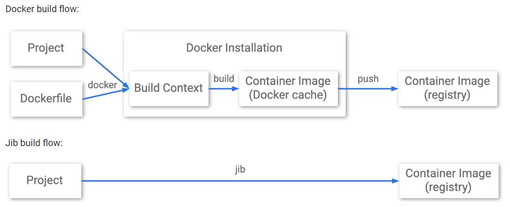

# Java

## Getting Started
### Building Java containers with Jib
* Jib 在不使用 Docker 的情况下构建容器。您可以使用 Maven 或 Gradle 的 Jib 插件，也可以使用 Jib Java 库。
* Jib是做什么的？Jib 处理将应用程序打包到容器镜像中的所有步骤。您无需了解创建 Dockerfile 或 安装 Docker 就可以。

* 其他自定义：您可以使用与 Dockerfile 类似的方式自定义 Jib 构建，例如添加环境变量和选择基础镜像。
  - Add environment variables: 您可以将环境变量添加到您的构建中，类似于 Dockerfile 中的 ENV 指令。
  - Change the base image: 基础镜像相当于 Dockerfile 中的 FROM 指令。
* 自定义其他 Java 方面: Jib 支持运行应用程序可能需要的 Java 运行时配置。[扩展使用](https://github.com/GoogleContainerTools/jib/tree/master/jib-maven-plugin#extended-usage)
* 发送代码: 设置 gcloud 默认值, Deploy to Cloud Run