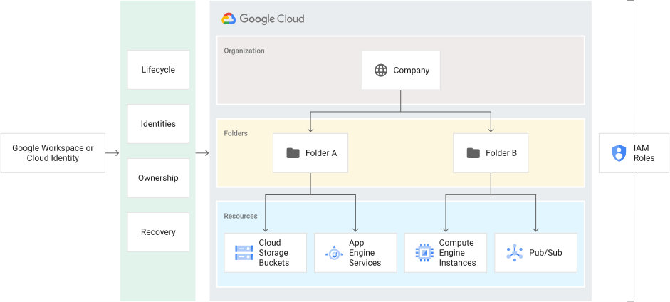

# Resource Manager
## Resource hierarchy 资源层次结构
Google Cloud 资源层次结构类似于传统操作系统中的文件系统，作为一种分层组织和管理实体的方式。通常，每个资源只有一个父资源。这种资源的分层组织使您能够在父资源上设置访问控制策略和配置设置，并且这些策略和身份和访问管理 (IAM) 设置由子资源继承。

### Google Cloud 资源层次结构详细信息
Google Cloud 资源按层次结构组织。除层次结构中最高资源外，所有资源都只有一个父资源。在最低级别，服务资源是构成所有 Google Cloud 服务的基本组件。服务资源的示例包括计算引擎虚拟机 (VM)、Cloud Storage 存储桶、App Engine 实例等。所有这些较低级别的资源都以项目资源作为其父级，这代表了 Google Cloud 资源层次结构的第一个分组机制。  

### 组织资源
组织资源代表一个组织（例如公司），并且是 Google Cloud 资源层次结构（如果存在）中的根节点。组织资源是文件夹和项目资源的层次祖先。对组织资源应用的 IAM 访问控制策略适用于组织中所有资源的整个层次结构。

#### 与 Google Workspace 或 Cloud Identity 帐号关联
Google Workspace 或 Cloud Identity 帐号代表一家公司，是访问组织资源的先决条件。在 Google Cloud 环境中，它提供身份管理、恢复机制、所有权和生命周期管理。下图显示了 Google Workspace 帐号、Cloud Identity 和 Google Cloud 资源层次结构之间的链接。  

#### 组织资源的好处
略

### 文件夹资源
文件夹资源可以选择提供额外的分组机制和项目之间的隔离边界。它们可以被视为组织资源内的子组织。文件夹资源可用于对公司内不同的法人实体、部门和团队进行建模。

### 项目资源
项目资源是基层组织实体。组织和文件夹资源可能包含多个项目。使用 Google Cloud 需要项目资源，并构成创建、启用和使用所有 Google Cloud 服务、管理 API、启用计费、添加和删除协作者以及管理权限的基础。

### IAM 策略继承
Google Cloud 提供 IAM，让您可以分配对特定 Google Cloud 资源的精细访问权限，并防止对其他资源进行不必要的访问。 IAM 允许您通过在资源上设置 IAM 策略来控制谁（用户）对哪些资源拥有哪些访问权限（角色）。  
您可以在组织级别、文件夹级别、项目级别或（在某些情况下）资源级别设置 IAM 策略。资源继承父资源的策略。如果您在组织级别设置策略，则该策略将由其所有子文件夹和项目资源继承，如果您在项目级别设置策略，则该策略将由其所有子资源继承。