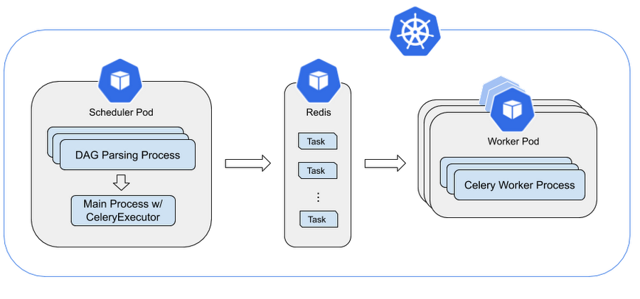
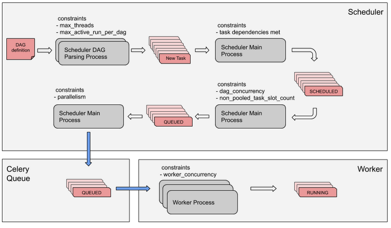
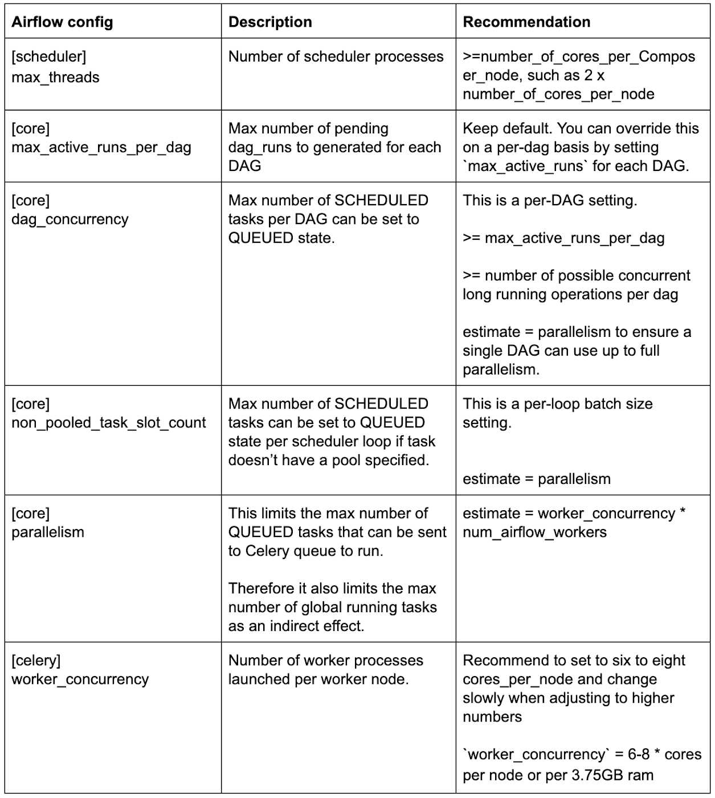

# 与您的业务一起扩展您的 Composer 环境
在构建数据管道时，重要的是要考虑现在和未来的业务需求。我们经常听到客户说他们想要配置和优化他们的 Cloud Composer 环境。因此，我们 Cloud Composer 工程团队将在这篇文章中分享 Cloud Composer（基于 Apache Airflow 构建）的工作原理，并提供一些技巧来优化您的 Cloud Composer 性能。

Cloud Composer 是一种完全托管的工作流编排服务，可让您创作、安排和监控跨越云和本地数据中心的管道。它基于 Apache Airflow 开源软件构建，并使用 Python 编程语言运行。

我们将从分析 Airflow 配置如何影响性能开始，然后提供有关快速引导初始设置以获得高性能的方法的提示。参考尺寸指南。

## 使用 CeleryExecutor 了解 Apache Airflow 调度器架构
让我们从 Cloud Composer 中 Airflow 调度器/工作器的详细架构开始。这假设您已经熟悉整个 Cloud Composer 架构和 Apache Airflow 概念。

在下图中，您可以看到从文件中重复解析, 加载 DAG 的过程。


调度器通过调用 Python **multiprocessing.Process** 来启动多个进程，并行解析 DAG 文件。调度程序可以启动的 DAG 处理进程总数受 Airflow 配置（调度程序）- **max_threads** 的限制。

### 每个DAG解析过程都会完成以下步骤：
* 解析 DAG 文件，并生成 DAG runs 和 Task。
* 收集满足所有依赖关系的任务。
* 将这些任务设置为 SCHEDULED 状态。
* 调度器的主进程会循环执行以下操作：
* 从 DAG 解析过程中收集所有 SCHEDULED 任务。
* 将符合条件的任务设置为 QUEUED 状态。
* 将一定数量的 QUEUED 任务发送到 Celery 队列中。这个数字是通过 parallelism 配置参数计算的，它代表并发运行的最大任务数。parallelism 定义了 Airflow 中每个调度程序可以同时运行的最大任务实例数，而不管工作人员的数量。 通常这个值乘以集群中调度器的数量就是元数据库中具有运行状态的任务实例的最大数量。
* 剩余的任务将保持在 QUEUED 状态。

## Cloud Composer 中任务的生命周期
每个 Airflow 任务在被 worker 执行之前都要经过下面描述的过程和约束。按顺序，Airflow 任务需要通过这些 Airflow 配置约束才能最终由 worker 执行：

1. 调度程序中的 **DAG 解析过程** 解析 DAG 定义，为 DAG 中的每个任务创建任务实例。
   1. max_threads: 调度程序可以并行运行多个进程来解析 dag。
   2. max_active_runs_per_dag: 每个 DAG 运行的活动 DAG 的最大数量。 如果达到限制，调度程序将不会创建更多 DAG 运行。 这可以在 DAG 级别使用 max_active_runs 配置，默认为 max_active_runs_per_dag。
2. 如果满足所有任务相关性，则将任务设置为 SCHEDULED 状态。
3. 一旦任务处于 SCHEDULED 状态，调度程序主进程就会选择它进行处理。
4. Scheduler 主 pProcess 选择处于 SCHEDULED 状态的任务，同时考虑每个 DAG 最大任务数的约束 “dag_concurrency” 和系统中最大任务数的“non_pooled_task_slot_count” 约束，以及其他排队标准。 有效排队的任务设置为 QUEUED 状态。
   1. dag_concurrency -> max_active_tasks_per_dag: 每个 DAG 中允许并发运行的最大任务实例数。 要计算 DAG 并发运行的任务数，请将 DAG 的所有 DAG 运行的运行任务数相加。 这可以在 DAG 级别使用 max_active_tasks 配置，默认为 max_active_tasks_per_dag。
   2. non_pooled_task_slot_count -> default_pool_task_slot_count: default_pool 的任务槽计数。 此设置不会对已创建 default_pool 的现有部署产生任何影响。 对于现有部署，用户可以使用 Web 服务器、API 或 CLI 更改插槽数
5. 下一步，Scheduler 主进程根据 parallelism 约束对 Celery 队列中的任务进行排队，这限制了 Celery 队列中排队任务的数量。 排队的任务保持在 QUEUED 状态。
   1. parallelism: 这定义了 Airflow 中每个调度程序可以同时运行的最大任务实例数，而不管工作人员的数量。 通常这个值乘以集群中调度器的数量就是元数据库中具有运行状态的任务实例的最大数量。
6. 最后，只要工作进程中的任务数低于 “worker_concurrency” 约束，工作进程就会从 Celery 队列中获取任务。 在 worker 中有效运行的任务被设置为 RUNNING 状态。
   1. worker_concurrency: 使用 airflow celery worker 命令启动 worker 时将使用的并发性。 这定义了工作人员将执行的任务实例的数量，因此请根据工作人员箱中的资源和任务的性质来调整工作人员的规模

## 推荐的 Airflow 配置变量以获得最佳性能
这是一个快速参考表，其中包含我们对可能影响性能的各种 Airflow 配置的建议。 我们将在以下部分讨论它们背后的基本原理。

|  Airflow 配置  |  说明  |  推荐  |
| ---- | ---- | ---- |
|  max_threads  |  调度程序可以并行运行多个进程来解析 dag。  |  TD  |
|  max_active_runs_per_dag  |  每个 DAG 运行的活动 DAG 的最大数量。  |  保持默认值。可以在 DAG 级别使用 max_active_tasks 配置  |
|  dag_concurrency  |  每个 DAG 中允许并发运行的最大任务实例数。  |  TD  |
|  non_pooled_task_slot_count  |  default_pool 的任务槽计数  |  TD  |
|  parallelism  |  这定义了 Airflow 中每个调度程序可以同时运行的最大任务实例数  |  TD  |
|  worker_concurrency  |  设置控制一个 worker 可以同时运行的任务实例的数量。  |  TD  |

## 选择正确的 Airflow 调度程序设置
当您需要扩展 Cloud Composer 环境时，您需要选择正确的 Airflow 配置以及节点和机器类型设置。
* Airflow 默认配置的 scheduler max_threads 只有两个，这意味着即使 Airflow scheduler pod 运行在 32 核节点上，它也只能启动两个 DAG 解析进程。 因此，建议将 max_threads 至少设置为每台机器的 vCPU 数量。
* 如果您发现任务在 SCHEDULED 状态下花费很长时间，则可能意味着任务受到 dag_concurrency 或 non_pooled_task_slot_count 的限制。 您可以考虑增加两个选项的值。
* 如果您发现任务卡在 QUEUED 状态，这可能意味着它们可能受到并行性的限制。 但是，它也可能受到工作人员处理能力的限制，因为任务只有在工作人员接手后才会设置为 RUNNING 状态。 您可以考虑增加并行度或添加更多工作节点。

## 测试 Airflow worker 性能
* Cloud Composer 为您环境中的每个节点启动一个工作程序 pod。 每个 worker pod 可以启动多个 worker 进程来从 Celery 队列中获取和运行任务。worker pod 可以启动的进程数受 Airflow 配置 worker_concurrency 的限制。
* 为了测试 worker 的性能，我们基于 no-op PythonOperator 进行了测试，发现六个或七个并发的 worker 进程似乎已经充分利用了一个 vCPU 和 3.75GB RAM（默认的 n1-standard-1 机器类型）。添加工作进程会引入大量的上下文切换开销，甚至会导致工作 pod 出现内存不足问题，最终中断任务执行。
* Cloud Composer 使用六作为环境的默认并发值。对于单个节点中具有更多核心的环境，使用公式 [worker_concurrency = 6-8 * cores_per_node or per_3.75GB_ram] 可以快速获得适合您的 worker_concurrency 数。如果您确实想要更高的并发，我们建议在新值生效后密切监控 worker pod 的稳定性。由于内存不足错误而发生的 Worker Pod 驱逐可能表明并发值过高。您的实际限制可能因您的工作进程内存消耗而异。
* 另一个需要考虑的因素是非 CPU 密集型的长时间运行的操作，例如来自远程服务器的轮询状态，它会消耗内存来运行整个 Airflow 进程。我们建议慢慢提升您的 worker_concurrency 数量，并在调整后密切监控。

## 考虑更多节点与更强大的机器
* 我们的内部测试表明，worker 处理能力受 vCPU 内核总数而非机器类型的影响最大。少量的多核机器和大量的单核机器在 worker 处理能力上没有太大区别，只要 CPU 核心总数相同即可。
* 然而，在小节点设置中，有大量节点但机器功能较弱，调度程序运行在一台小机器上，它可能没有足够的计算能力来产生任务供工作人员执行。
* 因此，我们建议使用相对较少的强大机器设置 Cloud Composer 集群，请记住，如果机器数量太少，一台机器发生故障将严重影响集群。
* 我们的内部测试表明，在 worker_cores:scheduler_cores 比率高达 9:1 左右的情况下，只要没有长时间运行的任务，对于相同数量的内核，在系统输出方面没有性能差异。 我们建议您仅在有长时间运行的任务时超过该比率。 您可以使用下面的公式快速计算出一个好的 worker_cores:scheduler_cores 比率。
```
node_count upper bound <= 9 + num_long_running_operations / worker_concurrency
```
* 例如，如果您最初将环境设置为每台机器三个节点和两个内核，然后估计您可能同时有 24 个长时间运行的任务，您可以尝试将环境扩展到 9 + 24 / (2 * 6) = 11 个节点。 如果您想获得更多性能，可能值得尝试使用更强大的机器类型。