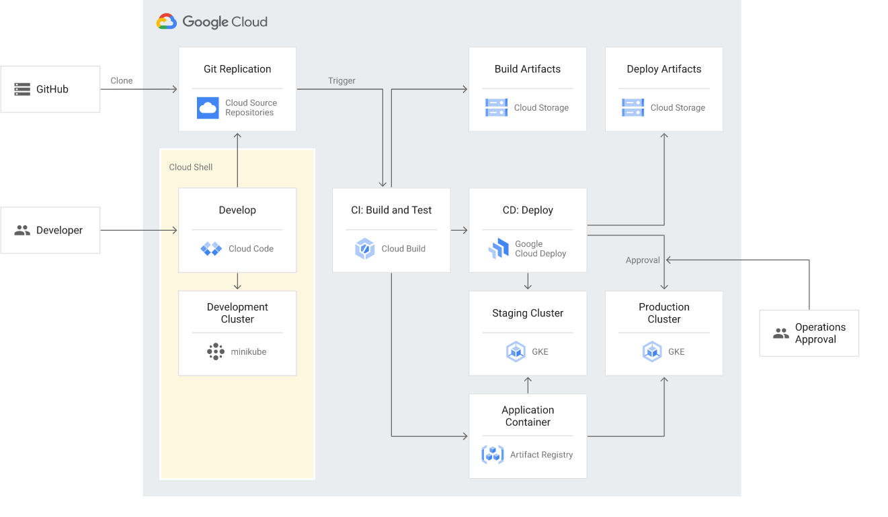

# 发现
## GKE 概览
代管式 Kubernetes 服务 Google Kubernetes Engine (GKE)，借助该服务，您可以使用 Google 的基础架构大规模部署和运营容器化应用。  
### 何时使用 GKE
* GKE 的优势
* GKE 应用场景
### GKE 的工作原理
GKE 环境由节点组成，节点是 Compute Engine 虚拟机 (VM)，它们组合在一起构成集群。您将应用（也称为工作负载）打包到容器中。您可以将多个容器作为 Pod 部署到节点。您可以使用 Kubernetes API 与工作负载进行交互，包括管理、扩缩和监控。  
* Kubernetes 版本和功能
* 运营模式
### GKE 使用入门

## 选择 GKE 操作模式
GKE 为集群提供以下操作模式：
* Autopilot 模式（推荐）：GKE 管理底层基础架构，例如节点配置、自动扩缩、自动升级、基准安全配置和基准网络配置。
* 模式：您负责管理底层基础架构，包括配置各个节点。
### 为何选择 GKE Autopilot 模式
### 为何选择 GKE Standard 模式
### 价格差异
### 何时使用 Standard 而非 Autopilot

## 使用场景
### GKE上的数据

## GKE的插件
### Backup for GKE

# 开始
## 快速入门
### 部署容器化网络服务器应用
1. 启用 Artifact Registry API, Kubernetes Engine API .
2. 创建名为 hello-cluster 的 Autopilot 集群:
```
gcloud container clusters create-auto hello-cluster \
    --region=asia-northeast2
```
3. 获取用于集群的身份验证凭据:
```
gcloud container clusters get-credentials hello-cluster \
    --region asia-northeast2
```
4. 部署应用:
```
kubectl create deployment hello-server \
    --image=us-docker.pkg.dev/google-samples/containers/gke/hello-app:1.0
```
5. 公开 Deployment:
```
kubectl expose deployment hello-server --type LoadBalancer --port 80 --target-port 8080
```
6. 检查和查看应用
```
kubectl get pods
kubectl get service hello-server
http://EXTERNAL-IP 
```
7. 清理

删除应用的 Service:
```
kubectl delete service hello-server
```
 删除集群:
```
gcloud container clusters delete hello-cluster \
    --region asia-northeast2
```

### 部署特定语言的应用
1. 启用 Artifact Registry, Cloud Build, and Google Kubernetes Engine API。
2. 创建一个 Spring Boot 应用。
3. 使用 Cloud Build 将应用容器化

Dockerfile
```
# Use the official maven/Java 8 image to create a build artifact.
# https://hub.docker.com/_/maven
FROM maven:3.5-jdk-8-alpine as builder

# Copy local code to the container image.
WORKDIR /app
COPY pom.xml ./
COPY src ./src/

# Build a release artifact.
RUN mvn package -DskipTests

# Use AdoptOpenJDK for base image.
# It's important to use OpenJDK 8u191 or above that has container support enabled.
# https://hub.docker.com/r/adoptopenjdk/openjdk8
# https://docs.docker.com/develop/develop-images/multistage-build/#use-multi-stage-builds
FROM adoptopenjdk/openjdk8:jdk8u202-b08-alpine-slim

# Copy the jar to the production image from the builder stage.
COPY --from=builder /app/target/helloworld-*.jar /helloworld.jar

# Run the web service on container startup.
CMD ["java","-Djava.security.egd=file:/dev/./urandom","-Dserver.port=${PORT}","-jar","/helloworld.jar"]
```
4. 创建 Artifact Registry 代码库
```
gcloud artifacts repositories create hello-repo \
    --project=PROJECT_ID \
    --repository-format=docker \
    --location=asia-northeast1 \
    --description="Docker repository"
```
5. 使用 Cloud Build 构建容器映像，此行为类似于运行 docker build 和 docker push，但构建是在 Google Cloud 上进行的：
```
gcloud builds submit \
  --tag asia-northeast1-docker.pkg.dev/PROJECT_ID/hello-repo/helloworld-gke .
```
6. 创建 GKE 集群
```
gcloud container clusters create-auto helloworld-gke \
  --region asia-northeast1
```
7. 部署应用

deployment.yaml
```
apiVersion: apps/v1
kind: Deployment
metadata:
  name: helloworld-gke
spec:
  replicas: 1
  selector:
    matchLabels:
      app: hello
  template:
    metadata:
      labels:
        app: hello
    spec:
      containers:
      - name: hello-app
        # Replace $LOCATION with your Artifact Registry location (e.g., us-west1).
        # Replace $GCLOUD_PROJECT with your project ID.
        image: $LOCATION-docker.pkg.dev/$GCLOUD_PROJECT/hello-repo/helloworld-gke:latest
        # This app listens on port 8080 for web traffic by default.
        ports:
        - containerPort: 8080
        env:
          - name: PORT
            value: "8080"
---
```
```
kubectl apply -f deployment.yaml
```

8. 部署 Service

service.yaml
```
apiVersion: v1
kind: Service
metadata:
  name: hello
spec:
  type: LoadBalancer
  selector:
    app: hello
  ports:
  - port: 80
    targetPort: 8080
---
```
```
kubectl apply -f service.yaml
```

9. 查看已部署的应用
```
 http://EXTERNAL-IP
```

## 示例

## 了解基础知识
### 视频播放列表：[GKE 基本功能](https://goo.gle/GKEEssentials)
* video/GKEEssentials.md
### 视频播放列表：[借助 Google 了解 Kubernetes](https://goo.gle/LearnK8swithGoogle)
* LearnK8swithGoogle.md
### Kubernetes 漫画
### Kubernetes.io

## 计划和准备
### 使用 Cloud Code、Cloud Build 和 Google Cloud Deploy 开发和交付应用
* 构架

* 部署
1. 启用 Artifact Registry, Cloud Build, Google Cloud Deploy, Cloud Source Repositories, Google Kubernetes Engine, Resource Manager, and Service Networking API。
2. 为服务帐号授予所需的权限：
```
gcloud config set project PROJECT_ID

gcloud projects add-iam-policy-binding PROJECT_ID \
    --member=serviceAccount:$(gcloud projects describe PROJECT_ID \
    --format="value(projectNumber)")-compute@developer.gserviceaccount.com \
    --role="roles/clouddeploy.jobRunner"

gcloud projects add-iam-policy-binding PROJECT_ID \
    --member=serviceAccount:$(gcloud projects describe PROJECT_ID \
    --format="value(projectNumber)")-compute@developer.gserviceaccount.com \
    --role="roles/artifactregistry.reader"

gcloud projects add-iam-policy-binding PROJECT_ID \
    --member=serviceAccount:$(gcloud projects describe PROJECT_ID \
    --format="value(projectNumber)")@cloudbuild.gserviceaccount.com \
    --role="roles/clouddeploy.operator"

gcloud projects add-iam-policy-binding PROJECT_ID \
    --member=serviceAccount:$(gcloud projects describe PROJECT_ID \
    --format="value(projectNumber)")-compute@developer.gserviceaccount.com \
    --role="roles/container.admin"

gcloud projects add-iam-policy-binding PROJECT_ID \
    --member=serviceAccount:$(gcloud projects describe PROJECT_ID \
    --format="value(projectNumber)")@cloudbuild.gserviceaccount.com \
    --role="roles/iam.serviceAccountUser"
```
3. 创建预演和生产 GKE 集群：
```
gcloud container clusters create-auto staging \
    --region asia-northeast1 \
    --project=$(gcloud config get-value project) \
    --async

gcloud container clusters create-auto prod \
    --region asia-northeast1 \
    --project=$(gcloud config get-value project) \
    --async
```
4. 获取与 GKE 集群进行交互的凭据
```
gcloud container clusters get-credentials staging --region us-central1
gcloud container clusters get-credentials prod --region us-central1
```
5. 克隆代码库并在 Cloud Shell 中打开。
```
https://ssh.cloud.google.com/cloudshell/editor?cloudshell_git_repo=https%3A%2F%2Fgithub.com%2Fgoogle%2Fgolden-path-for-app-delivery&cloudshell_git_branch=main&cloudshell_open_in_editor=README.md&hl=zh-cn

gcloud config set project PROJECT_ID
```
6. 在 Cloud Source Repositories 中创建一个代码库来存储源代码
```
gcloud source repos create cicd-sample
git push --all google
```
7. 在 Artifact Registry 中创建映像代码库
```
gcloud artifacts repositories create cicd-sample-repo \
    --repository-format=Docker \
    --location us-central1
```
8. 为 Cloud Build 创建一个 Cloud Storage 存储桶以存储 artifacts.json 文件（用于跟踪 Skaffold 为每个版本生成的工件）：
```
gsutil mb gs://$(gcloud config get-value project)-gceme-artifacts/
```

cloudbuild.yaml
```
substitutions:
  _REGION: us-central1
steps:
- name: 'gcr.io/k8s-skaffold/skaffold'
  entrypoint: 'sh'
  args:
  - -xe
  - -c
  - |
    # Build and push images
    skaffold build --file-output=/workspace/artifacts.json \
                   --default-repo=${_REGION}-docker.pkg.dev/$PROJECT_ID/cicd-sample-repo \
                   --push=true

    # Test images
    skaffold test --build-artifacts=/workspace/artifacts.json

- name: 'google/cloud-sdk:latest'
  entrypoint: 'sh'
  args:
  - -xe
  - -c
  - |
    gcloud config set deploy/region ${_REGION}
    sed -i s/PROJECT_ID/$PROJECT_ID/g deploy/*
    gcloud deploy apply --file deploy/pipeline.yaml
    gcloud deploy apply --file deploy/staging.yaml
    gcloud deploy apply --file deploy/prod.yaml
    gcloud deploy releases create rel-${SHORT_SHA} \
                        --delivery-pipeline cicd-sample \
                        --description "$(git log -1  --pretty='%s')" \
                        --build-artifacts /workspace/artifacts.json \
                        --annotations "commit_ui=https://source.cloud.google.com/$PROJECT_ID/cicd-sample/+/$COMMIT_SHA"
artifacts:
  objects:
    location: 'gs://$PROJECT_ID-gceme-artifacts/'
    paths:
    - '/workspace/artifacts.json'
options:
  machineType: E2_HIGHCPU_8
timeout: 3600s
```
9. 创建 Cloud Build 触发器
```
gcloud beta builds triggers create cloud-source-repositories \
    --name="cicd-sample-main" \
    --repo="cicd-sample" \
    --branch-pattern="main" \
    --build-config="cloudbuild.yaml"
```

#### 构建、测试和运行应用
1. 启动 minikube
```
minikube start
```
```
apiVersion: skaffold/v2beta16
kind: Config
metadata:
  name: full-stack
build:
  artifacts:
  - image: cicd-sample
    context: ./
test:
  - image: cicd-sample
    custom:
      - command: ./test.sh
        timeoutSeconds: 60
        dependencies:
          paths:
          -  "*_test.go"
          -  "test.sh"
      - command: echo Hello world!!
        dependencies:
          command: echo [\"main_test.go\"]
deploy:
  kustomize:
    paths:
    - k8s/dev/
portForward:
- resourceType: service
  resourceName: cicd-sample
  port: 8080
profiles:
- name: staging
  deploy:
    kustomize:
      paths:
      - k8s/staging/
- name: prod
  deploy:
    kustomize:
      paths:
      - k8s/prod/
```
2. 利用 Skaffold 构建和部署应用
3. 更改
4. 提交代码
```
git config --global user.email "YOU@EXAMPLE.COM"
git config --global user.name "NAME"

git add .
git commit -m "use lowercase for: sample app info"
```
5. 启动 CI/CD 流水线并部署到预演环境
```
git push google
```
6. 打开 Google Cloud Deploy 交付流水线页面, 部署到预演环境中。
7. 将版本提升到生产环境

### 解决持续交付挑战
文字介绍了部署模型，组织模型，工程环境以及 GitOps 概念。值得反复阅读。