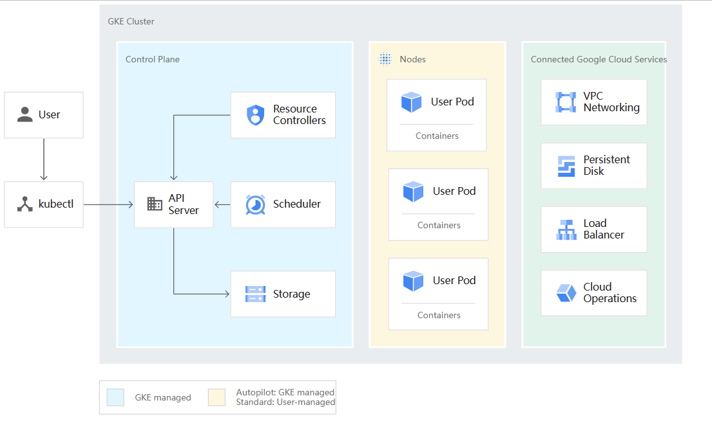

# 设置 GKE 集群
## 规划集群以运行工作负载
### 集群配置选项简介
介绍两种操作模式以及主要的集群配置选项。

两种操作模式：
* Autopilot：提供完全预配和托管式集群配置。
* 标准：提供集群底层基础架构的高级配置灵活性。

集群配置选项：

* 集群可用性类型：区域(Zones)级（单区域或多区域）集群和地区(Regions)级集群。
    > Compute Engine 资源托管在全球多个位置。这些位置由地区(Regions)和区域(Zones)组成。
    > 地区(Regions)是您可以托管资源的特定地理位置。
    > 地区(Regions)具有三个或更多区域(Zones)。
    > 例如，us-west1 表示美国西海岸的一个地区(Regions)，该地区(Regions)具有三个可用区域(Zones)：us-west1-a、us-west1-b 和us-west1-c。
* 集群版本: 发布渠道版本, 特定版本, 默认版本
* 集群网络：VPC 原生集群和基于路由的集群
* 网络隔离选项: 您可以配置从公共网络访问集群工作负载的方式。
* Kubernetes 特性: Kubernetes 中的新功能列为 Alpha 版、Beta 版或稳定版，具体取决于其在开发过程中的状态。

### 集群管理简介
您可以使用各种 Google Cloud 工具和 API（包括 Google Cloud CLI 和 Google Cloud 控制台）来配置集群的配置和特性。这些任务包括创建、更新和删除集群；添加或移除节点；以及使用 Identity and Access Management (IAM) 控制哪些用户可以访问集群。  
如需控制集群的内部行为，您可以使用 Kubernetes API 和 kubectl 命令行界面。
* 基本集群管理：基本的集群管理任务特定于 Google Cloud 上的 GKE 集群，通常不涉及 Kubernetes 系统本身；您可以使用 Google Cloud 控制台、Google Cloud CLI 或 GKE API 完整执行这些任务。
  - 集群和节点升级
  - 集群级层配置
  - 节点配置
* 配置集群监控：Google 建议您使用 Google Cloud 的 Managed Service for Prometheus 来监控您的 Kubernetes 应用和基础架构。
* 配置集群网络：集群管理的另一个方面是启用和控制集群的各种网络功能。大多数网络功能都是在创建集群时进行设置的：使用 Google Cloud 界面创建集群时，您必须启用要使用的网络功能。其中有部分功能可能需要使用 Kubernetes 界面（例如 kubectl 命令行界面）进行进一步配置。
* 配置集群安全性：GKE 包含可与您的集群搭配使用的 Google Cloud 专有功能和 Kubernetes 安全功能。您可以使用 Google Cloud 控制台管理 Google Cloud 级层的安全性，例如 IAM。您可以使用 Kubernetes API 和其他界面管理集群内安全功能，例如基于角色的访问控制。

### GKE 集群架构

* 关于控制平面: 控制平面运行 Kubernetes API 服务器、调度器和核心资源控制器等进程。GKE 管理从集群创建到删除的控制平面生命周期。其中包括对控制平面上运行的 Kubernetes 版本的升级。该升级将由 GKE 自动执行；如果您希望提前升级，而不按计划自动升级，可以请求手动执行。
  * 控制平面和 Kubernetes API: 控制平面是集群的统一端点。您可以通过 Kubernetes API 调用与控制平面进行交互。控制平面运行 Kubernetes API 服务器进程 (kube-apiserver) 以处理 API 请求。
  * 控制平面与节点的交互: 控制平面管理集群的所有节点上运行的内容。控制平面安排工作负载并管理工作负载的生命周期、扩缩和升级。此外，控制平面还会管理这些工作负载的网络和存储资源。控制平面和节点使用 Kubernetes API 相互通信。
  * 控制平面与 Artifact Registry 的互动: 当您创建或更新集群时，GKE 会从 pkg.dev Artifact Registry 或 gcr.io Container Registry 中拉取控制平面和节点上运行的 Kubernetes 系统软件的容器映像。
* 关于节点: 节点是运行容器化应用和其他工作负载的工作器机器。各个机器是 GKE 创建的 Compute Engine 虚拟机 (VM)。控制平面管理和接收每个节点自我报告状态的更新。节点运行支持容器（容器构成了集群的工作负载）所必需的服务。这些服务包括运行时和 Kubernetes 节点代理 (kubelet)；该节点代理会与控制平面通信，并负责启动和运行被调度到该节点上的容器。GKE 还运行多个系统节点，这些容器作为每个节点的代理（称为 DaemonSet）运行，可提供日志收集和集群内网络连接等功能。

## 设置 Autopilot 集群
### GKE Autopilot 简介
什么是 Autopilot？GKE Autopilot 是 GKE 中的一种运维模式，在此模式中，Google 管理集群配置，包括节点、扩缩、安全和其他预配置设置。
* 网络：创建使用公共网络的 Autopilot 集群时，集群中的工作负载可以相互通信以及与互联网通信。这是默认的网络模式。
* 缩放：在 Autopilot 中，GKE 根据集群中的 Pod 数量自动扩缩节点。
* 安全
* 创建集群：规划环境并了解自己的要求后，请创建 Autopilot 集群。 新的 Autopilot 集群是具有可公开访问的 IP 地址的区域级集群。每个集群都应用了基准安全强化措施，以及自动扩缩和其他功能。
* 在 Autopilot 上部署工作负载：如需将工作负载部署到正在运行的 Autopilot 集群，请编写 Kubernetes 清单并将其应用于集群。默认情况下，Autopilot 集群经过优化，可运行大多数生产工作负载。
* 工作负载分离：Autopilot 集群支持使用节点选择器和节点亲和性来配置工作负载分离。
* 使用可用区拓扑在特定可用区中调度 Pod：请使用具有 topology.kubernetes.io/zone 键的 nodeSelector。
* Pod 相似性和反相似性：使用 Pod 亲和性和反亲和性将 Pod 共置在一个节点上，或让某些 Pod 避免使用其他 Pod。Pod 亲和性和反亲和性告知 Kubernetes 根据在特定拓扑网域（例如特定区域或可用区）中的节点上运行的 Pod 的标签来做出调度决策。
* Pod 拓扑分布限制：在 Kubernetes 增加和减少 Pod 数量时，如需提高工作负载的可用性，您可以设置 Pod 拓扑分布限制。这将控制 Kubernetes 如何在拓扑网域（例如区域）内的节点上分布 Pod。

### 创建 Autopilot 集群
略
## 创建 Standard 集群
略

### 使用预留区域级(Zones)资源
客户可以预留特定区域(Zones)中的 Compute Engine 实例，确保资源在需要时可供工作负载使用。创建预留后，您可以创建 GKE 集群和节点池时使用预留实例。  
在创建集群或节点池时，您可以通过指定 --reservation-affinity 标志来指明预留使用模式。
* 使用任何匹配的预留：预留标志设置为 --reservation-affinity=any。
* 使用特定的单项目预留: 预留标志设置为 --reservation-affinity=specific 并提供具体预留名称。
* 使用特定的共享预留: 预留标志设置为 --reservation-affinity=specific --reservation=projects/OWNER_PROJECT_ID/reservations/RESERVATION_NAME
* 创建节点但不使用预留: 预留标志设置为 --reservation-affinity=none。

### 地区(Regions)级集群
地区(Regions)集群在单个地区(Regions)内跨多个区域(Zones)复制集群的控制平面和节点。
* 优势：应对单个可用区域(Zones)故障的能力。持续控制层面升级、控制层面大小调整以及缩短控制层面故障造成的停机时间。

### 创建地区(Regions)集群
略

### 功能门控
略

### Alpha 版集群简介
您可以通过创建 Alpha 版集群来体验 Kubernetes Alpha 版功能。Alpha 版集群启用了所有 Kubernetes API 和功能。 Alpha 版集群专为高级用户和尝鲜者而设计，在新功能可用于生产环境之前用工作负载进行相关试验。您可以像使用普通 GKE 集群一样使用 Alpha 版集群。

### 创建 Alpha 版集群
略

### 使用 Windows Server 节点池创建集群

## 准备使用集群
### 安装 kubectl 并配置集群访问权限
* kubectl 的工作方式。kubectl 是一个命令行工具，可用来与 GKE 集群进行交互。如需将 kubectl 与 GKE 搭配使用，您必须安装该工具并将其配置为与集群通信。如果您在 Google Cloud 中运行多个集群，则需要进一步配置 kubectl。
* 如何安装 kubectl 以及任何必需的依赖项。
* 如何为 kubectl 设置默认集群。
* 如何针对特定集群运行 kubectl 命令。
```
# 查看kubeconfig
kubectl config view

# 查看 kubectl 的当前上下文
kubectl config current-context

# 为特定集群生成 kubeconfig 上下文
# 运行 gcloud container clusters get-credentials 还会将 kubectl 的当前上下文更改为该集群。
gcloud container clusters get-credentials CLUSTER_NAME \
    --region=CLUSTER_REGION

# 切换 kubectl 的当前上下文：
gcloud container clusters get-credentials CLUSTER_NAME \
    --region=COMPUTE_REGION

# 您可以使用 --cluster=CLUSTER_NAME 针对特定集群运行单独的 kubectl 命令。
略
```

### 使用标签整理集群
* GKE 集群和节点池标签以及 Kubernetes 标签GKE 集群和节点池标签与 Kubernetes 中的标签有所不同。这两个标签系统独立工作，不继承或共享标签。GKE 集群和节点池标签是附加到您的资源的任意元数据，可用于跟踪使用情况和结算信息。

### 使用标记将政策应用于集群
标记是一种可附加到 Google Cloud 中的资源的键值对。您可以使用标记，根据资源是否有特定标记，有条件地允许或拒绝政策。作为平台管理员，您可以使用访问权限控制和标记来根据集群是否具有特定标记有条件地授予 Identity and Access Management (IAM) 角色。

## 配置节点池
### 节点镜像简介
Google Kubernetes Engine (GKE) 节点的节点映像。GKE Autopilot 节点始终使用带有 containerd 的 Container-Optimized OS (cos_containerd)，这是推荐的节点操作系统。如果使用 GKE Standard，则可以选择创建集群或节点池期间在每个节点上运行的操作系统映像。还可以升级现有 Standard 集群以使用其他节点映像。

### containerd 节点映像
Google Kubernetes Engine (GKE) 节点中使用 containerd 作为容器运行时的节点映像的信息。

### 指定节点镜像
为 Google Kubernetes Engine (GKE) Standard 模式集群中的节点指定节点映像。

### GKE 上的 Arm 工作负载简介
略

### 创建具有 Arm 节点的集群和节点池
略

### 规划 GKE Standard 节点大小
规划 Google Kubernetes Engine (GKE) 标准节点池中节点的大小，以降低工作负载中断和资源不足终止的风险。GKE Autopilot 不需要此规划，因为 Google 会为您管理节点。
* 节点可分配资源：可用于工作负载的其余资源（系统开销之外的资源）称为可分配资源。
* GKE 资源预留：GKE 会根据节点上可用资源的总大小在节点上预留特定数量的内存和 CPU 资源。
* 本地临时存储预留：GKE 提供具有本地临时存储空间的节点，由本地连接的设备（例如节点的启动磁盘或本地 SSD）提供支持。
* 使用资源预留规划节点大小

### Spot 虚拟机简介
Spot 虚拟机是一种价格低于标准 Compute Engine 虚拟机但不保证可用性的 Compute Engine 虚拟机 (VM) 实例。

### 使用单租户节点
单租户节点是运行特定项目虚拟机的专用物理服务器。您可以使用单租户节点将您的虚拟机与其他项目中的虚拟机进行物理隔离，或者将您的虚拟机汇集到同一主机硬件上。

### Windows Server 容器简介
在 GKE 上使用 Windows Server 容器可让您利用 Kubernetes 的优势：灵活性、部署速度以及简化 Windows Server 应用的管理。您可以在同一集群中并行运行 Windows Server 容器和 Linux 容器，从而为这两个容器平台提供集中管理平面。目前不支持 Microsoft Hyper-V 容器。

## 使用硬件和 AI 加速


