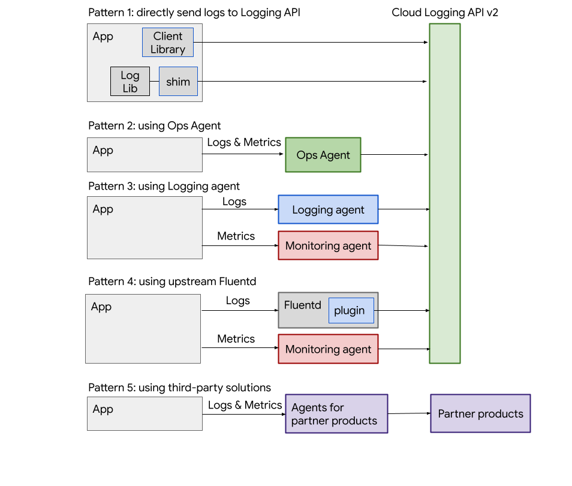

# 探索
## Cloud Logging 概览
Cloud Logging是一种支持日志、搜索、分析和监控的实时日志管理系统。Cloud Logging 会自动从 Google Cloud 资源收集日志。您还可以从应用、本地资源和其他云服务提供商处收集日志。您可以配置提醒，以便在日志中报告某些类型的事件时收到通知，并根据监管或安全原因确定日志数据的存储位置。

### 从应用和第三方软件中收集日志
略
### 排查和分析日志
略
### 监控日志
略
### 日志存储
略
### 日志类别
略
### 日志的数据模型
略
### 访问权限控制
略
### 保留
略
### 价格
略

# 开始使用
## 快速入门：Compute Engine 虚拟机的日志记录
略

## 快速入门：使用 gcloud CLI 写入和查询日志
略

## 快速入门：使用 Python 脚本编写和查询日志
略

# 收集和写入日志
## 您应该使用哪个：代理还是客户端库？
以编程方式使用客户端库还是使用 Logging 代理将应用日志发送到 Cloud Logging。

## 结构化日志记录
略

## 从虚拟机和第三方应用收集日志
### 管理虚拟机上的 Logging 代理
Ops Agent，旧版 Logging 代理

### Ops Agent
#### Ops Agent 概览
略
#### 安装 Ops Agent
* 使用 Google Cloud CLI 创建代理政策，以在一组虚拟机上安装和管理代理。
* 使用自动化工具在一组虚拟机上安装代理
* 在单个虚拟机上安装 Ops Agent
#### 管理 Ops Agent
* 授权 Ops Agent
* 配置 Ops Agent
* 对 Ops Agent 自日志使用日志轮替
#### 排查 Ops Agent 问题
略
#### 从第三方应用收集日志
略
### 旧版 Logging 代理
略
### 收集本地和多云日志
略
## 收集 Kubernetes Engine 日志
略

## 写入应用日志
### logging 库概览
许多编程语言都有标准的日志写入接口，您可以重新配置这些接口以使用日志记录。
### Java: 使用 Logback 或 java.util.logging
您可以使用 Logback 附加器或 java.util.logging 处理程序将 Java 应用中的日志写入 Cloud Logging，也可以直接使用 Java 版 Cloud Logging 库。
#### 适用于 Cloud Logging 的 Logback 附加器
* 使用 Logback 附加器，您可以将 Cloud Logging 与 SLF4J 日志门面一起使用。
* 您也可以通过默认的 Java Logging API 处理程序来使用 Cloud Logging API。
* 如需了解如何直接使用 Java 版 Cloud Logging 客户端库，请参阅 [Cloud Logging 客户端库](https://cloud.google.com/logging/docs/reference/libraries)。

# 安全访问日志
## 使用 IAM 控制访问权限