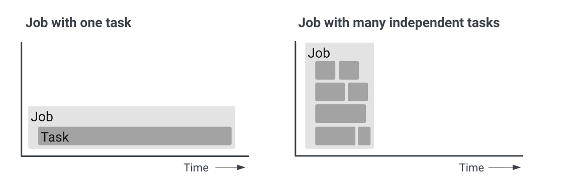
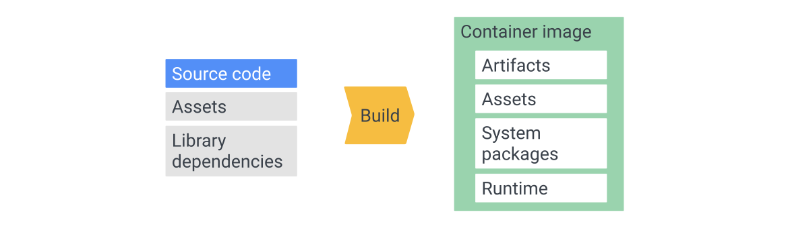

# Cloud Run
Cloud Run 是一款代管式计算平台，供您运行可通过请求或事件调用的容器。Cloud Run 采用无服务器设计：您不用管理基础架构，因此可全力专注于最重要的工作，构建出色的应用。

## 产品概述
https://cloud.google.com/run

## Cloud Run 是什么
* Cloud Run 是一个托管计算平台，可让您直接在 Google 的可扩展基础架构之上运行容器。

* 在 Cloud Run 上，您的代码可以作为service或job连续运行。service用于运行响应 Web 请求或事件的代码。job用于执行工作，并在工作完成后退出。

### Cloud Run services
* Cloud Run 服务为您提供运行可靠 HTTPS 端点所需的基础架构。您的职责是确保您的代码侦听 TCP 端口并处理 HTTP 请求。

* 标准服务功能包括：Unique HTTPS endpoint for every service, 基于请求的快速自动伸缩, 内置流量管理, Private and public services.
* 扩缩到零和最小实例: Cloud Run 会自动添加和移除容器实例以处理所有传入请求。如果您的服务没有传入请求，即使是最后一个剩余的容器实例也将被删除。如果没有活动的容器实例，一旦有请求进来，就会按需创建一个新的容器实例。这会对这些第一个请求的响应时间产生负面影响，具体取决于容器准备好处理请求的速度。为确保您的服务不会扩展到零实例，您可以配置 Cloud Run 以保持最少数量的容器实例处于活动状态。
* 即用即付: 如果您未配置最少实例，则如果您的服务未被使用，则不会向您收费。两种定价模式：Request-based, Instance-based.
* 一次性容器文件系统: Cloud Run 上的容器实例是一次性的。要永久保存文件，您可以与 Cloud Storage 集成或挂载网络文件系统 (NFS)。
* 何时使用 Cloud Run 服务: Websites and web applications, APIs and microservices, Streaming data processing.

### Cloud Run Jobs
* 如果您的代码执行工作然后停止(a script is a good example), 您可以使用 Cloud Run job来运行您的代码。

* Array job 是运行作业的更快方式: 一个job可以启动一个容器实例来运行你的代码, 这是运行脚本或工具的常用方法。但是，您也可以并行启动许多相同的、独立的容器实例，即一个Aarry job。

* 何时使用 Cloud Run job: Cloud Run job非常适合运行执行工作并在工作完成后退出的代码。Script or tool, Array job, Scheduled job.

### Cloud Run 集成
* Cloud Run 与更广泛的 Google Cloud 生态系统集成，使您能够构建功能齐全的应用程序。Data storage, Logging and error reporting, 服务标识, 持续交付, Private networking, Google Cloud APIs, 后台任务.

### Services or jobs must be packaged in a container image
为了使您的 Services 或 jobs 可部署到 Cloud Run，您必须将其打包到容器镜像中。
* 容器镜像是一个包，其中包含您的服务运行所需的一切。这包括构建工件、资产、系统包和（可选）运行时。这使得容器化应用程序具有固有的可移植性, 它在容器可以运行的任何地方运行。
