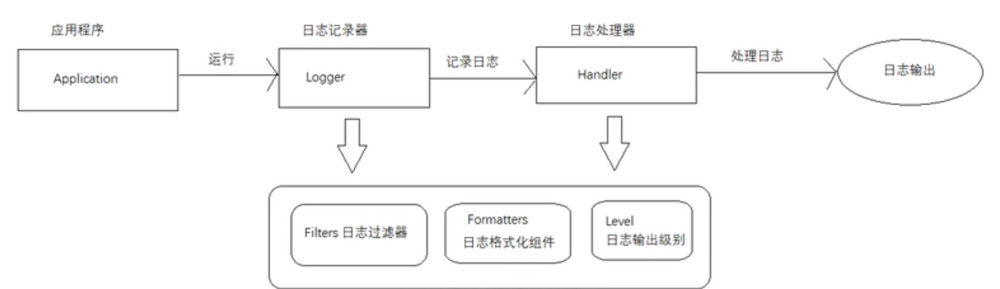

# [Java日志框架视频教程-全网最全最细的Java日志框架](https://www.bilibili.com/video/BV1Mb4y1Z74W)

## JUL Java Util Logging

* 
* Java 原生日志框架。
* 适合小型项目。

## Log4j
* Apache 开源项目。

## Logback
* Log4j 同一个人开发的。

## Log4j2
* 结合Log4j 和 Logback。

## 门面技术
由于各个日志框架都有自己的API，为了统一他们的使用方式。

* JCL
* SLF4j