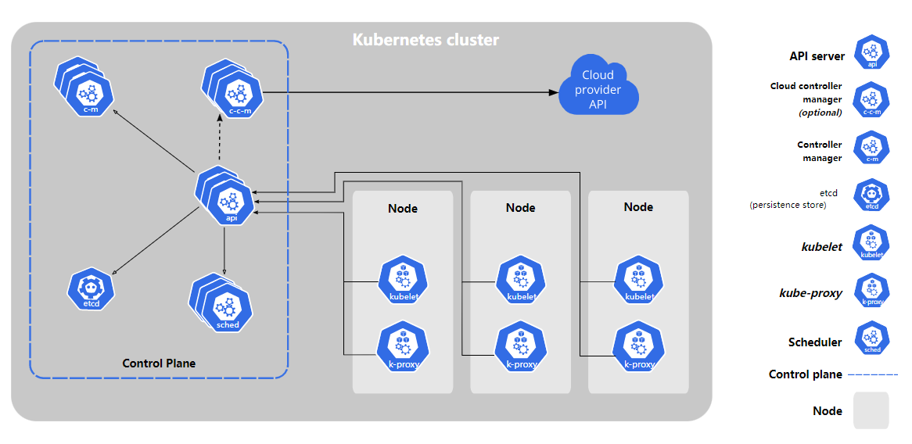

## 概述
Kubernetes 是一个可移植、可扩展的开源平台，用于管理容器化的工作负载和服务，方便进行声明式配置和自动化。Kubernetes 拥有一个庞大且快速增长的生态系统，其服务、支持和工具的使用范围广泛。
### 时光回溯

### 为什么需要 Kubernetes，它能做什么？
Kubernetes 为你提供了一个可弹性运行分布式系统的框架。 Kubernetes 会满足你的扩展要求、故障转移你的应用、提供部署模式等。  
Kubernetes 为你提供：
* 服务发现和负载均衡
* 存储编排
* 自动部署和回滚
* 自动完成装箱计算
* 自我修复
* 密钥与配置管理
### Kubernetes 不是什么
Kubernetes 不是传统的、包罗万象的 PaaS（平台即服务）系统。 由于 Kubernetes 是在容器级别运行，而非在硬件级别，它提供了 PaaS 产品共有的一些普遍适用的功能， 例如部署、扩展、负载均衡，允许用户集成他们的日志记录、监控和警报方案。 但是，Kubernetes 不是单体式（monolithic）系统，那些默认解决方案都是可选、可插拔的。 Kubernetes 为构建开发人员平台提供了基础，但是在重要的地方保留了用户选择权，能有更高的灵活性。  
此外，Kubernetes 不仅仅是一个编排系统，实际上它消除了编排的需要。 编排的技术定义是执行已定义的工作流程：首先执行 A，然后执行 B，再执行 C。 而 Kubernetes 包含了一组独立可组合的控制过程，可以持续地将当前状态驱动到所提供的预期状态。 你不需要在乎如何从 A 移动到 C，也不需要集中控制，这使得系统更易于使用且功能更强大、 系统更健壮，更为弹性和可扩展。
### Kubernetes 组件
当您部署 Kubernetes 时，您会得到一个集群。  
Kubernetes 集群由一组运行容器化应用程序的工作机器（称为节点）组成。 每个集群至少有一个工作节点。  
工作节点托管作为应用程序工作负载组件的 Pod。 控制平面管理集群中的工作节点和 Pod。 在生产环境中，控制平面通常运行在多台计算机上，一个集群通常运行多个节点，提供容错和高可用性。

#### 控制平面组件（Control Plane Components） 保安室
控制平面的组件做出关于集群的全局决策（例如，调度），以及检测和响应集群事件（例如，当部署的副本字段不满足时启动新的 pod）。
#### kube-apiserver 保安本人
Kube-apiserver 是 Kubernetes 的核心组件之一，是控制平面的关键组件之一，为用户和管理员提供了与 Kubernetes 集群进行交互的途径。
#### etcd 工作记录本
etcd是Kubernetes的核心组件之一，它是一个可靠、高效、分布式的键值存储系统，用于存储Kubernetes集群的所有重要信息，包括集群状态、Pod和Service信息、节点信息等。
#### kube-scheduler
kube-scheduler 是 Kubernetes 的核心组件之一，用于将新的 Pod 调度到Kubernetes 集群中的合适节点上。
#### kube-controller-manager
kube-controller-manager 是 Kubernetes 的核心组件之一，它是一个控制器，用于管理 Kubernetes 集群中的各种控制器，包括 Replication Controller、Endpoints Controller、Namespace Controller 等。
#### cloud-controller-manager
Kubernetes集群可以运行在公共云、私有云或混合云环境中。不同的云服务提供商会提供不同的API来管理他们的云资源，如虚拟机、负载均衡器、存储卷等。而cloud-controller-manager就是一种在Kubernetes集群中运行的组件，它与云服务提供商的API进行交互，从而可以让Kubernetes集群更好地与云服务提供商的资源进行集成和管理。

#### 节点组件（Node Components）
节点组件运行在每个节点上，维护运行中的 Pod 并提供 Kubernetes 运行时环境。
#### kubelet
kubelet 是 Kubernetes 的核心组件之一，它是一个代理，用于管理节点上的 Pod 和容器。
#### kube-proxy
kube-proxy 是一个网络代理，运行在集群中的每个节点上，kube-proxy 在节点上维护网络规则。 这些网络规则允许从集群内部或外部的网络会话与您的 Pod 进行网络通信。
#### 容器运行时
容器运行时是一个软件，用于在节点上运行容器。 Kubernetes 支持多种容器运行时：Docker、containerd、CRI-O、rktlet 等。

#### 插件（Add-ons）
* DNS
* Web UI (Dashboard)
* Container Resource Monitoring
* Cluster-level Logging

### Kubernetes API
Kubernetes API 是 Kubernetes 中最核心的组件之一，它提供了 Kubernetes 系统中各个组件之间的通信机制。Kubernetes API 是一个 RESTful API，通过该 API，用户可以管理 Kubernetes 集群中的各种资源，例如 Pod、Service、ReplicaSet 等等。

### 使用 Kubernetes 对象
#### 理解 Kubernetes 对象
在 Kubernetes 中，对象（Object）是 Kubernetes API 的核心概念之一。对象是 Kubernetes 集群中的可部署组件，如应用程序、服务、卷或部署等。Kubernetes 对象具有一组属性，包括元数据、规范和状态，这些属性描述了对象的特征和期望行为。

元数据（Metadata）包含了对象的名称、命名空间、标签等信息。规范（Spec）定义了对象的期望状态，包括容器的镜像、副本数量、端口等。状态（Status）则记录了对象的当前状态，比如对象是否正在运行、容器的运行状况、副本数量等信息。
#### Kubernetes 对象管理