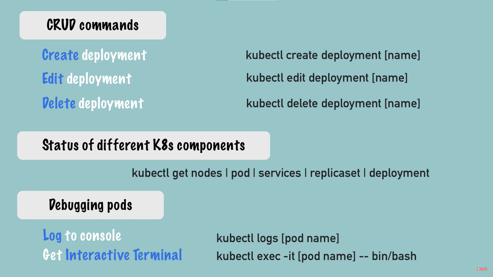
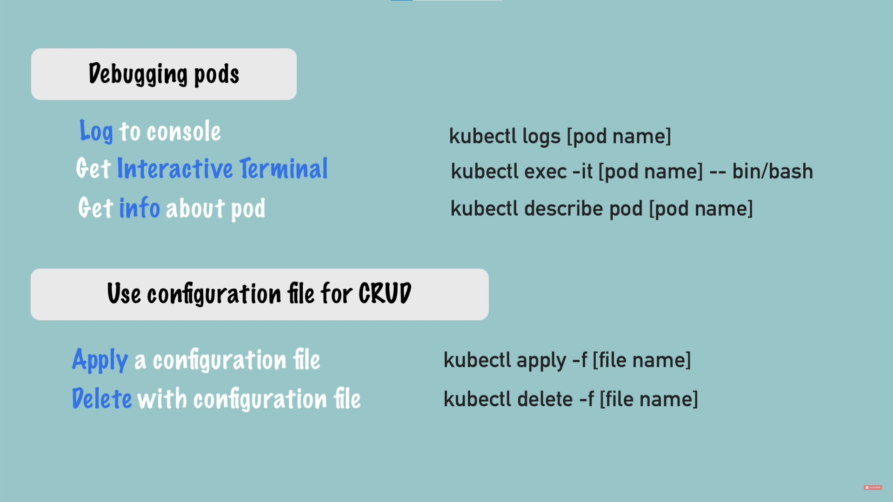

### 本地构建 Minikube 环境
1. GCE 新建实例
2. 安装 Docker
3. 安装 kubectl
4. 安装 Minikube

### Kubectl CLI 和 Minikube CLI
kubectl CLI和Minikube CLI都是非常有用的命令行工具，用于管理和操作Kubernetes集群和Minikube本地集群。kubectl CLI是Kubernetes API的主要客户端工具，用于管理和操作Kubernetes资源对象，而Minikube CLI则是用于管理和操作Minikube本地集群的工具。

### 启动 Minikube
```
minikube start
```
### 获取 Minikube 状态
```
minikube status
```

***
***



### 获取 kubectl 版本
```
kubectl version
```
### 创建 deployment
```
kubectl create deployment nginx-depl --image=nginx
```
### 通过适用配置文件创建 deployment
```
kubectl apply -f nginx-deployment.yaml
```
### 编辑 deployment
```
kubectl edit deployment nginx-depl
```
### 获取 node 状态
```
kubectl get nodes
```
### 获取 pod 状态
```
kubectl get pod
```
### 获取 service 状态
```
kubectl get services
```
### 获取 deployment 状态
```
kubectl get deployment
```
### 获取 replicaset 状态
```
kubectl get replicaset
```
### 删除 deployment
```
kubectl delete deployment mongo-depl
```
### 获取 pod 日志
```
kubectl logs nginx-depl-8475696677-dqtz5
```
### 获取关于 pod 的描述
```
kubectl describe pod mongo-depl-5ccf565747-znrjh
```
### 进入 pod 内部
```
kubectl exec -it mongo-depl-5ccf565747-znrjh -- bin/bash

用户可以使用Ctrl+D命令退出会话并返回到终端上。
```
kubectl exec是Kubernetes命令行工具kubectl提供的一个子命令，用于在正在运行的Pod中执行命令。这个命令可以让用户与正在运行的Pod进行交互，