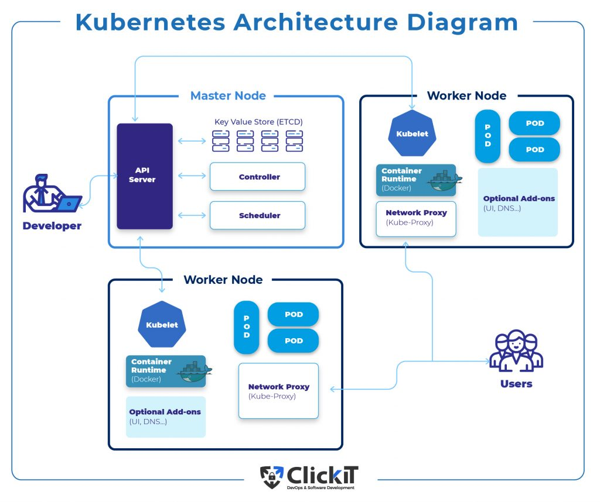

## 课程概要

## 什么是 K8s
Kubernetes（通常称为“K8s”）是一个开源的容器编排系统，可以帮助管理和部署容器化的应用程序。

## K8s 基础组件介绍
### pod: 在Kubernetes中，一个pod是最小的可部署单元，它包含一个或多个紧密相关的容器，它们共享网络和存储资源。
* Pod具有以下特点：
1. Pod是临时的，它可以在任何时候被删除或替换。
2. Pod中的所有容器都可以使用相同的网络和存储资源。
3. Pod内的容器可以相互通信，而不需要通过网络进行通信。

### node: 是集群中的一个工作节点，也称为主机。是Kubernetes集群中的一部分，用于运行Pod。每个Node都有一些计算资源，例如CPU和内存，以及一些存储资源，例如磁盘空间。Node还可以与其他Node通信，以便在需要时进行负载均衡和故障转移。当创建一个Pod时，Kubernetes调度器会根据Pod的需求选择一个合适的Node来运行Pod。这通常基于Node上可用的资源和Pod的需求。一旦Pod被调度到一个Node上，Kubernetes会创建一个或多个容器，将它们部署到该Node上，并启动它们。每个Node上都运行着一些Kubernetes组件，例如kubelet和kube-proxy。kubelet是Kubernetes节点代理，负责与Kubernetes Master通信，并管理Node上的Pod和容器。kube-proxy是一个网络代理，负责管理集群中的网络流量，并在需要时进行负载均衡。

### kubelet: 是运行在每个Node上的一个代理进程，它负责管理该Node上的Pod和容器。kubelet与Kubernetes Master进行通信，以确保Node上的Pod状态与Kubernetes API服务器保持同步。kubelet还监控Pod的健康状况，如果发现Pod出现故障或异常，会尝试重启或清理Pod。
* kubelet可以执行以下一些主要任务：
1. 容器的生命周期管理：kubelet可以根据Pod的配置启动、停止、重启和销毁容器。
2. 容器资源管理：kubelet负责分配Node上的计算和存储资源给Pod中的容器，并监控容器使用的资源情况。
3. 容器健康监测：kubelet会定期检查容器的健康状况，如果发现容器出现故障或异常，会尝试重启或清理容器。
4. Pod和容器日志管理：kubelet负责收集和存储Pod和容器的日志，并将其转发到Kubernetes集群中的日志存储服务中。
5. 容器网络管理：kubelet负责管理Node上的容器网络，并将其与集群网络连接起来。

### kube-proxy: 是一个网络代理，它运行在每个Node上，并负责管理集群中的网络流量。kube-proxy通过将网络流量转发到正确的Pod上，实现了Kubernetes中的服务发现和负载均衡功能。
* kube-proxy主要执行以下任务：
1. 服务发现：kube-proxy监听Kubernetes API服务器上的服务定义，将其转化为Node上的iptables规则，以便将请求转发到正确的Pod上。
2. 负载均衡：kube-proxy使用iptables规则或IPVS模块，在Pod之间分发请求，以便实现负载均衡。
3. 网络代理：kube-proxy通过Pod的IP地址和端口号来管理Node上的网络流量，以便将请求转发到正确的Pod上。
4. 高可用性：kube-proxy可以检测Pod的健康状况，并根据需要更新服务的iptables规则或IPVS表，以确保流量在健康的Pod之间正确地分配。

### Master Node: 是集群的控制节点，负责管理集群中的资源和协调集群中的各种活动。Master Node通常运行在高可用性集群中，以确保集群的稳定性和可靠性。
* Kubernetes Master Node包括以下组件：
1. API Server：是Kubernetes集群中的中心控制器，处理集群内部各种请求和操作，包括创建、更新、删除Pod、Replication Controller和Service等操作。
2. Etcd：是Kubernetes集群中的分布式键值存储系统，用于保存集群中的所有信息和状态，包括Pod、Service、ConfigMap、Secret等对象信息，以及各种操作的历史记录和日志。
3. Scheduler：是Kubernetes集群中的调度器，负责根据各种调度策略将Pod分配到Node上，并优化集群中各种资源的利用率。
4. Controller Manager：是Kubernetes集群中的控制器管理器，负责监控和管理集群中的各种控制器，包括Replication Controller、DaemonSet、Job、CronJob等，以确保集群中的应用程序正常运行。

### service: 是一种抽象的概念，用于将一组逻辑相同的pod集合（也称为后端）暴露给其他部署在Kubernetes集群中的组件（也称为前端）。通过一个虚拟IP（ClusterIP）和一个DNS名称来标识，它们将所有相同标识的Pod作为一个逻辑单元进行管理，并在这个逻辑单元内提供负载均衡。当其他部署在Kubernetes集群中的组件需要与service中的pod进行通信时，它们只需要使用service的DNS名称或虚拟IP即可，而无需了解后端的详细信息。
* 在k8s中，有几种类型的service可供选择：
1. ClusterIP service：默认类型，只能在集群内部使用，对外不可访问。
2. NodePort service：在每个节点上公开一个静态端口，并将该端口映射到service的ClusterIP上，从而可以从集群外部访问service。
3. LoadBalancer service：使用云提供商的负载均衡器将service公开到集群外部。
4. ExternalName service：提供一个service的别名，并将DNS查询重定向到指定的服务名称。

### Ingress: 是一种API对象，它充当了一个入口点（即流量进入Kubernetes集群的地方）的角色。Ingress控制器是一种运行在Kubernetes集群中的代理服务器，它会根据Ingress规则中定义的信息，将流量路由到正确的后端服务。

### Kubernetes Ingress和Service都是Kubernetes中用于管理网络流量的对象。它们之间的区别在于，Service是一种用于将流量路由到Pod的抽象，而Ingress是一种用于将流量路由到Service的抽象。

### ConfigMap: 是一种Kubernetes API对象，用于存储非机密配置数据，ConfigMap允许开发人员将配置数据与应用程序代码分离，使得在不更改代码的情况下更改应用程序配置变得更加容易。应用程序可以使用容器环境变量直接访问ConfigMap的key-value对数据，或者可以将ConfigMap挂载到Pod的文件系统中，从而在容器中访问ConfigMap文件。
* ConfigMap可以包含以下类型的数据：
1. 以key-value对形式存储的数据
2. 以文件形式存储的数据

### Secret: 是一种Kubernetes API对象，用于存储机密配置数据，例如密码，API密钥和TLS证书等。Secret的数据是Base64编码的，以保护敏感数据。与ConfigMap类似，Secret也允许开发人员将机密数据与应用程序代码分离，以提高应用程序的可移植性和安全性。

### volume: 是一种可以在Pod中持久化存储数据的机制。它是一个抽象概念，可以将不同类型的存储介质（例如云存储、网络存储或本地存储）映射到容器内部的一个或多个目录中。使用Volume，容器中的数据可以在容器之间或在容器被删除后继续存在。这意味着即使Pod被重新调度或重启，数据也不会丢失。通过使用Volume，Kubernetes可以为应用程序提供可靠的、持久的存储。
* 在Kubernetes中，可以使用各种类型的Volume来存储数据，例如：
1. EmptyDir：创建一个空目录，它只在Pod的生命周期内存在。
2. HostPath：将Pod中的目录映射到Node上的一个目录。这种Volume适用于需要在Pod和Node之间共享数据的情况。
3. ConfigMap：将Kubernetes中的ConfigMap对象中的数据作为文件或环境变量注入到Pod中。这种Volume适用于需要在Pod中使用配置数据的情况。
4. Secret：将Kubernetes中的Secret对象中的数据作为文件或环境变量注入到Pod中。这种Volume适用于需要在Pod中使用敏感数据的情况。
5. PersistentVolumeClaim（PVC）：将Pod中的目录映射到持久化存储设备（例如云存储或网络存储）中的一个卷。使用PVC，Pod可以在多个Node之间移动而不会失去数据。

### Deployment: 是一种控制器对象，它用于管理Pod的创建和更新。Deployment可以确保指定数量的Pod副本在集群中运行，并可以自动扩展或缩减Pod数量以适应负载变化。Deployment还支持滚动更新，可以在更新应用程序版本时逐步替换Pod，以确保应用程序的高可用性。需要注意的是，Deployment只能管理Pod的创建和更新，不能管理Pod之间的通信。
* Deployment由以下几个主要组件组成：
1. Pod模板：定义要创建的Pod的规范。Pod模板包含了容器的镜像、命令、参数和环境变量等信息。
2. 副本数：定义应该创建多少个Pod副本。
3. 滚动更新策略：定义如何更新应用程序版本。可以使用滚动更新策略来逐步替换Pod，以确保应用程序的高可用性。

### StatefulSet是一种控制器对象，它用于管理有状态的应用程序，例如数据库或分布式系统。StatefulSet为每个Pod提供一个唯一的标识符（通常是基于索引的名称），并在Pod的生命周期中保持这个标识符不变。这使得StatefulSet可以为每个Pod提供一个稳定的网络标识符，可以在集群中保持不变，从而方便应用程序进行网络通信。需要注意的是，与Deployment不同，StatefulSet的Pod不支持自动水平扩展，因为它需要按照一定的顺序进行部署和删除。
* StatefulSet有以下几个主要特点：
1. 稳定的网络标识符：每个Pod都有唯一的名称，可以在集群中保持不变。这使得有状态应用程序可以进行网络通信，而不受Pod重新调度的影响。
2. 有序部署和删除：StatefulSet可以按照定义的顺序部署和删除Pod。这使得有状态应用程序可以保持一致的状态，而不会出现数据损坏或丢失。
3. 有序扩展和收缩：StatefulSet可以按照定义的顺序扩展和收缩Pod。这使得有状态应用程序可以保持一致的状态，而不会出现数据损坏或丢失。

### Kubernetes中的Deployment和StatefulSet都是控制器对象，用于管理Pod的创建和更新。然而，它们在处理有状态应用程序时有所不同。
* 稳定的网络标识符
Deployment通常管理无状态应用程序，而StatefulSet则管理有状态应用程序。StatefulSet为每个Pod提供一个稳定的网络标识符，通常是基于索引的名称，这使得有状态应用程序可以进行网络通信，而不受Pod重新调度的影响。
* Pod的唯一性
Deployment通过创建和销毁Pod来管理应用程序的状态，Pod是无状态的。而StatefulSet保证每个Pod的唯一性，每个Pod都有唯一的名称和标识符。这使得StatefulSet可以管理有状态应用程序中的数据，例如存储在磁盘上的数据。
* 滚动更新策略
Deployment支持滚动更新策略，可以在更新应用程序版本时逐步替换Pod，以确保应用程序的高可用性。StatefulSet也支持滚动更新策略，但需要按照定义的顺序进行部署和删除，以确保有状态应用程序可以保持一致的状态，而不会出现数据损坏或丢失。
* 自动水平扩展
Deployment支持自动水平扩展，可以根据负载变化自动调整Pod的数量。而StatefulSet不支持自动水平扩展，因为它需要按照一定的顺序进行部署和删除。
* 综上所述，Deployment和StatefulSet都是控制器对象，用于管理Pod的创建和更新。Deployment适用于无状态应用程序，支持自动水平扩展和滚动更新策略。StatefulSet适用于有状态应用程序，支持稳定的网络标识符、Pod的唯一性和有序部署、删除、扩展和收缩。

### 在Kubernetes中，ReplicaSet是一种控制器对象，用于确保Pod的副本数保持在指定的数量范围内。ReplicaSet定义了一个Pod模板和一个副本数，它会自动监控Pod的运行状态，并根据需要启动、重启或停止Pod的副本，以确保指定的副本数处于运行状态。ReplicaSet通常用于管理无状态的应用程序，例如Web服务器或API服务器，这些应用程序可以通过多个副本实现负载均衡和高可用性。ReplicaSet可以与Deployment对象一起使用，Deployment对象是一个更高级别的控制器对象，用于管理Pod的滚动更新和回滚，以及管理ReplicaSet的副本数。使用Deployment和ReplicaSet可以实现无缝的应用程序升级和降级，以及滚动更新和回滚的自动化管理。在Kubernetes中，通常使用控制器对象来管理Pod和副本数，而不是直接使用Pod对象。这是因为控制器对象提供了更高级别的管理功能，例如滚动更新、自动伸缩和自动修复等，可以更好地保证应用程序的可用性和健壮性。
* ReplicaSet的主要属性包括：
1. spec.replicas: 指定ReplicaSet所需的Pod副本数。
2. spec.selector: 指定要由ReplicaSet管理的Pod的选择器标签。
3. spec.template: 指定要由ReplicaSet创建的Pod的模板规范。

## K8s 基础构架解释

### 上图展示了Kubernetes的整体架构，主要包括以下几个组件：
* Master Node：控制整个集群的中心节点，负责管理集群的资源和协调各种活动。
  * API Server：是Kubernetes集群的中心控制器，负责处理集群内部各种请求和操作。
  * Controller：控制器负责管理Pod的生命周期，包括创建、启动、停止、重启等操作。
  * Scheduler：是Kubernetes集群的调度器，负责根据各种调度策略将Pod分配到Node上，并优化集群中各种资源的利用率。
  * etcd：是Kubernetes集群的分布式键值存储系统，用于保存集群中的所有信息和状态。
* Node：集群中的工作节点，负责运行Pod和其他应用程序。
  * Pod：是Kubernetes的最小部署单位，它包含一个或多个容器和共享存储、网络和其他资源，用于运行应用程序。
  * Container Runtime：容器运行时是Kubernetes中负责运行容器的底层软件，支持多种容器运行时，如Docker、CRI-O、containerd等。
  * Kubelet：是Kubernetes Node上的代理，负责管理和运行Pod。
  * Kube-proxy：是Kubernetes集群中的网络代理，用于实现集群内部的服务发现和负载均衡。

## Minikube 和 Kubectl
### Minikube是一个在本地机器上运行Kubernetes集群的工具，它使用虚拟机或容器技术创建一个单节点Kubernetes集群。Minikube非常适合Kubernetes初学者或开发人员在本地开发、测试和学习Kubernetes。

### kubectl是Kubernetes的命令行工具，用于管理和操作Kubernetes集群。使用kubectl，您可以在Kubernetes集群中创建、更新、删除和查询资源对象，例如Pod、Deployment、Service、ConfigMap、Secret等。kubectl还可以帮助您查看集群状态、监视资源对象、调试应用程序和执行复杂的操作。

> 参考 minikubeAndKubectlSetUpLocal.md