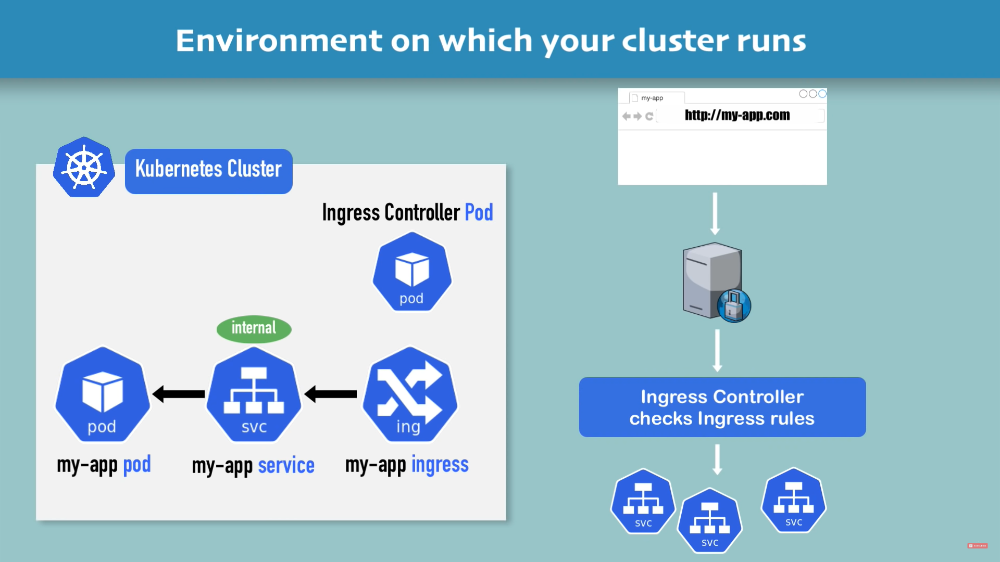

## Ingress
Kubernetes Ingress 是一个 API 对象，用于管理 HTTP(S) 流量的入口，它提供了一种方式将流量路由到 Kubernetes 集群内部的 Service。通常情况下，Ingress 被用于代理集群内部 Service 的外部 HTTP(S) 流量，并允许管理员在集群内部管理路由规则，而无需向外部负载均衡器配置更改。

## Ingress 控制器
Kubernetes本身不提供Ingress控制器的实现。因此，要使用Ingress，您必须使用Ingress控制器。Ingress控制器是实现Ingress API的软件，它将Ingress规则转换为反向代理配置，并将其应用于请求。当Ingress规则被创建或更新时，Ingress控制器将根据规则的配置创建或更新负载均衡器的配置。这样，集群外部的流量可以通过该负载均衡器路由到Ingress规则指定的服务中。

## 一个实例

### dashboard-ingress.yaml
```
apiVersion: networking.k8s.io/v1
kind: Ingress
metadata:
  name: dashboard-ingress
  namespace: kubernetes-dashboard
  annotations:
    kubernetes.io/ingress.class: "nginx"
spec:
  rules:
  - host: dashboard.com
    http:
      paths:
      - path: /
        pathType: Exact  
        backend:
          service:
            name: kubernetes-dashboard
            port: 
              number: 80
```