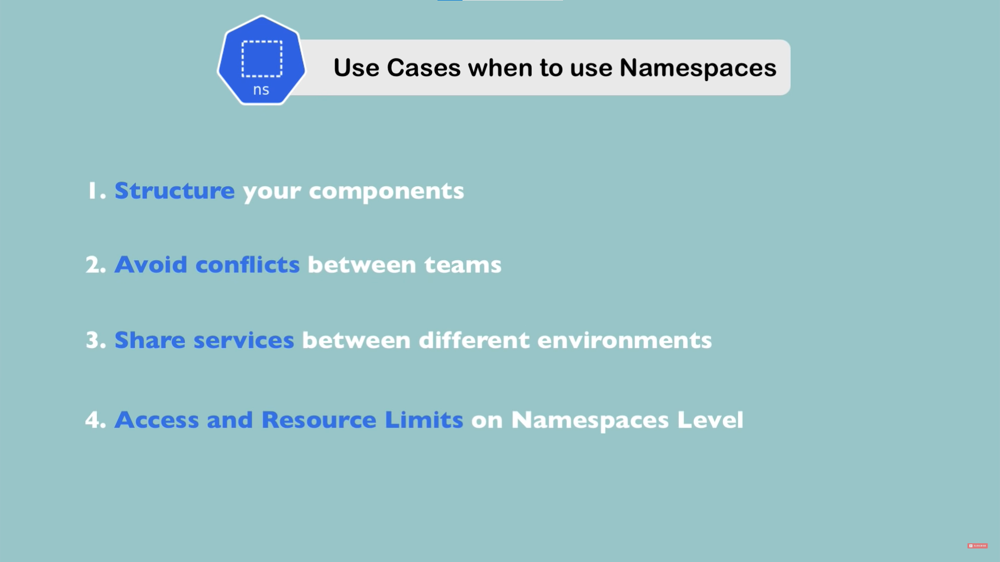

## 什么是 Namespace
Nampspace: 是一种资源对象，用于对Kubernetes集群中的资源进行逻辑隔离和划分，以便于多个团队或项目在同一集群中管理自己的资源。在同一个Kubernetes集群中，可以创建多个不同的Namespace，并在每个Namespace中创建各自的资源对象，如Pod、Service、Deployment等。这样，不同的团队或项目可以在同一个集群中共享底层资源，但各自管理自己的资源对象，互不干扰。Kubernetes默认情况下包含两个特殊的Namespace，分别是default和kube-system。其中，default命名空间是默认的命名空间，当没有指定命名空间时，Kubernetes会将资源对象分配到该命名空间中。kube-system命名空间用于存储Kubernetes系统的资源对象，如kube-dns、kube-proxy等。

## 何时考虑使用 Namespace

### 使用Kubernetes Namespace的主要目的是将Kubernetes资源隔离开来，以便在同一集群中部署多个应用程序或环境时，它们可以相互隔离，而不会互相干扰。下面是一些可以考虑使用Kubernetes Namespace的场景：
1. 部署多个环境：例如，开发、测试和生产环境。可以使用不同的Namespace来隔离它们，并确保它们不会干扰彼此。
2. 部署多个应用程序：可以使用不同的Namespace来隔离它们，并确保它们不会干扰彼此。
3. 限制访问权限：可以使用Namespace来限制用户或服务帐户对Kubernetes资源的访问权限。可以为每个Namespace分配不同的RBAC角色或权限，以限制它们可以访问的资源和操作。
4. 资源限制：可以为每个Namespace设置资源限制，以确保在同一集群中运行的多个应用程序或环境之间平等地分配资源，防止其中一个应用程序耗尽所有资源并影响其他应用程序。

## Namespace 特性
Kubernetes中的Namespace是用于对Kubernetes资源进行逻辑分区的一种机制。它将集群内的资源划分为不同的逻辑单元，使得不同的资源可以彼此隔离，不会产生冲突，同时也方便管理和控制。以下是一些Namespace的特性：
1. 逻辑分区：Namespace可以将集群内的资源分为多个逻辑分区，每个Namespace内部的资源可以互相访问，但是不同的Namespace之间是隔离的。
2. 隔离性：不同Namespace之间的资源是隔离的，这使得不同的用户或者团队可以在同一集群内部进行开发和部署，而不会相互干扰。
3. 命名空间：每个Namespace都有一个唯一的名称，可以通过该名称来识别和访问该Namespace内部的资源。
4. 安全性：使用Namespace可以帮助提高集群的安全性，通过对不同Namespace的资源进行访问控制和权限控制，可以防止恶意用户或程序的攻击。
5. 可视性：通过Namespace可以方便地查看集群内不同资源的状态和使用情况，使得集群管理更加简单和高效。

## 创建资源时使用 Namespace
### 在使用 k8s 创建资源时，可以使用 kubectl 命令的 -n 或 --namespace 选项来指定 Namespace，例如：
```
kubectl create deployment my-deploy --image=nginx --namespace=my-namespace
```
如果没有指定 Namespace，则会使用默认的 Namespace（通常为 default）。
### 在创建配置文件时，可以在 YAML 文件的 metadata 字段中指定 Namespace，例如：
```
apiVersion: v1
kind: Pod
metadata:
  name: my-pod
  namespace: my-namespace
spec:
  containers:
  - name: nginx
    image: nginx
```

## 设置默认 Namespace
### 使用以下命令设置默认 Namespace：
```
kubectl config set-context --current --namespace=my-namespace
```
### 也可以通过编辑 ~/.kube/config 文件来手动设置默认 Namespace。
```
contexts:
- context:
    cluster: my-cluster
    user: my-user
    namespace: my-namespace
  name: my-context
```