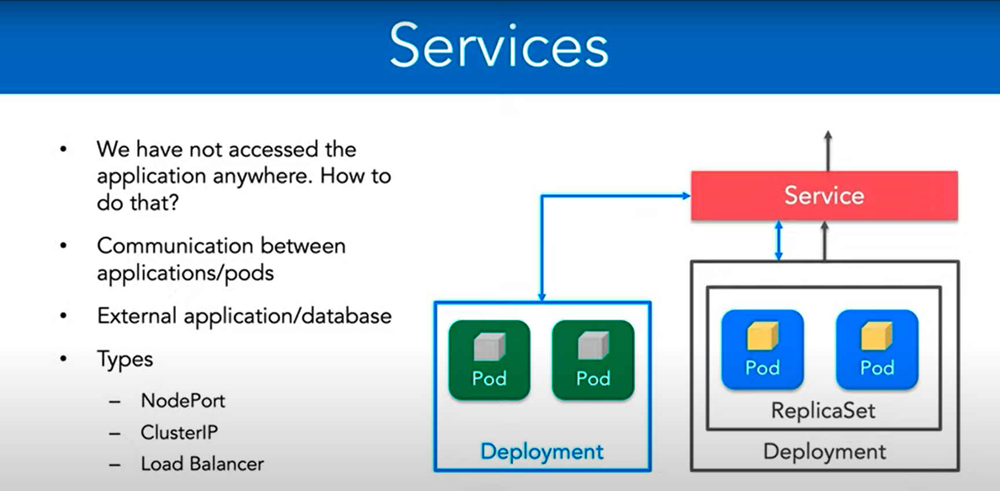
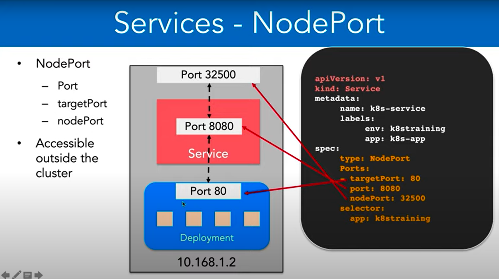
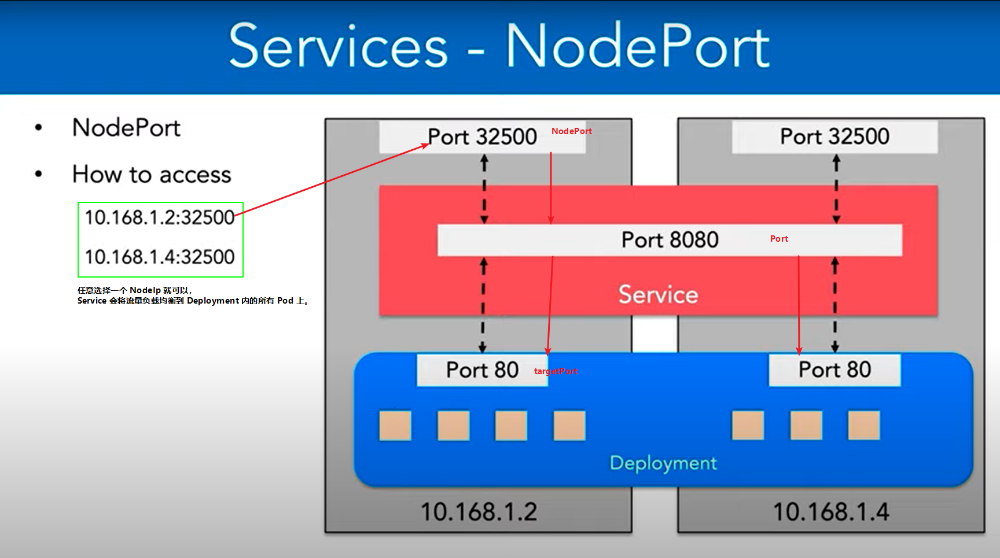

## Service
在 Kubernetes 中，一个 Service 用于定义一组具有相同功能的 Pod，并且提供一个稳定的访问它们的方式，以便其它的应用程序或者 Service 能够与它们进行通信。它们可以通过 Cluster IP 或者 NodePort 或者 LoadBalancer 或者 ExternalName 来暴露服务。  
  

### 以下是 Service 的主要特点：
* 稳定的 DNS 名称：Service 在 Kubernetes 集群内会分配一个稳定的 DNS 名称，其它应用程序可以通过这个名称来访问这个 Service，而不必关心 Service 后面的 Pod 是否在改变。
* 稳定的 IP 地址：Service 为一组后端 Pod 分配了一个稳定的 Cluster IP 地址，这个地址对于集群内的所有 Pod 都可见，而对于集群外部的客户端则不可见。
* 负载均衡：当多个后端 Pod 提供相同的服务时，Service 可以在它们之间进行负载均衡。默认情况下，Service 会以 round-robin 的方式将请求分发到后端 Pod 上。
* 服务发现：通过 Service，集群内的应用程序可以方便地发现和访问其他的服务，而不必知道这些服务的 IP 地址和端口号。
* Session Affinity：Service 支持通过 Session Affinity 机制来保证同一个客户端的请求会被转发到同一个后端 Pod 上。
* 多种类型的暴露方式：Kubernetes 支持多种方式来暴露 Service，包括 Cluster IP、NodePort、LoadBalancer 和 ExternalName。

### 使用 Service 的步骤通常是：
1. 创建 Pod。
2. 创建 Service。
3. 向 Service 中添加 Pod，这样就可以在 Service 的 DNS 名称或者 IP 地址下访问这些 Pod。
4. 如果需要暴露 Service 到集群外部，则可以使用 NodePort、LoadBalancer 或者 ExternalName 这些暴露方式。

    需要注意的是，创建 Service 时需要指定一些参数，例如 Service 的类型、Pod 的选择器、端口映射等，这些参数会影响 Service 的功能和行为。

---

在Kubernetes中，一个Service是指一组具有相同功能的Pod的抽象，它们一起提供了一个服务。Pod是可以被创建、销毁和重启的，而Service对于客户端来说是一个稳定的IP地址和端口，它们可以在Pod创建、销毁或迁移时保持不变。这使得Service成为客户端和后端Pod之间的一种抽象层，客户端无需关注后端Pod的具体IP地址和端口，而是直接使用Service的IP和端口。

当客户端向Service发送请求时，请求会被路由到一个后端Pod上，负载均衡器会根据Service的配置来选择后端Pod。Service的配置包括了三种类型：ClusterIP、NodePort和LoadBalancer。

ClusterIP类型的Service将在集群内部创建一个虚拟IP地址，只有在集群内部才能访问，对于外部的请求它是不可见的。当客户端向Service的虚拟IP地址发送请求时，请求会被路由到一个后端Pod上，这个Pod的IP地址和端口是通过Endpoint对象来维护的。Endpoint对象是Service和Pod之间的一种关系，它包含了一个或多个Pod的IP地址和端口，当Service创建或更新时，Endpoint对象会自动更新。

NodePort类型的Service会在每个节点上监听一个端口，所有进入该端口的请求都会被转发到Service的ClusterIP地址和端口上。NodePort类型的Service通常用于让外部客户端可以访问集群内部的服务。当Service创建时，Kubernetes会自动为它分配一个端口，也可以通过配置指定一个固定的端口。  
  
  

LoadBalancer类型的Service通常用于将服务暴露到公共互联网上，它会在云服务提供商（如AWS、GCP、Azure）上创建一个负载均衡器，并将请求路由到Service的ClusterIP地址和端口上。当Service创建时，Kubernetes会向云服务提供商请求一个负载均衡器，并分配一个外部IP地址。