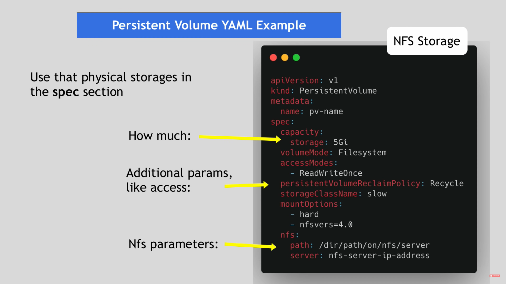
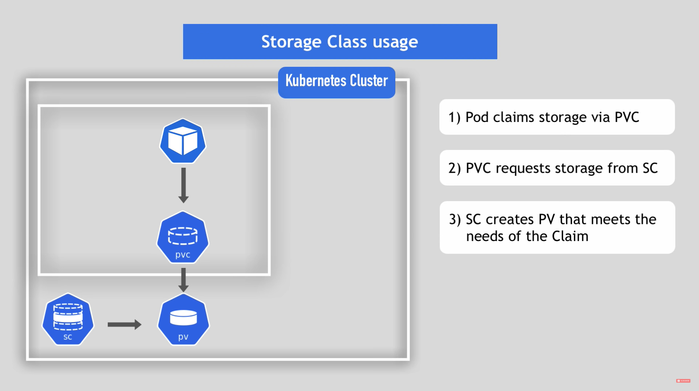

## 持久化数据 - 卷
在 Kubernetes 中，一个 Volume 是容器内文件系统的一种抽象，它可以被挂载到一个或多个容器中。这个 Volume 可以由多个 Pod 共享，使得它们可以更方便地共享数据。Volume 通常用于容器内部的持久化数据存储，比如数据库文件、配置文件等。

### 在 Kubernetes 中，Persistent Volume（持久卷）、Persistent Volume Claim（持久卷声明）和Storage Class（存储类）是用来管理存储的三个关键组件。
* Persistent Volume（PV）：PV 是一块可供 Kubernetes 集群中的 Pod 访问的网络存储资源。它们是在集群范围内定义的，并且可以独立于 Pod 而存在。PV 可以连接到不同的云提供商存储、网络存储设备、本地存储设备等。管理员创建 PV 并指定存储的大小、类型和访问模式等信息。PV 可以被动态或手动分配给 Persistent Volume Claim（PVC）。
* Persistent Volume Claim（PVC）：PVC 代表 Pod 或容器需要访问的存储的请求。它们是针对集群内 PV 的声明。使用 PVC，管理员和用户可以抽象出与 PV 相关的详细信息，而不必了解 PV 的具体细节。PVC 可以声明需要的存储量、访问模式和 Storage Class 等信息。
* Storage Class（存储类）：Storage Class 是用于动态分配 Persistent Volume 的抽象。它是一个 Kubernetes 资源对象，描述了一组存储属性，比如卷类型、大小、访问模式等。管理员可以创建多个存储类，以便为不同类型的应用程序提供不同的存储属性。
* 在 Kubernetes 中，应用程序使用 PVC 与 PV 进行交互，而不是直接使用 PV。PVC 具有对 PV 的引用，PV 与底层存储设备进行交互。使用 Storage Class，管理员可以动态地分配 PV 给 PVC，从而避免了手动分配 PV 的工作。

### Persistent Volume（持久卷）

### Persistent Volume Claim（持久卷声明）

### Storage Class（存储类）

---

