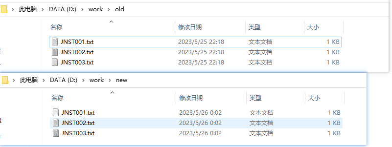
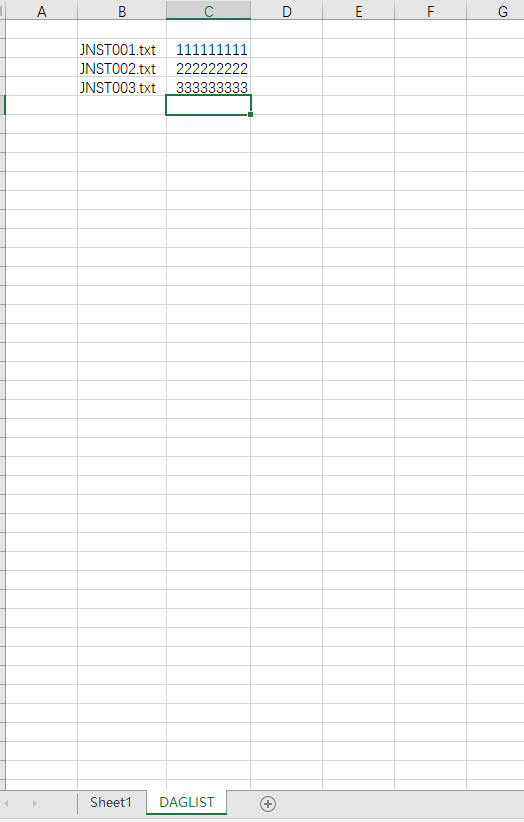

```
Sub ReplaceTextInFiles()
    Dim SourceFolderPath As String
    Dim DestinationFolderPath As String
    Dim FindString As String
    Dim ReplaceString As String
    Dim FileExtension As String
    Dim SourceFolder As Object
    Dim FileItem As Object
    Dim FileContent As String
    Dim NewFileContent As String
    Dim NewFileName As String
    Dim FoundDagCell As Range

    ' 设置源文件夹路径、目标文件夹路径、查找字符串和替换字符串
    SourceFolderPath = "D:\work\old"
    DestinationFolderPath = "D:\work\new"
    FindString = "hzh"
    ReplaceString = "heido"
    FileExtension = ".txt" ' 修改为需要处理的文件类型，例如 "*.txt" 表示处理所有文本文件

    ' 创建目标文件夹
    If Not FolderExists(DestinationFolderPath) Then
        MkDir DestinationFolderPath
    End If

    ' 获取源文件夹对象
    Set SourceFolder = CreateObject("Scripting.FileSystemObject").GetFolder(SourceFolderPath)

    ' 遍历源文件夹下的文件
    For Each FileItem In SourceFolder.Files
        ' 检查文件扩展名是否匹配
        If UCase(Right(FileItem.Name, Len(FileExtension))) = UCase(FileExtension) Then
        
            Set FoundDagCell = FindCellWithDag(FileItem.Name)
            
            ReplaceString = FoundDagCell.Offset(0, 1).Value
            
            ' 读取文件内容
            FileContent = ReadFileContent(FileItem.Path)
            
            ' 替换字符串
            NewFileContent = Replace(FileContent, FindString, ReplaceString)

            ' 生成新的文件名
            NewFileName = DestinationFolderPath & "\" & FileItem.Name

            ' 保存修改后的文件
            SaveFileContent NewFileName, NewFileContent
        End If
    Next FileItem

    MsgBox "success!!!"
End Sub

Function FolderExists(ByVal FolderPath As String) As Boolean
    FolderExists = CreateObject("Scripting.FileSystemObject").FolderExists(FolderPath)
End Function

Function ReadFileContent(ByVal FilePath As String) As String
    Dim FileNumber As Integer
    FileNumber = FreeFile

    ' 打开文件并读取内容
    Open FilePath For Input As FileNumber
    ReadFileContent = Input$(LOF(FileNumber), FileNumber)
    Close FileNumber
End Function

Sub SaveFileContent(ByVal FilePath As String, ByVal FileContent As String)
    Dim FileNumber As Integer
    FileNumber = FreeFile

    ' 打开文件并写入内容
    Open FilePath For Output As FileNumber
    Print #FileNumber, FileContent
    Close FileNumber
End Sub

Function FindCellWithDag(searchString As String) As Range
    Dim searchRange As Range
    Dim dagRange As Range
    
    Set searchRange = ThisWorkbook.Worksheets("DAGLIST").UsedRange ' 设置搜索范围为活动工作表的使用范围

    ' 使用Find方法在搜索范围内查找包含指定字符串的单元格
    Set dagRange = searchRange.Find(What:=searchString, LookIn:=xlValues, LookAt:=xlPart)
    
    ' 在Immediate窗口中输出右移后单元格的值
    Debug.Print dagRange.Address
    
    Set FindCellWithDag = dagRange

End Function

Function FindStartDate(foundCell As Range) As String

    ' 使用Offset方法将Range对象右移一个单元格
    Set shiftedCell = foundCell.Offset(0, 1)
    
    ' 获取右移后单元格的值
    FindStartDate = shiftedCell.Value
    
    ' 在Immediate窗口中输出右移后单元格的值
    Debug.Print shiftedCell.Value
End Function
```