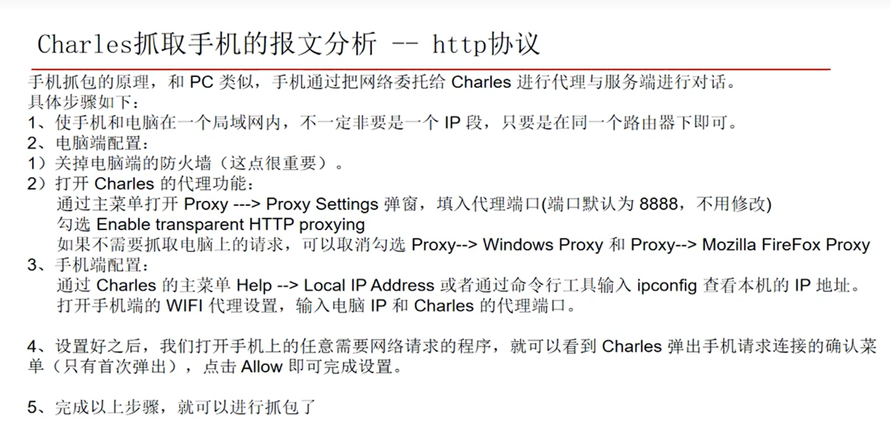

# [软件测试教程之Charles抓包工具讲解](https://www.bilibili.com/video/BV1GG4y1R7r2)

## 01-Charles 工具的介绍

## 02-http 协议的原理介绍

## 03-https 协议的原理介绍

## 04-Charles 工具的菜单和视图介绍

## 05-Charles 抓包代理设置和 http 报文基本分析
略

## 06-Charles 的 compose 进行数据篡改
略

## 07-Charles 的断点测试

## 08-Charles 抓取浏览器的 https 协议的报文

## 09-Charle 抓取手机端 http 报文

