# GIT 的基础知识
以下是版本控制系统为开发人员提供的几个主要好处：
* 历史记录和时间表
* 协作与团队合作
* 分支和实验
* 回滚和 Revert
* 协作和代码审查
* 可追溯性和问责制
* 实验和功能开发
* 备份和灾后恢复

## 什么是 Git
Git 是一个用于管理源代码的分布式版本控制系统。版本控制系统会在您修改文件时记录并保存更改，使您可以随时恢复以前的工作版本。

### Git 组件
Git 项目包含三个主要组件：存储库，工作树，索引。  
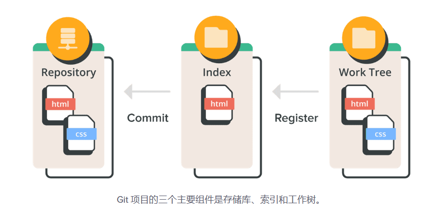

### Git 的基本工作流程
1. 修改工作树中的文件。
2. 暂存要包含在下一次提交中的更改。
3. 提交您的更改。(提交将从索引中获取文件并将它们作为快照存储在存储库中。)

### Git 文件的三种状态
已修改，已暂存，已提交。  
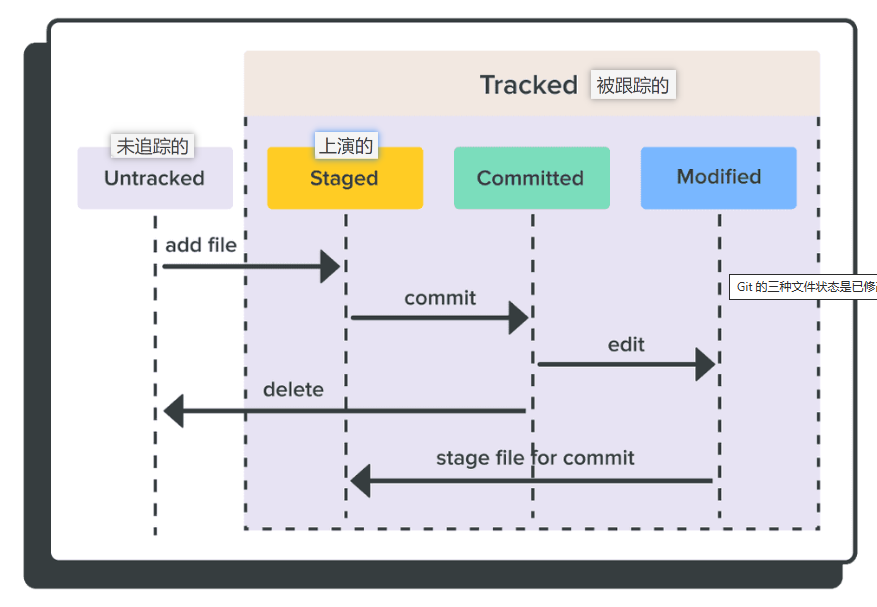  
> 修改文件时，您只会在工作树中看到这些更改。然后您必须暂存更改以将它们包含在您的下一次提交中。完成暂存所有文件后，您可以提交它们并添加一条消息来描述您所做的更改。然后您的更改将安全地记录在存储库中的新快照中。

## 存储库
存储库（Repository，通常缩写为 repo）是一个包含项目文件、历史记录和元数据的地方。它是一个版本控制系统（VCS）的核心概念，用于跟踪文件的更改、协作开发和管理项目的不同版本。

### 远程存储库与本地存储库
Git 存储库有两种类型：远程和本地。  
* 远程存储库托管在远程服务器上 (这可以在互联网上或异地服务器上；它甚至可以是不同路径中的同一台机器) 并在多个团队成员之间共享。
* 地存储库为单个用户托管在本地机器上。

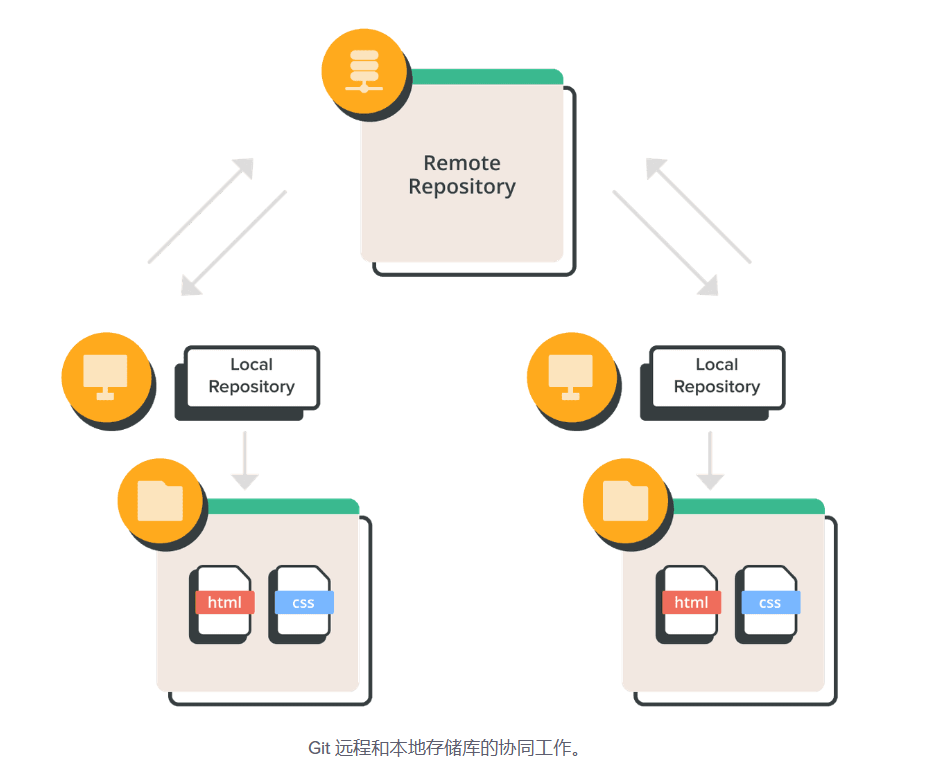

### 创建存储库
* 新的存储库：您可以使用 git 初始化命令。它可以将 Git 引入到现有的、未版本控制的项目中，以便您可以开始跟踪更改。
* 复制的存储库：您可以使用 git clone 命令将远程存储库复制到本地计算机上。默认情况下，git clone会自动建立一个本地主分支，来跟踪它所克隆的远程主分支。

## 记录变更
Git 不会自动记录您所做的每个更改。您必须通过在索引中暂存这些更改来告诉 Git 您想要记录哪些更改。暂存后，您可以提交这些更改，以便将它们记录在存储库中。

### 进行更改
工作树是您进行更改的地方。您可以在那里编辑文件、添加新文件和移除不需要的文件。

### 提交更改
提交命令允许您在存储库的 Git 历史记录中记录文件更改。  
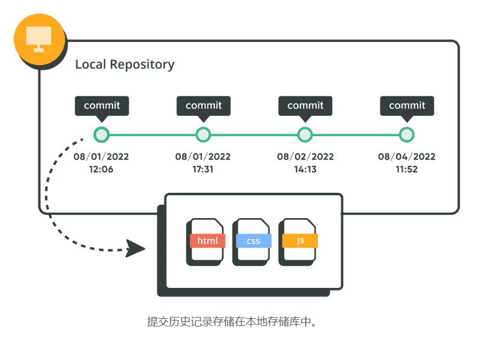

### Git 提交消息
提交更改时，您需要输入提交信息。提交消息应该简洁准确地描述您所做的更改。  
为了使消息一致且易于理解，请尝试以下 Git 提交消息模板：  
* 第 1 行：提交更改的内容摘要
* 第 2 行：空行
* 第 3 行：变更原因

## 还原变更
Git 最有价值的特性之一是能够撤销错误的操作。当您进行新的提交时，Git 会存储项目的快照，以便您可以在需要时返回到较早的版本。  
撤消更改的方法主要有两种：git revert 和 git reset。

### 撤消提交
使用 git revert 命令撤消以前的提交。这是撤消更改的最常用方法。  
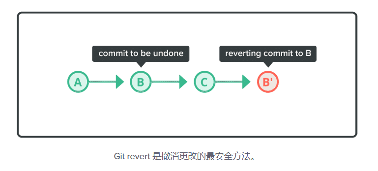

Revert 命令可创建一个新的提交，用于恢复先前提交所做的更改。它允许您撤消不需要的更改，而无需完全移除提交或修改存储库的历史记录。它是一个有用的工具，用于管理对 Git 存储库的更改，同时保留其历史记录。

虽然你可以用 git reset 或 git rebase -i 命令，从历史记录中删除先前的提交，但一般不建议这样做，因为这会导致远程存储库与其他成员的本地存储库不同。

> 使用 git revert 时，你创建一个新的提交，以撤销特定提交的更改，但保留完整的提交历史。
> 使用 git reset 时，你移动分支指针并可能删除提交，可以改变提交历史。慎用，特别是在已共享历史的情况下。
> 使用 git rebase -i 时，你可以进行更复杂的提交历史修改，包括合并、重排和删除提交。同样，慎用，因为它会改变提交历史。

### 移除提交
使用 git reset 命令使 HEAD 指向先前的提交。您可以通过进入重置模式来指定重置命令的范围。  
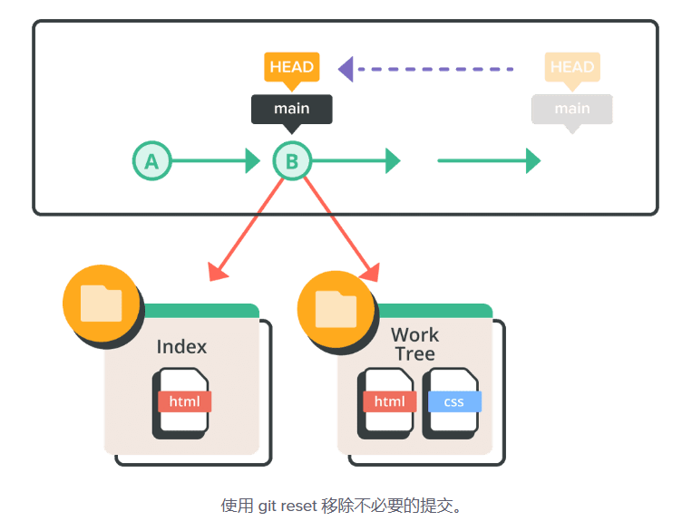

### 重置模式
共有三种主要的重置模式：
* 混合的 (默认) 模式可恢复已更改索引的状态。
* Soft 模式可撤消先前的提交。
* Hard 模式可移除提交的所有痕迹。

以下是每种重置模式的快速细分。  
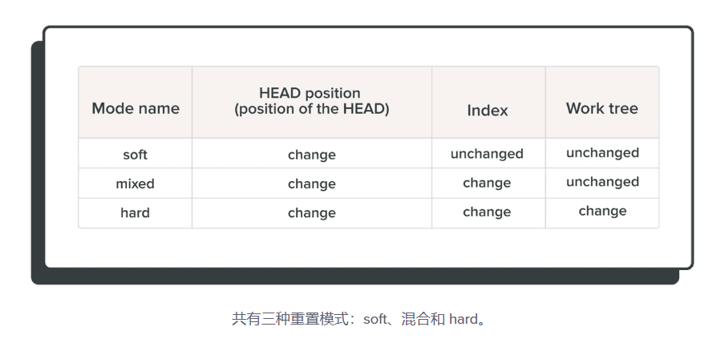  

## 同步存储库
远程存储库可以位于私人服务器、与您不同的计算机上，或者通过某些项目管理软件托管。  
无论您在哪里托管，都需要经常将本地存储库与远程存储库同步，以便与其他团队成员共享更改内容。  
您可以使用三个命令同步存储库：git push, git pull,和 git merge.。

### 推送更改
要与他人共享更改，您必须使用 git push命令。这将更新远程存储库并将其与本地存储库同步。  
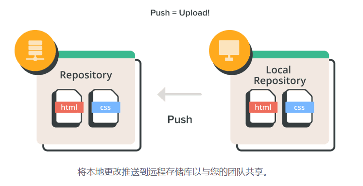

### 拉取更改
每当有人将他们的更改推送到共享的远程存储库时，您的本地存储库就会过时。要将本地存储库与新更新的远程存储库重新同步，只需运行 git pull 命令。

当运行拉取命令时，最新的修订历史记录会从远程存储库下载并导入到您的本地存储库。

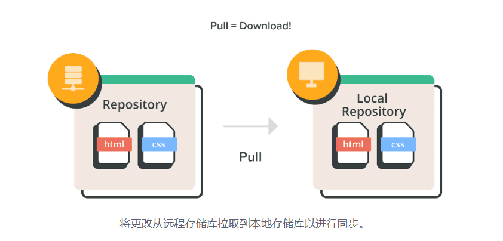

### 合并更改
如果您的本地存储库已过时，您对远程存储库的推送将被拒绝。  
在这种情况下，您可以使用 git merge 命令在推送前整合远程分支的本地副本的最新修改。Git 强制执行此操作以确保其他成员所做的更改可保留在版本历史记录中。  
在合并期间，Git 将尝试自动应用历史更改并将它们与当前分支合并。但是如果有冲突，会报错提示你手动解决。  

### 解决合并冲突
在正确完成合并之前，您可能会遇到需要解决的冲突。例如，如果两个或多个成员在两个不同的分支 (即远程和本地分支) 中对文件的同一部分进行更改，Git 无法自动合并它们。

发生这种情况时，Git 会在冲突文件中添加冲突解决标记。这些标记可帮助您确定文件的哪些部分需要手动处理。

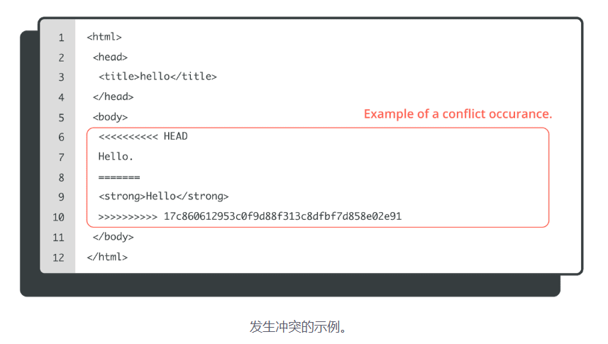

在我们上面的例子中，=====上面的所有内容都是您的本地内容，下面的所有内容都来自远程分支。

在继续创建合并提交之前，您必须依照下列所示方式解决冲突部分。

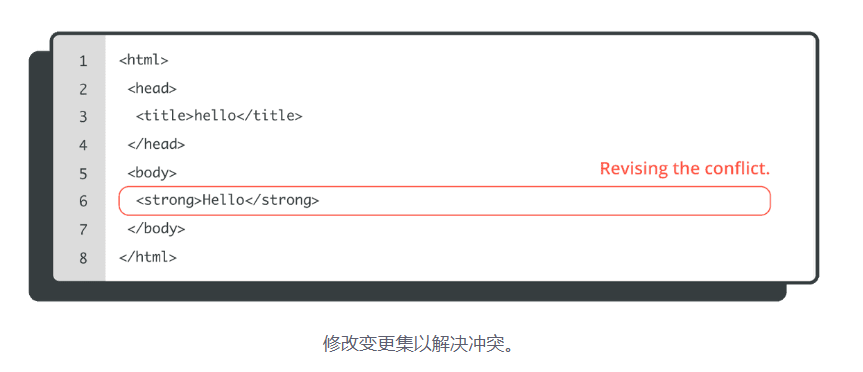

## 管理 Git 历史记录
有时您需要修改本地提交历史记录。示例场景包括需要更改您的提交信息，更新您的提交顺序，或将提交压缩在一起。

### 修改提交
您可以通过运行 git commit --amend 命令修改同一分支中的最新提交。这个命令可以方便地将新的或更新的文件添加到上一次提交中。这也是一种编辑提交消息或将提交消息添加到上一次提交的简便方法。

1. 修改最后一次提交的提交信息：
> 此命令将会打开默认的文本编辑器，允许你编辑最后一次提交的提交信息。保存并关闭编辑器后，将替代原来的提交。

2. 追加修改到最后一次提交：
> 这个命令的使用场景主要是在你已经执行了 git commit，但后来发现需要进行一些修改。使用 --amend 可以避免创建新的提交，而是修改最后一次提交。

> 需要注意的是，如果你已经将提交推送到远程仓库，修改提交后再次推送时可能会引发问题，因为提交历史已经改变。在这种情况下，最好不要修改已经推送的提交。

### 将提交复制到新分支
变基是将在一个分支上提交的所有更改复制到新分支的过程。

运行 git rebase 命令并加上-i选项以重写、替换、删除和合并历史记录中的个别提交。

您也可以使用变基命令来：
* 重写过去的提交信息
* 将一组提交压缩在一起
* 添加尚未提交的文件

### 将提交复制到其他分支
您可以使用 git cherry-pick 命令将现有提交从另一个分支复制到存储库中的当前分支。

Cherry-picking 可以让您：
* 将提交从错误的分支移动到正确的分支。
* 根据另一个分支的现有提交，为当前分支添加提交。

### 合并提交
压缩是将多个提交合并为一个提交的过程。  
如果你运行 git merge 命令和 --squash 选项，一个新的提交会将来自一个分支的所有提交组合在一起。然后该提交可以合并到当前分支中。

# GIT 协作
## 分支
在协作环境中，多个开发人员共享源代码和共用同一个源代码工作是很常见的。虽然一些开发人员会修复 bug，但其他开发人员会实现新功能等。随着这么多事情的进行，需要有一个系统来管理同一代码库的不同版本。

### 什么是 Git 分支？
Git 分支在本质上是一条独立的开发线。在处理新功能或 bug 修复时，您可以使用分支来将您的工作与其他团队成员的工作隔离开来。

### 创建分支
创建新分支不会更改存储库，只是为当前提交添加了一个新指针。

## 切换分支
git checkout 命令可更新工作树中的文件，以匹配存储在您希望切换到的分支中的版本。

您可以将其视为在不同工作区之间切换的一种方式。

### 指向分支
HEAD 用于表示分支的当前快照。对于一个新的存储库，在默认情况下，Git 会将 HEAD 指向主分支。更改 HEAD 指向的位置将更新您的活动分支。

~ (代字号) 和 ^ (插入符号) 指向相对于特定提交的位置。这些符号与提交引用一起使用，通常是 HEAD 或提交哈希(hash)。

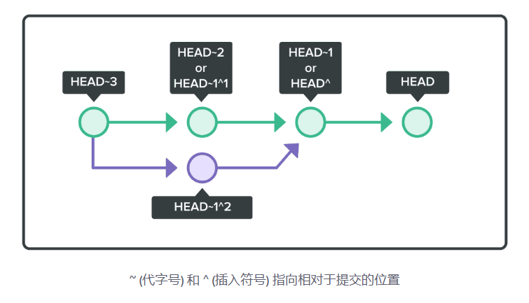

### 暂存分支
如果您的工作树中有未提交的更改 (或添加的新文件)，并且您想要切换到新分支，则这些未提交的更改也将转移到新分支。您提交的更改将提交到新分支。

但是，如果 Git 发现当前分支中未提交的更改与您要切换到的新分支中的文件之间存在冲突，则不会允许您切换。您必须在切换分支之前提交或暂存这些更改。

## 远程分支
虽然 Git 在您的本地计算机上，但您也可以拥有存储库的远程副本。远程存储库可以位于私有中央服务器上，也可以位于同事的计算机上。

您也可以使用版本控制软件，例如 Backlog 来托管远程存储库。

您可以检索其他人对存储库所做的更改或将存储库的本地副本移到远程服务器。

### 拉取远程分支
您可以使用 git pull 命令将远程存储库中的最新更改应用到本地存储库。  
* 如果我们要将远程分支 (origin/main) 的合并应用到我们的本地分支 (main)，这将是一个快进合并。
* 但是如果本地 main 分支中的更改不存在于远程 origin/main 分支中，则拉取命令将执行合并，且将创建将这些更改绑定在一起的合并提交。
* 执行拉取时，会在本地存储库中自动创建合并提交。如果存在冲突，您将必须解决冲突并手动提交合并。如果没有冲突，提交将自动合并。

### 获取远程分支
只要没有冲突，在执行拉取时，来自远程分支的更改会自动合并到您当前的本地分支。如果您想获取远程的修改但又不想将它们合并到您当前的本地分支中，您可以执行 git fetch 命令。

### 推送分支到远程
在将本地分支推送到远程存储库之前，所有提交都可用。换句话说，您可以按照自己的节奏在本地分支工作，而不会影响其他团队成员。

当您将本地分支推送到远程时，Git 将快进合并到目标存储库。

但是，如果推送导致非快进合并，Git 将拒绝您的推送以防止您覆盖以前的提交。在这种情况下，您必须拉取最新的远程更改并再次推送。

> 您不得覆盖或更改已提交到远程存储库的提交。这样做会导致其他团队成员的本地存储库与远程存储库不同。

## 分支的工作流程
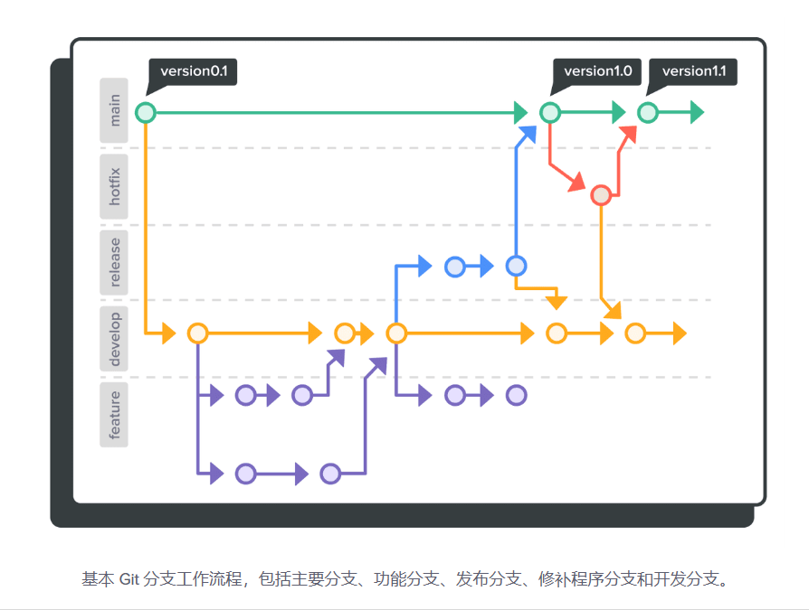

### 主分支(main)
在存储库中进行第一次提交时，默认情况下 Git 会自动创建一个主分支。随后的提交将在主分支下进行，直到您决定创建并切换到另一个分支。

### 功能分支
当您开始处理新功能或 bug 修复时，您应该创建一个功能分支 (即主题分支)。功能分支通常是在开发分支之外创建的。在功能的整个开发生命周期中，该主题分支可以驻留在您的本地机器中。

每当您准备好将变更集与开发分支合并时，您将把这个分支推送到远程存储库。

### 发布分支
当您推出新版本时，您会创建一个发布分支。发布分支可帮助您确保新功能的正常运行。

按照惯例，在命名发布分支时以前缀release-开头。

通常当它接近生产就绪时，您会在开发分支之外创建发布分支。

团队成员应仅解决此分支上的 bug 修复和与发布相关的问题。这允许其他团队成员继续将新功能推送到开发分支，而不会中断发布的工作流程。

准备发布时，将发布分支与主分支合并，并为新创建的合并提交标记发布编号。

您还应该将发布分支与开发分支合并，以便主分支和开发分支都可从发布分支接收最新的更改/bug 修复。

### 修补分支
当您需要快速向生产代码库添加关键修复时，您可以在主分支之外创建一个修补分支。

按照惯例，在命名修补分支时以前缀hotfix-开头。

修补分支的优点是它允许您快速发布补丁，并将更改与主分支合并，而无需等待下一个版本。

修补分支也应该与开发分支合并。

### 开发分支
您的团队应该始终保持开发分支 (即集成分支) 的稳定。您的团队从这个分支创建新的分支，它可以在生产环境中运行。

当一些更改需要合并到开发分支时，创建一个功能/分支来处理通常是个好主意。

### Git 分支工作流程的示例
略

## 整合分支
一旦您完成了一个功能分支的工作，您通常会将它与一个开发分支合并。您可以使用 git 合并或 git 变基命令来完成此操作，但结果会有不同：
* 合并方法：保留合并分支的所有更改和历史记录。多次合并后，修订历史记录可能会变得复杂。
* 变基方法：维护一个干净的修订历史记录，因为合并的提交会附加在目标分支的末尾。与合并的方法相比，冲突可能更频繁地发生。

### 合并分支
您可以使用 git merge 指令来将多个分支集成。

考虑下面的情况。有两个分支：一个bugfix分支，其中有一些来自main分支的提交。

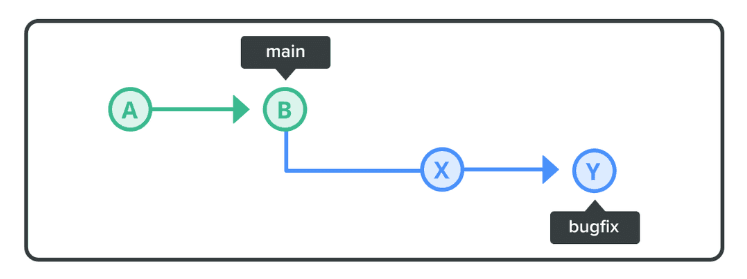

在这种情况下，将“bugfix“合并回“主要“分支并不是什么大问题。那是因为自从创建“bugfix”分支以来，“主要“分支没有改变。Git 将通过将“主要“分支位置移动到“bugfix“分支的最新位置来合并它。这种合并称为“快进“。

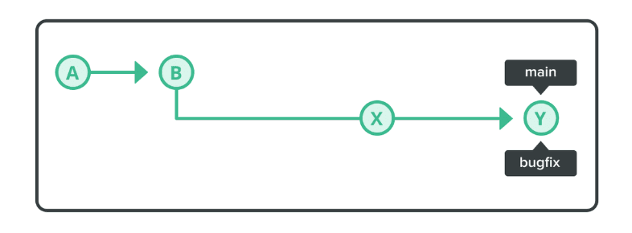

然而，在下面的示例中，自从bugfix分支出来后，main分支已经更新了几次。在这两个分支上执行合并时，必须组合来自bugfix和main分支的更改。

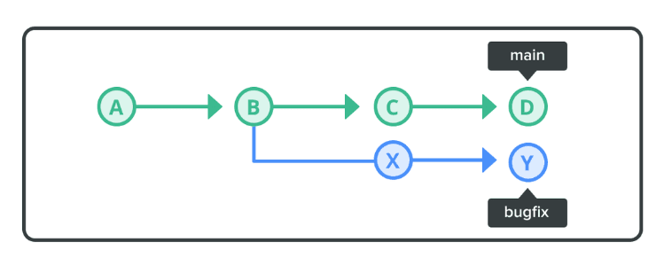

对于这种合并，创建一个“合并提交“并将“主要“位置更新为新创建的合并提交。

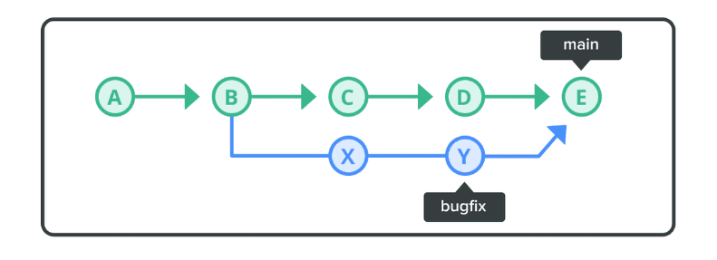

> 即使快进合并是可能的，您仍然可以明确地强制它在没有快进合并的情况下进行合并。

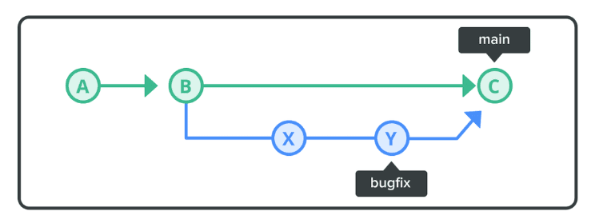

如上所示，非快进合并保留了bugfix分支。这让您更清楚地了解功能分支bugfix。您可以轻松找到功能分支的开始或结束位置，并跟踪对功能分支所做的更改。

### 将分支变基
要获得更清晰的修订历史记录，您可以使用 git rebase 命令来整合您的分支。

假设我们有两个具有非快进合并场景的分支。

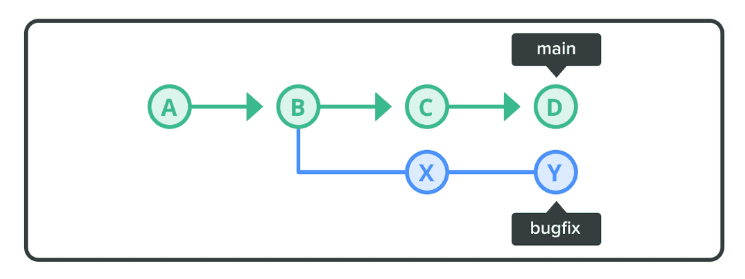

变基将导致分支历史记录看起来类似于下面的示例。

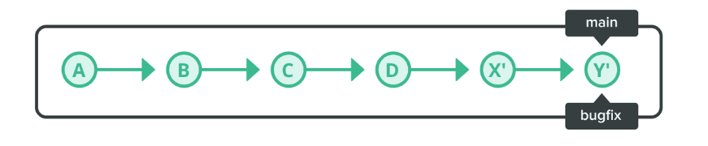

当您将bugfix分支变基到主分支时，来自bugfix分支的提交将被重播并附加到主分支的末尾。结果是bugfix分支历史记录中的单个简单提交串流。

如果在附加提交时发生冲突，Git 会要求您解决冲突，然后再继续对其他提交进行变基。

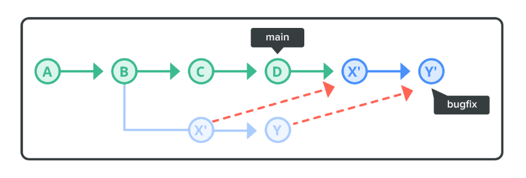

变基不会移动main的位置。在任何情况下，您都可以在变基后进行快进或从bugfix到main的干净合并。

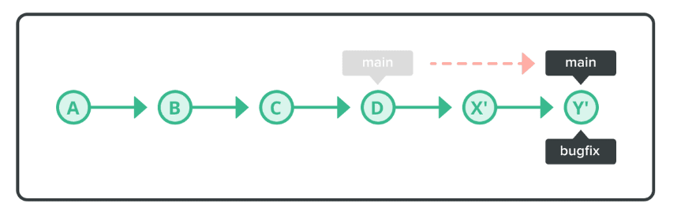

## 标签
Git 标签标记并标记历史记录中的特定提交。标签通常用于指示发布版本，发布名称 (即 v1.0) 是标签的名称。

Git 标签有两种类型：

轻量标签
附注标签
轻量标签类似于不会改变的分支。它只是直接指向历史记录中的特定提交。轻量标签主要在您的本地工作区中暂时使用。

附注标签是校验和的，通常在计划标记重要提交时使用。您可以添加消息、签名、日期以及标记者的姓名和电子邮件。

## 查看变更
在进行大的更改之前，比如合并到主分支或向公众发布更新，开发人员会进行代码审查，包括系统地检查所有的代码更改。这个协作过程包括一个或多个审查员仔细检查代码中的潜在问题，如错误、bug 和对编码标准的遵守。

### 代码审查的好处
代码审查在软件开发过程中提供了几个好处，包括：
* 提高代码质量
* 知识共享与协作
* 错误和 Bug 检测
* 一致性和遵守标准
* 持续学习和成长

### 拉取请求
拉取请求，也称为合并请求或合并提议，是使用 Git 等版本控制系统进行协作软件开发的基本组成部分。

### Backlog 中的拉取请求
略

### 拉取请求的工作流程
这是一个简单的开发工作流程，其中包含您的团队可以遵循的拉取请求：
1. [开发人员] 克隆或拉取工作目标的源代码。
2. [开发人员] 为工作创建一个分支。
3. [开发人员] 进行功能的添加、修改等开发工作。
4. [开发者] 推送完成的任务。
5. [开发人员] 创建拉取请求，指定哪个分支合并到哪个分支。
6. [审查者] 检查通知的拉取请求和审查中的更改。
7. [审查者] 判断工作并在必要时向开发人员发送反馈。
8. [审查者] 审查没有问题就合并。
9. [审查者] 如果由于审查而不需要拉取请求，则关闭。

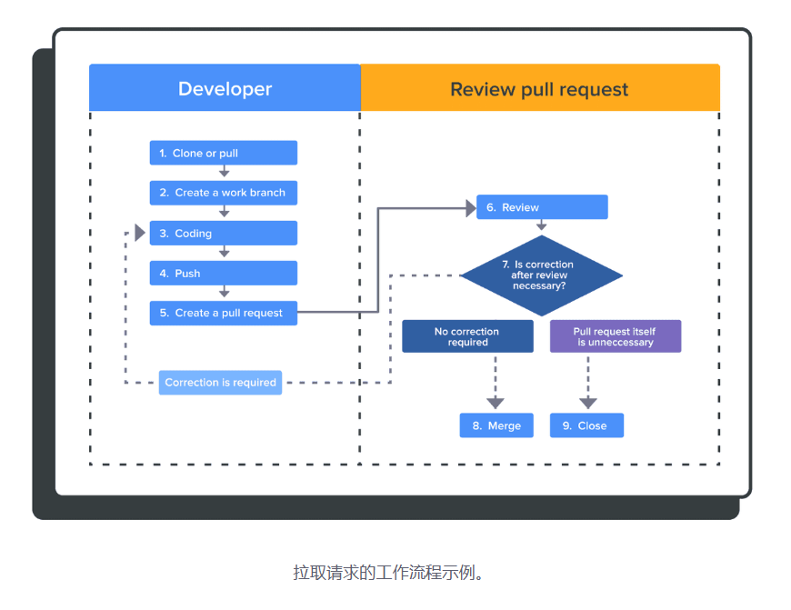

# 如何使用 GIT

## 如何在 Windows 中使用 Git 和 如何在 Command Line 中使用 Git
### 安装 Git
### 默认设置
### 创建本地存储库
### 提交文件
### 创建远程存储库
### 推送到远程存储库
### 复制远程存储库
### 从克隆的存储库推送
### 从存储库拉取
### 制造冲突
### 解决冲突

## 如何在 Git 中使用分支
### 创建分支
### 切换到一个分支
### 把分支合并到主分支
### 删除分支
### 并行作业
### 解决合并的冲突
### 将分支变基

## 如何在 Git 中使用标签

### 添加标签
### 为标签加注释
### 删除标签

## 如何在 Git 中管理历史记录

### 修改提交
### 撤消提交
### 移除以前的提交
### 将提交复制到不同的分支
### 组合提交
### 组合并移动提交
### 组合和合并提交

## 如何在 Git 中使用拉取请求

# GIT 命令和设置

