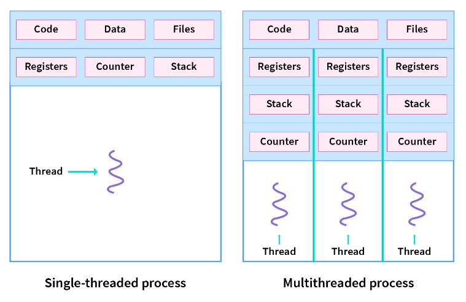

# 事件循环
## 浏览器进程模型
> 进程是计算机科学中的一个重要概念，它是操作系统管理和执行的基本单位。进程是一个正在执行的程序实例，它包含了程序代码、数据、执行状态以及与其他进程之间的通信和同步机制。
> 进程（Process）：进程是操作系统中的独立执行实体，它包含了程序的代码、数据、执行状态以及系统资源。进程是程序的一个运行实例。

> 进程隔离是计算机系统中的关键概念，用于确保不同进程之间的独立性、安全性和稳定性。它是操作系统的一个重要特性，有助于确保多任务处理的可行性，并为各种应用程序和服务提供了安全的执行环境。容器技术是进程隔离的一个典型应用，它在云计算和应用程序部署中广泛使用。

> 线程是计算机科学中的重要概念，它是进程的一部分，用于执行程序的最小单位。线程允许程序以并发的方式执行多个任务，提高了计算机系统的性能和响应能力。
> 线程（Thread）：线程是进程的一部分，它是程序的最小执行单位，用于执行程序中的特定任务。

> 浏览器进程模型是浏览器内部用于管理和执行网页的一种体系结构，它确保了浏览器的稳定性、安全性和性能。

## 渲染主线程是如何工作的

渲染阶段包括很多阶段：
* DOM 构建 (将 HTML 解析为 DOM 树)
* 样式计算 (CSS 样式计算)
* 布局 (布局是查找元素几何形状的过程。包含 x y 坐标和边界框大小等信息。)
* 绘制 (判断你以什么顺序绘制)
* 合成 (合成是一种将页面的各个部分分成图层、分别栅格化它们以及在称为合成器线程的单独线程中合成为页面的技术)
  * 合成 (合成器线程栅格化每个图层)
  * 光栅 (栅格线程栅格化每个切片并将其存储在 GPU 内存中)
* ......

## 参考资料
* [现代网络浏览器内部观察](https://developer.chrome.com/blog/inside-browser-part1/#browser-architecture)
* [渲染阶段](https://cabulous.medium.com/how-does-browser-work-in-2019-part-iii-rendering-phase-i-850c8935958f)
* [事件循环一](https://dev.to/lydiahallie/javascript-visualized-event-loop-3dif)
* [事件循环二](https://www.webdevolution.com/blog/Javascript-Event-Loop-Explained)
* [事件循环三](https://dev.to/lydiahallie/javascript-visualized-promises-async-await-5gke)
* [牛人笔记](https://mathiasbynens.be/)
* [JavaScript modules](https://v8.dev/features/modules)
* [BlinkOn 会议上的一些演讲](https://www.youtube.com/watch?v=Y5Xa4H2wtVA)
* [图层](https://blog.logrocket.com/eliminate-content-repaints-with-the-new-layers-panel-in-chrome-e2c306d4d752/?gi=cd6271834cea)
* [lighthouse](https://developer.chrome.com/docs/lighthouse/overview/)